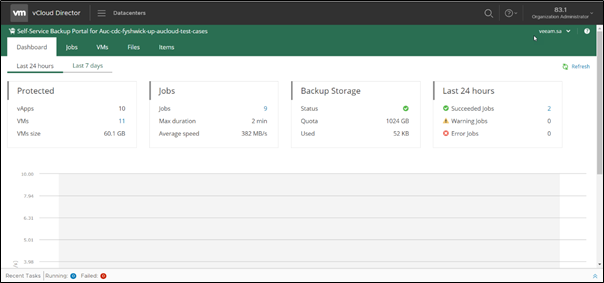

## Overview

The **Dashboard** tab contains statistics on the VMware Cloud Director backup jobs created by your VMware Cloud Director organization administrators, including information on the VMs, job runs and backup storage. Views for the last 24 hours and last 7 days are available.

1. The **Protected** widget reports on:
    - **vApps** — displays the number of vApps for which restore points were successfully created during the specified period.
    - **VMs** — displays the number of VMs for which restore points were successfully created during the specified period.
    - **VMs size** — total size of source VMs successfully processed.

1. The **Jobs** widget reports on:
    - Number of jobs created by currently logged in administrator
    - Max job duration
    - Average data transfer speed.

1. The **Backup Storage** widget reports on status of the backup storage assigned to the organization, on the storage quota assigned, and on the storage size used. Status indicators are as follows:
    - Green — more than 10% of storage space is free.
    - Yellow — less than 10% of storage space is free.
    - Red – no free space on backup storage (please contact AUCyber Support to increase storage space if required).

1. The Last 24 hours/Last 7 days widget reports on the job session results for the corresponding period.

1. To visualise data for on-going jobs, the **Dashboard** tab displays a graph showing time and date when jobs were performed, and the network throughput rate (in MB/s) during the job.