## Overview

In the **Jobs** tab of the Self-Service Backup Portal, you can perform the following operations:

- Create a new VMware Cloud Director backup job
- Start, stop or retry a job
- Disable or enable a job
- Edit job settings

## Create Backup Jobs

1. Go to the **Jobs** tab of the Self-Service Backup Portal and click **Create**.

    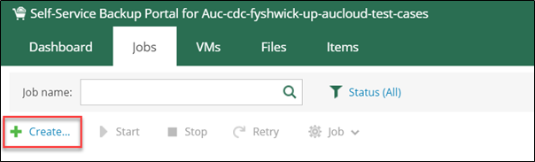

1. Specify job name, description and retention settings (how many restore points should be stored in repository for future restores).\\

    !!! note

        To keep certain full backups for archive purposes, ensure the **Keep certain full backups** checkbox has been checked and is configured by clicking **configure**.

    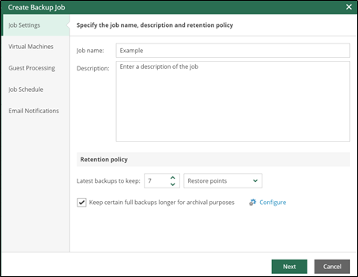

    !!! note

        A scale out backup repository (SOBR) will be assigned to your vCD tenancy. The SOBR consists of a Primary Tier backup storage appliance to ingest backups and a Capacity Tier appliance (S3 based storage used for longer backup retention and archive purposes. For more information please see the [AUCyber Backup overview](./index.md).

    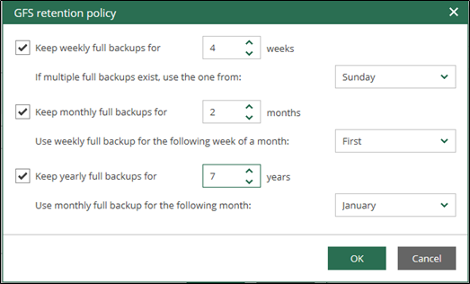

2. Add vApps and/or VMs from the VMware Cloud Director organization to the job by clicking **+Add** and make a selection.

    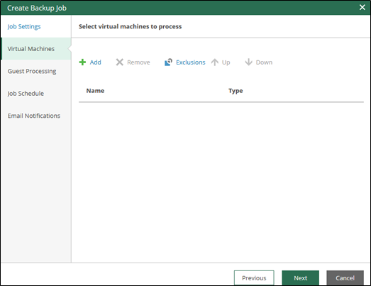

3. Follow the wizard to configure other settings available to you such as guest processing, schedule, notifications on job completion (see below images).

    **Guest OS Processing**

    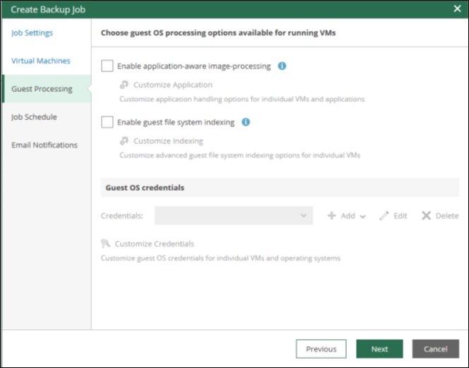

    **Application aware backups and file exclusions**

    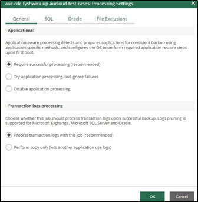

    **Scheduling options**

    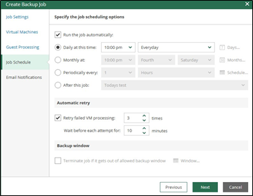

    **Enable notifications**

    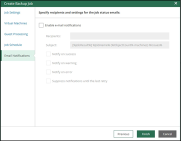

4. The remaining settings (repository, processing mode, etc.) will be obtained from the repository set up in your tenancy by AUCyber.

## Manage Backup Jobs

1. Once a backup job has been created you can manage that job from within the portal.

    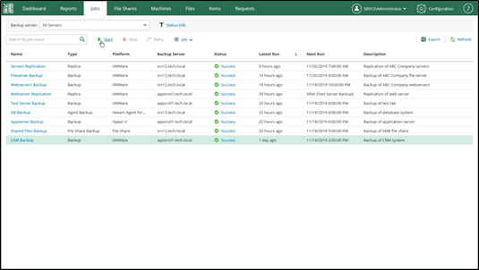

1. To **run a job**, select the job from the list on the _Jobs_ tab, then click **Start**.

    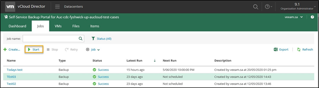

1. To **stop a job**, select the job from the list on the _Jobs_ tab, then click **Stop.**

    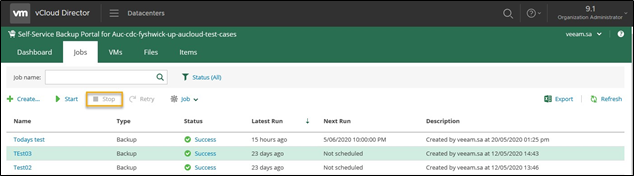

1. To **re-run a job** that has failed, select the job from the list on the _Jobs_ tab, then click **Retry.**

    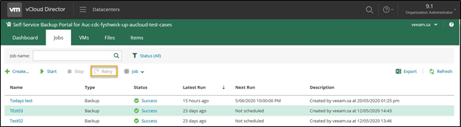

1. To **delete a job**, select the job from the list on the _Jobs_ tab, then click **Job > Delete**.

    !!! note

        After deletion, this job will be removed from configuration and no longer appear in web portal and in Veeam Backup Management Console._

    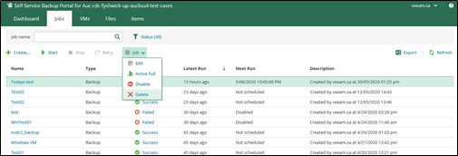

1. Additional backup job management options include:

    - Edit job settings
    - Enabling and disabling selected jobs
    - Performing a Active Full backup

## Considerations and Limitations

1. Job cloning is not available.

1. The following limitations apply to VM backups and subsequent restores via the Self-Service Backup Portal:

    - You create a backup job that will process a VM added explicitly (that is, not as a part of a vApp container). This job runs, creating several restore points.
    - When you restore this VM to the original location via the Self-Service Backup Portal, the VM identifier changes in VMware Cloud Director hierarchy. Due to this reason, the backup job is unable to locate this VM. To rectify, you need to edit job settings, adding this VM anew. To ensure that job configuration will store this VM with the new metadata (not the old one from VMware Cloud Director hierarchy cache), you should first click Refresh in the Add Objects window.
    - At the next job run, a new full backup will be created for this VM. However, if you try to perform file-level restore via the Self-Service Backup Portal from the restore points created initially for that VM (in step 2), the restore operation will fail, as that VM identifier does not exist.

    

    