## Overview

AUCyber provides a public catalog for you to use that contains standard virtual machine (VM) sizes and operating systems. The public catalog is a good place to start when you first deploy VMs into VMware Cloud Director. However, you may want to create your own catalogs, containing specific applications or gold images, which you can then use to deploy VMs quickly.

## Create a catalog

1. In VMware Cloud Director, click **Content Hub** from the top menu bar.

    

1. In the left navigation panel, click **Catalogs**.

    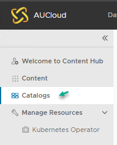  

1. To create a new catalog, click **New.**

    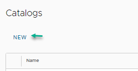

1. In the _Create Catalog_ dialog box, **Name** the catalog and give it a **Description** if needed.

1. To specify a storage policy for the catalog, select the **Pre-provision on specific storage policy** option then select the desired **Storage Policy**. The storage policy is dependent on what is preferred at the time your Org VDC is created. _Contact AUCyber for more information on different storage policies._

    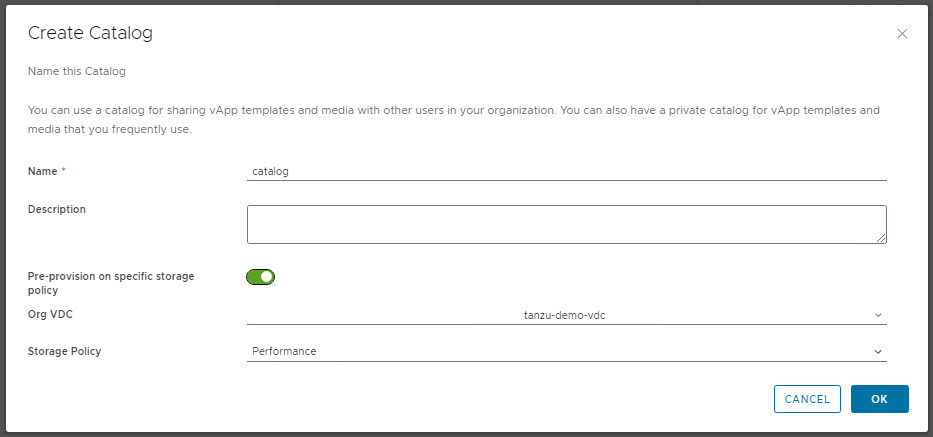

1. To finish, click **OK**.

1. To make the catalog visible to others within your organisation, click the ellipsis and select **Share**.

    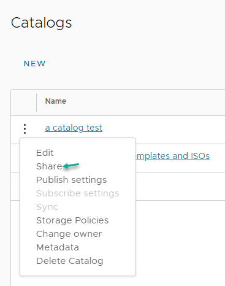  

1. In the _Share with Users and Groups_ dialog box, select:

    - **Share with All Principals** grant catalog access to all users and groups in the organisation; or
    - **Share with Specific Principals** grant catalog access to selected users or groups.

    !!! note

        You can give users different access levels: **Read Only**, **Read/Write** or **Full Control**. 
        
    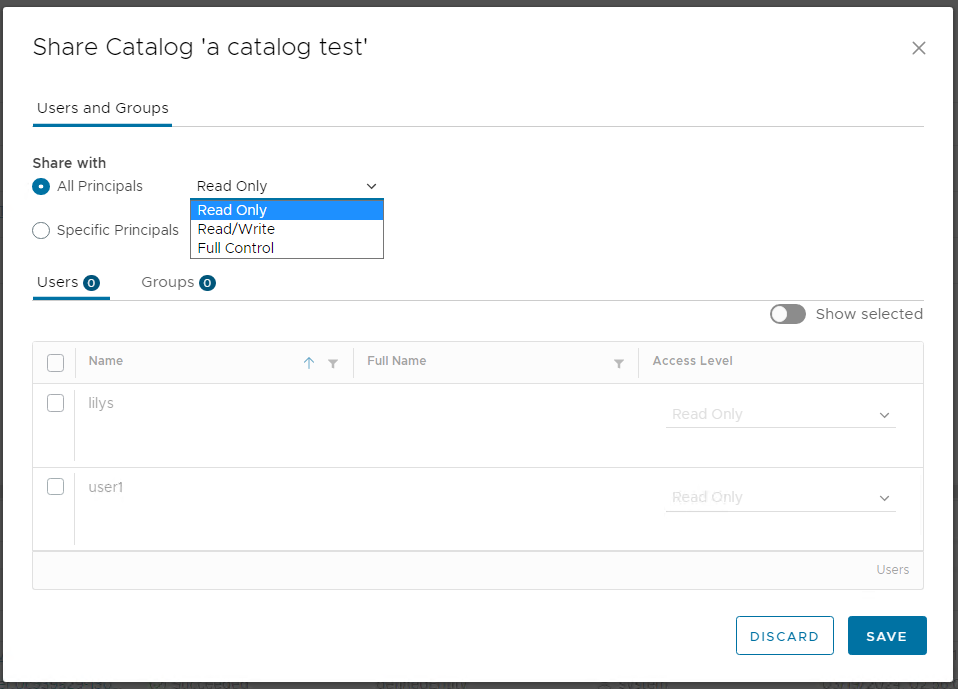

    | Option | Description |
    | :--- | :--- |
    | **Read Only** | Users with this access can only read the catalog's vApp templates and ISO files |
    | **Read/Write** | Users with this access have the ability to both read and add new vApp templates and ISO files to the catalog |
    | **Full Control** | Users with this access have full control of the catalog's contents and settings |

1. When you have added all the users you want to access the catalog, click **OK**.

1. To finish, click **Save**.

## Populating a catalog

### VM/vApp Templates  

There are two ways to populate a VM/vApp template into a catalog:

   1. Upload an OVA/OVF package
    
      - In the _Content Hub_ page, in the left navigation panel, select **Content**.
    
        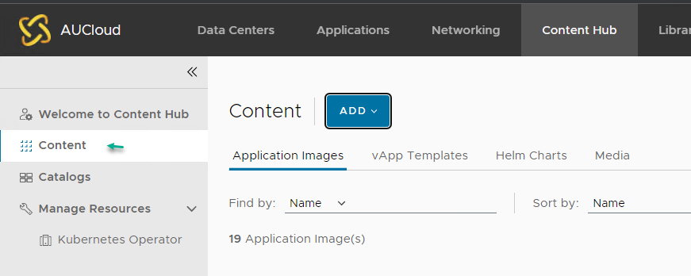  
   
      - Click **ADD** drop down menu and select **OVA/OVF** to open an OVF upload window.
       
        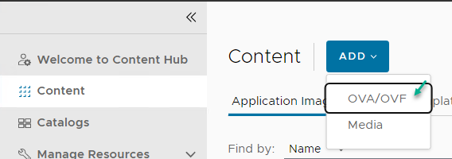
       
      - In the _Create vApp template from OVF_ dialog box, select the source of the OVF - either enter a **URL** or **Browse** for a local file.
   
        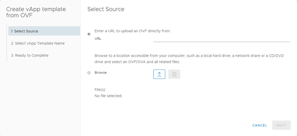
       
      - Click **Next** then review the details of the OVF template and then click **Next**.

      - Enter a **Name** and **Description** for the template and from the **Catalog** list, select the catalog in which you want to put the OVF. Click **Next** to continue.
       
        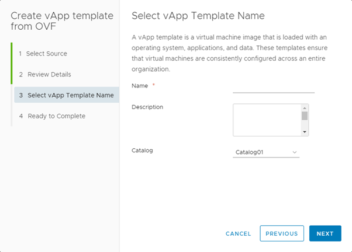
       
      - Review the details of the vApp template and click **Finish** to deploy.
      
        !!! note
        
            Depending on template size and network speed, the upload may take some time.

   2. Create a template from an existing vApp
         
      - In VMware Cloud Director, click **Datacenters** from the top menu.
       
       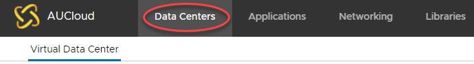  
       
      - Select the VDC where the vApp is located.
   
      - In the left navigation panel, click **vApps**.
       
       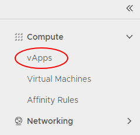  
       
      - In the card for the vApp that you want to add to the catalog, select **Actions** then **Create Template**.
       
       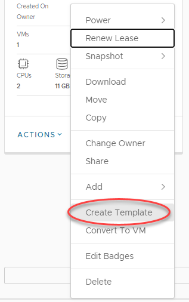
      
    !!! note

        You can add both running and stopped vApps to the catalog, although it is worth noting that creating a catalog image from a running vApp could affect performance.

        
      - You can now choose the catalog you want to add the vApp to, give the vApp a new name, assign a storage lease, and define whether vApps deployed using this template are identical or customisable. You can also overwrite an existing catalog item. If the catalog you are adding the vApp to is published externally, a warning will appear.
   
      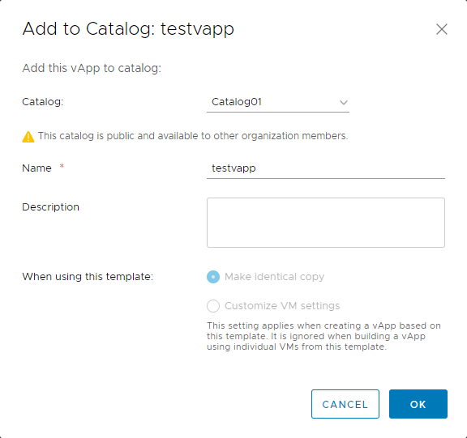

      - To finish, click **OK**.
   
        A status bar will appear on top with the message: **Please wait**. You can close the window and check the progress by expanding the _Recent Tasks_ section at the bottom of the VMware Cloud Director interface.

### Media   

1. In the _Content Hub_ page, in the left navigation panel, select **Content**.

      

2. Click **ADD** drop down menu and select **Media** to open an Upload Media window.

    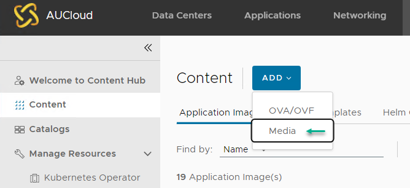

3. In the _Upload Media_ dialog box, select the **Catalog** from the drop down menu.

    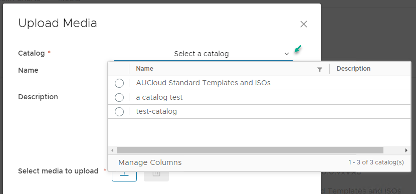  

4. Enter a **Name** and **Description** for the template and select the media to upload by clicking on the upload icon to browse and select the image file. 

    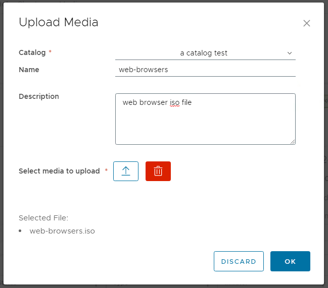

5. Click **OK** to upload the media file.

    !!! note

        Depending on media file size and network speed, the upload may take some time.
        After the upload process starts, the media file appears in the catalog/content media grid.