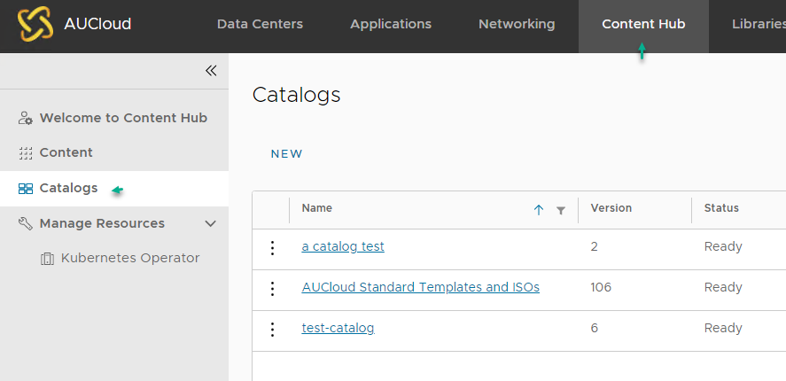

## Overview

You can share catalog library between AUCyber Sovereignty Zones (*SZ) by performing Catalog publishing/subscription.

Follow the below steps if you require access to a catalog created in CSZ (Canberra) when in SSZ (Sydney), or vice versa.

## Share catalog library between AUCyber Sovereignty Zones (e.g. CSZ to SSZ)

1. Log in to the environment where the catalog you want to share is stored (e.g. CSZ)

1. Navigate to **Content Hub**, then select **Catalogs**.

    

1. Click the ellipsis next to the catalog that you wish to share and select **Publish settings**.

    

2. A new pop up window will appear, then tick **Enable Publishing**.

    !!! note

        To enable password protection on your catalog, enter a password and type the same password again to confirm then click on **Save**.

    

3. Once the publishing settings is saved, it will return to the _Catalogs_ page again.

4. Click the ellipsis next to the catalog that you wish to share and select **Publish settings**.

    !!! note

        This time it will show the subscription URL. Highlight the URL and hit **Ctrl+C** on your keyboard to copy the URL details somewhere safe i.e. notepad.

    

5. Then login to the other environment where you want to share this catalog to (e.g. SSZ).

6. Navigate to **Libraries,** then select **Catalogs > New**.

    

7. Then perform the following:

    - enter the **catalog name,**
    - enable **subscribe to an external catalog** option,
    - enter the **subscription url** (by pasting the url copied earlier on step 6),
    - enter the **password** that was set earlier (Step 4), and
    - click **OK.**

    

8. Once the new catalog is created with subscription to the catalog (e.g. from CSZ), it will start performing synchronisation of the catalog items between Sovereignty Zones (e.g. CSZ to SSZ).  

    
    
    Once the sync task is complete, the vApp templates/media from the new catalog can be utilised.
