## Overview

This guide leads you through the three basic steps for using VMware Cloud Director to quickly build a simple virtual machine (VM) and connect it to the internet.

The three steps covered in this guide are:

1. Create a network (to move requests around your VMs).

1. Configure the edge gateway (in this guide we focus on the firewall and NAT configuration).

1. Create a virtual machine.

If you follow these steps, you can have a VM up and running with a connection to the internet in about 20 to 25 minutes.

## Create a network

Before you can start building VMs in your VDC, you need to create the network that connects the VMs to each other and the outside world.

First, you need to create a network that can connect to external networks outside your VDC (including the internet). This is called an external routed network. You can find more information about routed networks in [How to create a routed VDC network](../NSX-V_Networks/how_to_create_a_routed_vdc_network.md).

1. Log in to the AUCloud Portal.

    For more detailed instructions, see the [Getting Started Guide](../../../../Platform_Overview/portal/getting_started) for the AUCloud Portal

2. Select your account.

3. In the Portal navigation panel, expand VMware Cloud Director and then select the compute service in which you want to create your VM.

     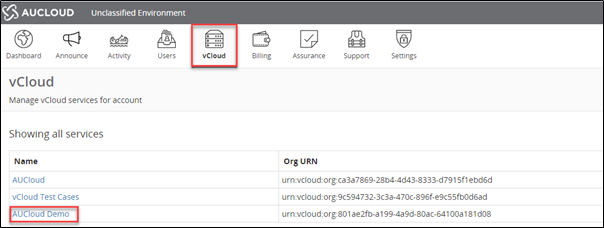

4. On the VMware Cloud Director tab, enter your Portal password and click Confirm.

     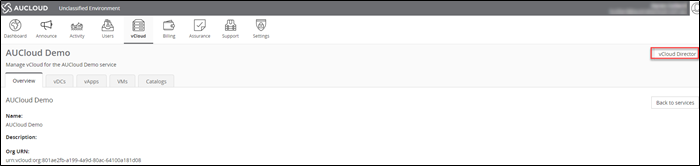

5. In the VMware Cloud Director dashboard, select your VDC.

6. In the left navigation panel, select Networks.

     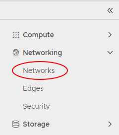

7. To create a new network, click the New button.

     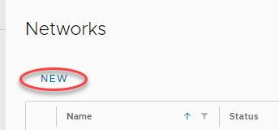

8. Select Routed as the network type as in this example you want your VM to connect to the internet.

    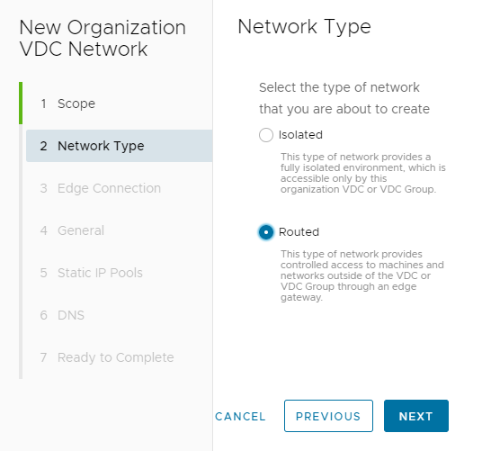

9. Click Next.

10. When you connect a network to the outside world, it's important that you control exactly what can access your environment via that network. VMware Cloud Director uses edge gateways to do this.

    In the Edge Connection page, select the edge that you want your new network to use.

    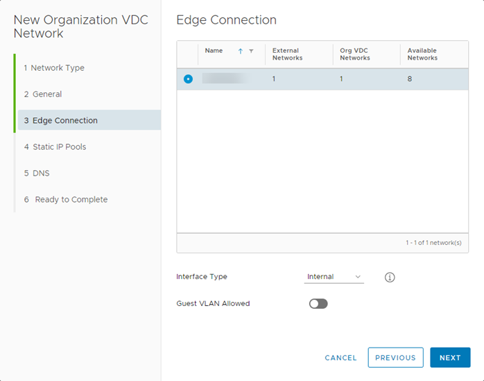

11. In the General page, give the network a Name and Description.

12. In the Gateway CIDR field, enter the details for the gateway address.

13. You can make your network available to other VDCs within the same region so that VMs can communicate with each other, regardless of which VDC they are in. Select Shared to enable this feature.

    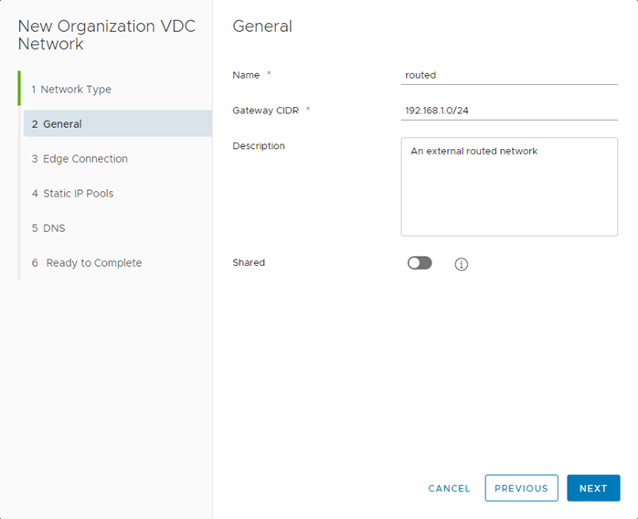

14. Click Next.

15. A VM needs an IP address to identify it on the network.

    In the Static IP Pools page, identify the range of IP addresses that VMs connecting to this network can use then click Add. For example, if your Gateway CIDR is 192.168.1.0/24, you can use the 192.168.1.10-192.168.1.100 range for your static IP pool, giving 91 usable internal IP addresses.

    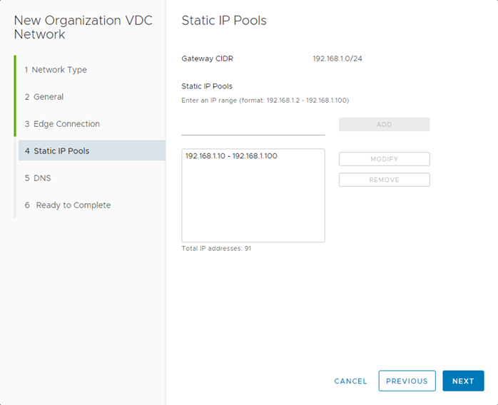

16. Click Next.

17. In the DNS page, enter your DNS information.

    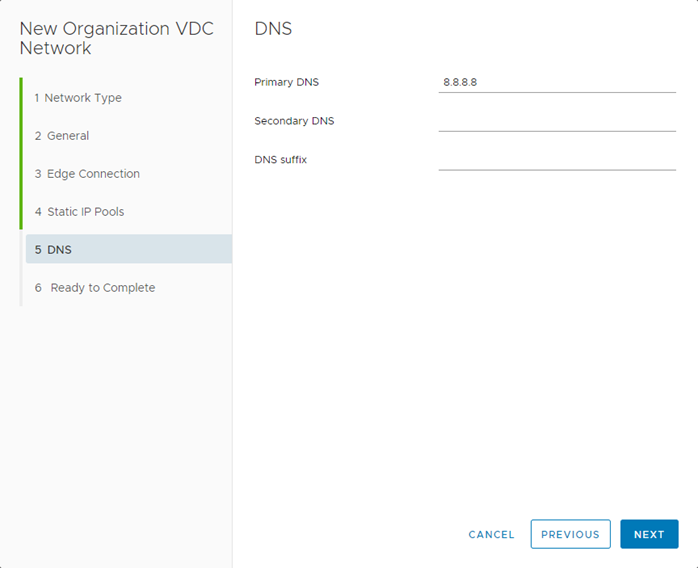

18. Click Next.

19. In the Ready to Complete page, review your selections then click Finish.

    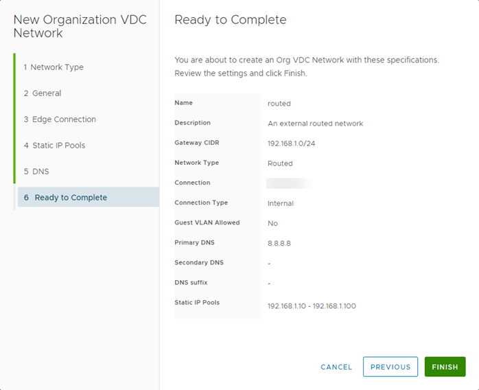

## Configure the edge gateway

The edge gateway is possibly the most complex part of the VDC because of its high level of functionality. The following steps show you how to quickly configure the edge gateway to enable you to access the internet from a VM.

1. In the VMware Cloud Director Virtual Datacenters dashboard, select your VDC.

1. This time you're working with the edge gateway, so in the left navigation panel, click Edges.

    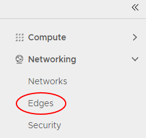

1. Select the edge gateway you want to work with and click the Services button.

    

1. Each tab in the Edge Gateway dialog box provides access to a different service provided by the edge gateway. The main tabs are:

    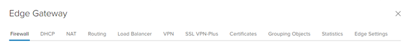

1. In the VMware Cloud Director Virtual Datacenters dashboard, select your VDC.

1. This time you're working with the edge gateway, so in the left navigation panel, click Edges.

    

1. Select the edge gateway you want to work with and click the Services button.

    

1. Each tab in the Edge Gateway dialog box provides access to a different service provided by the edge gateway. The main tabs are:

    

- **Firewall** - As well as a physical firewall, you can control which networks and ports can communicate through the edge gateway. You'll set up some firewall rules later in this exercise.
- **DHCP** - The edge gateway can act as a DHCP server for VMs connected to Org networks connected to an edge. The DHCP tab shows DHCP information for any VDC networks that have been configured with DHCP, and so acts as a centralised view. For more information, see How to create a DHCP pool.
- **NAT** - Network address translation, both in (DNAT) and out (SNAT) of the edge gateway. You'll set up some NAT rules later in this exercise.
- **Routing** - You can provide static routes from the edge gateway to other networks, for example networks in other VDCs in your compute service. For more information, see How to create a static route.
- **Load Balancer** - The edge gateway provides simple HTTP and HTTPS load balancing using round robin. For more information, see How to configure a load balancer.
- **VPN** - IPsec site to site VPN is available on the edge gateway. You can configure an IPsec VPN within VMware Cloud Director, but you may need to perform additional configuration through the API. For more information, see How to configure IPsec VPN.

To access the internet from a VM, you'll need to create firewall rules to determine who can access your network and NAT rules to route traffic within your network.

## Creating firewall rules

Let's start with firewall rules:

1. In the Edge Gateway dialog box, select the Firewall tab.

1. Make sure the Enabled option is selected.

    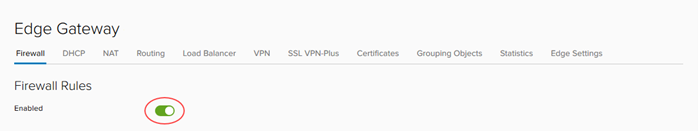

1. Click the + button to add a new row to the firewall rules table.

    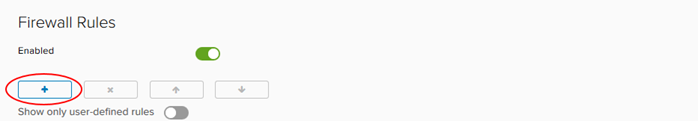

1. Edit the values in the row for the New Rule using the settings below:

    - **Name** - HTTPS outbound
    - **Source** - internal
    Click + (Add object) button, select Internal, click the right arrow button, then click Keep.
    - **Destination** - external click + (Add object) button, select External, click the right arrow button, then click Keep.
    - **Service** - Click the + button and enter the following values in the Add Service dialog box
    - Protocol - TCP
    - Source Port - any
    - Destination Port - 443

    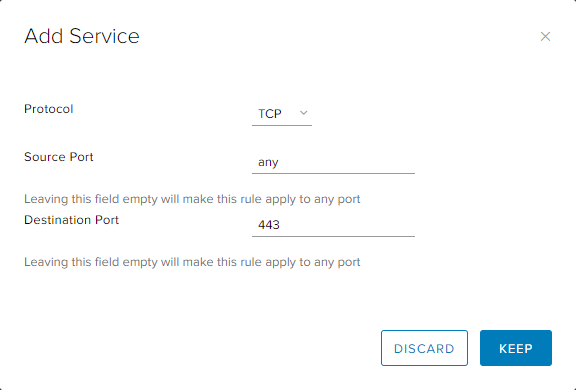

    - Click Keep when you're done.
    - Action - Accept

    These settings allow traffic from the VMs (Source = internal) to reach destinations outside your VDC (Destination = external) on port 443 (HTTPS). You'll need to repeat these steps for ports 80 (HTTP) and 53 (DNS).

    You can also allow traffic to reach your VMs from outside your VDC by swapping the Source and Destination values. However, because this opens up your firewall to a lot of traffic, we recommend that you first complete this guide to get comfortable with general networking concepts, and then take a look at the information in [How to create firewall rules](../NSX-V_Networks/how_to_create_firewall_rules.md) where you can find out how to lock the firewall down.

    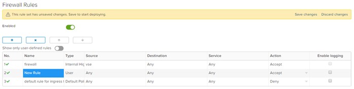

1. Click Save changes.

    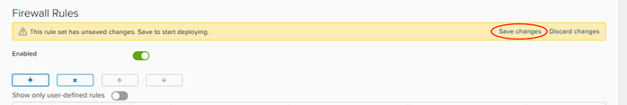

## Creating NAT rules

Now that you've set up the firewall rules, you can create NAT rules:

1. In the Edge Gateways dialog box, select the NAT tab.

    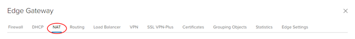

1. In the NAT44 Rules section, click the SNAT Rule button to create a source NAT (SNAT) rule to translate internal IP addresses into something that the external network can understand.

    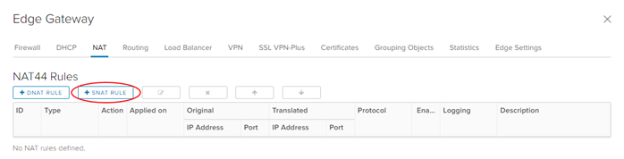

1. In the Add SNAT Rule dialog box, from the Applied on list, choose the edge gateway to which you want to apply the SNAT rule.

1. In the Original Source IP/Range field, enter the range of addresses you created when you created the network in the previous exercise.

1. In the Translated Source IP/Range field, enter one or more of the external IP addresses provided to you by AUCloud.

    If you are not sure what your IP addresses are, see [How to find your allocated external IP addresses](../NSX-V_Networks/how_to_find_allocated_external_ip_addresses.md).

    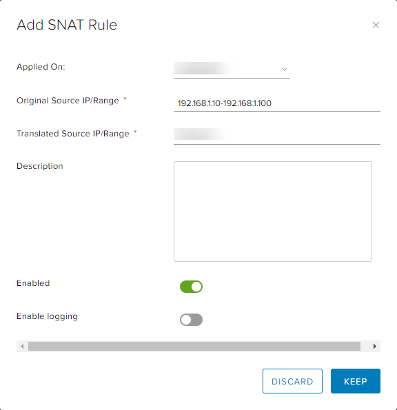

1. When you're done, click Keep and then Save changes.

    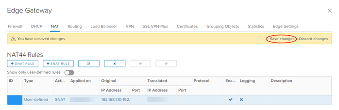

You can also add destination NAT (DNAT) rules to translate external IP addresses to route traffic to the appropriate internal addresses. However, because the firewall only provides outbound access to the internet, we do not need to add DNAT rules at the moment.

You can find more information about setting up NAT rules in How to create NAT rules.

## Create a virtual machine

Now that you've laid the groundwork, it's time to create your VM. The best way to do this is to create a virtual application (vApp). You can think of a vApp as a container for your VMs; it enables you to group related VMs together to manage them in one place. See How to create a vApp to find out more.

1. In the VMWare Cloud Director Virtual Datacenters dashboard, select your VDC.

1. In the left navigation panel, click vApps.

    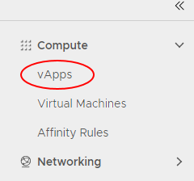

1. In this exercise, you'll create the vApp from scratch, so click New vApp.

    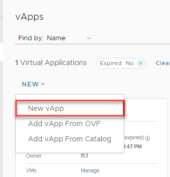

1. In the New vApp dialog box, give the vApp a Name and Description.

1. Click Add Virtual Machine.

    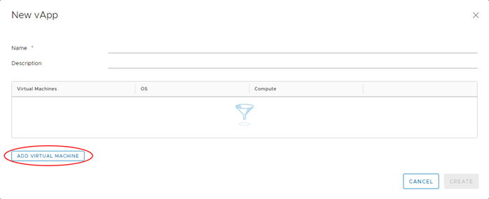

1. In the New VM dialog box, you can create your VM. Enter a Name, Computer Name and Description for the VM.

1. The easiest way to create a VM is to use a pre-built template from a catalog, so from the Type radio buttons, select From Template.

1. From the list of Templates, select the one you want to use.

1. Click *OK.

1. Back in the New vApp dialog box, you can add more VMs if you want, but for now click Create to create the vApp and the single VM.

1. There are some more configuration tasks to complete for your new VM, so in the left navigation panel, select Virtual Machines to list all the VMs in the VDC.

    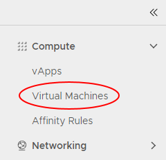

1. In the card for your new VM, click Details.

1. In the General section, you can click edit and change the VM name in the Name field but keep the default Storage Policy option.

    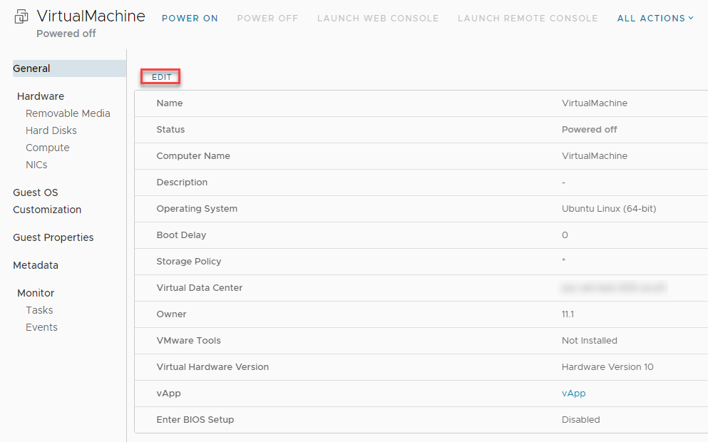

1. Under the Hardware section, click NICs, then click Edit and select the externally routed Network you created in the first exercise.

1. From the IP Mode list, choose Static - IP Pool to use the IP pool you defined earlier when you created your network.

    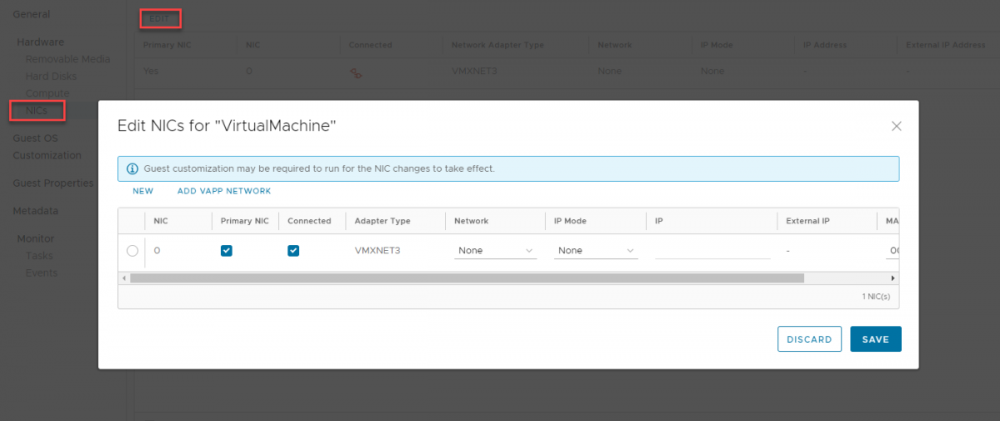

1. You do not need to change anything in the other sections, so click Save.

1. If your VM is not already powered on, in the card for the VM, select Actions, Power then Power On, Force re-customization.

    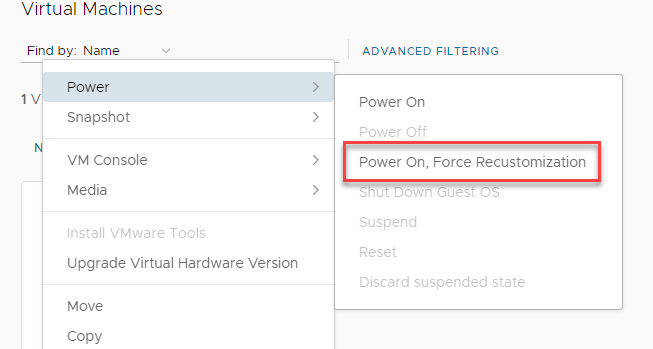

1. Click the Actions > VM Console, Launch Web Console and go through the setup procedure.

1. To confirm that you have connectivity to the internet and have an assigned IP address:

- Type `ipconfig` into the Command Prompt. If you've configured the networking correctly, your VM will return an IP address.

- Open an internet browser page and navigate to an external web page

- Ping the IP address of your DNS (for example, 8.8.8.8) through the command line.