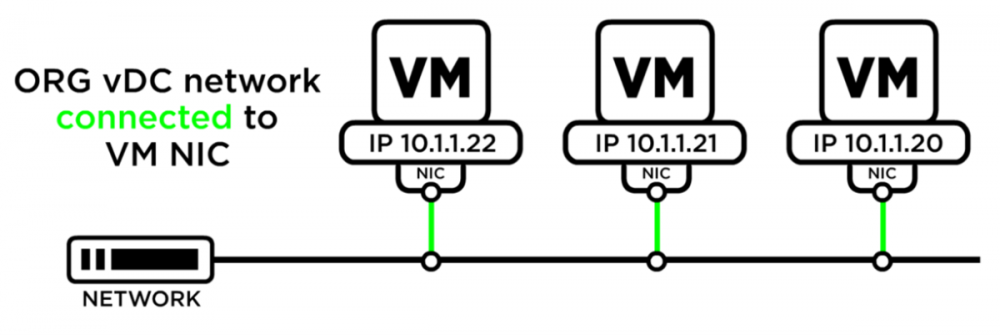

### Introduction

This use case is a walk-through of a general process for deploying a web and application server through VMware Cloud Director.

### Build Virtual Machines

The first step is to build the required virtual machines (VMs).

VMs can be created as standalone or within a vApp. In this example we will create the VM from scratch inside a vApp which allow you to combine multiple VMs into a single management unit.

[Create a New Standalone Virtual Machine](https://docs.vmware.com/en/VMware-Cloud-Director/10.2/VMware-Cloud-Director-Tenant-Portal-Guide/GUID-12E43116-1120-45FA-A1E7-AEBEE61373C1.html)

Additional information on how to import a saved vApp from an imported OVF

### Import OVF

[Create a vApp Template from an OVF File](https://docs.vmware.com/en/VMware-Cloud-Director/10.2/VMware-Cloud-Director-Tenant-Portal-Guide/GUID-5EA412C4-179A-42CF-9B30-1B81C23551E6.html)

Example only. vApp content and IP addresses are variable. IPs can be assigned in several different ways.

### Create an Internal Network

An ORG vDC network is required to allow your VMs to communicate with each other and external networks.

#### Build an ORG vDC network

[Add a Routed Organization Virtual Data Center Network](https://docs.vmware.com/en/VMware-Cloud-Director/10.2/VMware-Cloud-Director-Tenant-Portal-Guide/GUID-74C4D27F-9E2A-4EB2-BBE1-CDD45C80E270.html)

### Connect Network to vApp and VM

#### Connect vApp to network

[Add a Network to a vApp](https://docs.vmware.com/en/VMware-Cloud-Director/10.2/VMware-Cloud-Director-Tenant-Portal-Guide/GUID-B95FB8AF-C428-4FCB-88DA-5DCA35B19B5A.html)

#### Connect the VM Primary NIC to the network

[Change the Hardware Properties of a Virtual Machine](https://docs.vmware.com/en/VMware-Cloud-Director/10.2/VMware-Cloud-Director-Tenant-Portal-Guide/GUID-BB95EAB5-13D7-4C4A-BDA3-AA1338BC01CA.html)

### Configure Firewall NAT rules on Edge Services Gateway

#### Configure firewall

[Add an NSX-T Data Center Edge Gateway Firewall Rule](https://docs.vmware.com/en/VMware-Cloud-Director/10.2/VMware-Cloud-Director-Tenant-Portal-Guide/GUID-BE02B1A7-9191-4520-A248-D2A7D2CA640E.html)

!!! note

    Locate your public IP address by clicking on Edges, navigating to **General** → **Configuration** → **Gateway Interfaces** tab. The public IP is located in the Primary IP column.

#### Configure NAT

[Add an SNAT or a DNAT Rule to an Edge Gateway](https://docs.vmware.com/en/VMware-Cloud-Director/10.2/VMware-Cloud-Director-Tenant-Portal-Guide/GUID-9E43E3DC-C028-47B3-B7CA-59F0ED40E0A6.html)

### About the ESG

[How the Edge Services Gateway works](../NSX-V_Networks/how_the_nsx-v_edge_service_gateway_works.md)

Turn on VMs and force re-customisation to complete
