## Overview

The AUCloud Customer Infrastructure-as-a-Service (IaaS) platform is underpinned by VMware vSphere with network virtualisation services provided by VMware NSX-T. Within a customer tenancy, an Edge Gateway is the default tenancy boundary enforcement appliance and provides Layer 2-4 firewall, IPSec VPN, NAT and routing services. Customers have the option of complementing the Edge Gateway with a bring-you-own firewall service to introduce more advanced security functionality such as Layer 7 firewall services, Intrusion Prevention and Anti-Virus filtering. In this architecture the Edge Gateway is still present but will likely only perform routing to the chosen firewall appliance.

In the Networking environment provided by NSX-T, public IP addresses are not assigned directly to the Edge Gateway or BYOFW device interfaces. As such, when deploying a BYOFW device, public IP addresses can instead be assigned using DNAT and SNAT, while maintaining routing functionality via the Edge Gateway. This simplifies the deployment of a BYOFW device within the AUCloud environment and provides flexibility to use pay-as-you-go public IPv4 address assignment.

The topology below represents a likely architecture for the AUCloud BYOFW solution, which is referenced throughout this document.

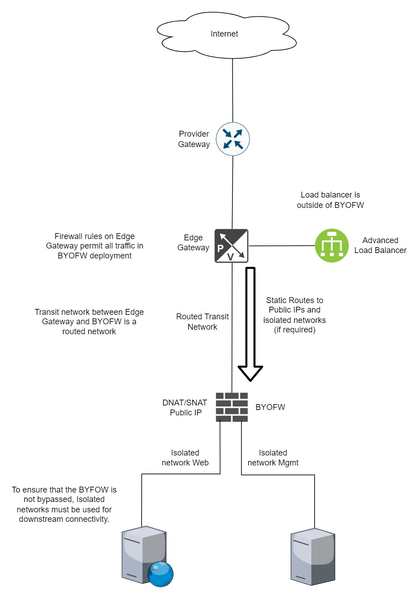

!!! note
        In the diagram above the Advanced Load Balancer is deployed and connected to the Edge Gateway. This architecture can not be modified. If Public IP addresses are used on the Advanced Load Balancer then firewall rules on the Edge Gateway will be required, as will firewall rules between the Load Balancer and the load balanced pool-members behind the BYOFW device. An alternative to the above is to deploy a separate virtual Load Balancer (such as an F5 LTM) behind the BYOFW device. This will not be discussed further in this article.

## Deploy a BYOFW Solution

### Upload BYOFW Image to a Content Library

The first step in the BYOFW solution is to upload the appropriate image file(s) to your content library (if you do not have a content library you can create one by following this [**procedure**](../Catalogs/VCD%2010.4.x/how_to_create_a_catalog.md) for VCD 10.4.x or this [**procedure**](../Catalogs/VCD%2010.5.x%20(new)/how_to_create_a_catalog.md) for VCD 10.5.x) )

Logon to the [**AUCloud Portal**](https://portal.australiacloud.com.au).

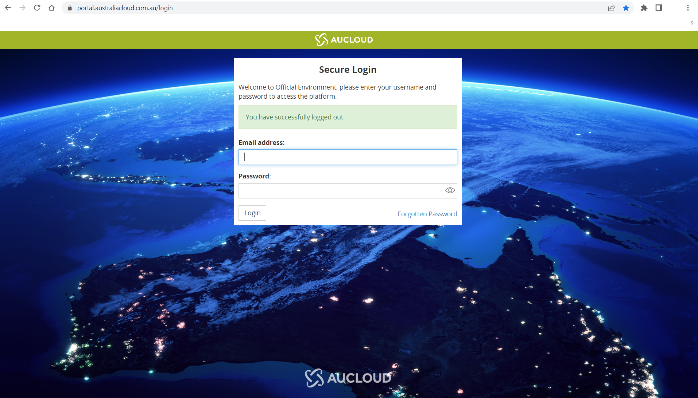

Navigate to the **vCloud** tab and select the **Organisation**, to which you will deploy the **BYOFW** device.

Select the **vCloud Director** icon, this will redirect you to an additional login page. After entering your password, select **Continue** to proceed to the vCD portal.

Once redirected to the vCD portal, select the **Libraries** option from the top of the page.

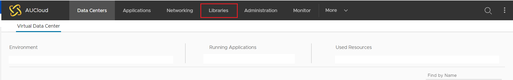

Select the **New** option under **vApp Templates** to add a new virtual image file.

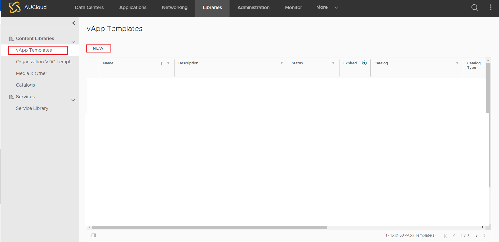

On **Create vApp template from OVF**, select the radio button next to **Browse** to upload the virtual image file(s) to vCD from a local source. Select the arrow pointing upward icon to chose which image file(s) to add.

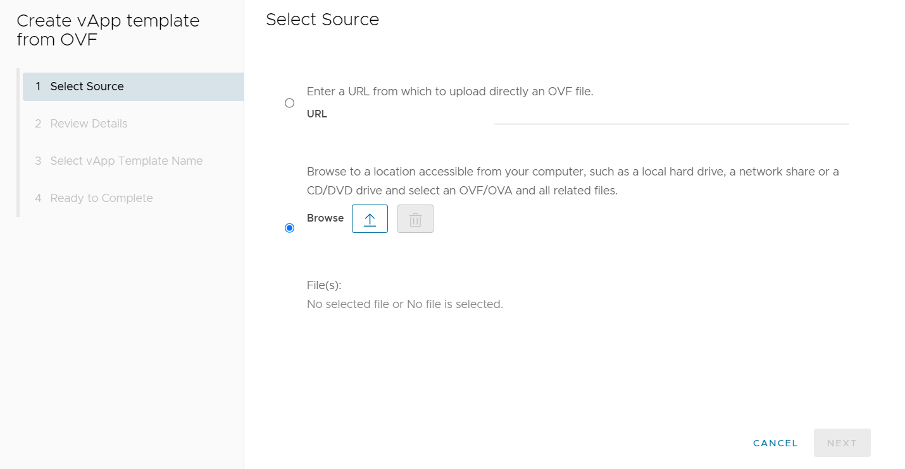

Select the image file(s) from the local file system. In the example below Fortigate image file(s) are used, but this will be dependent on which BYOFW virtual appliance you are deploying to your tenancy.

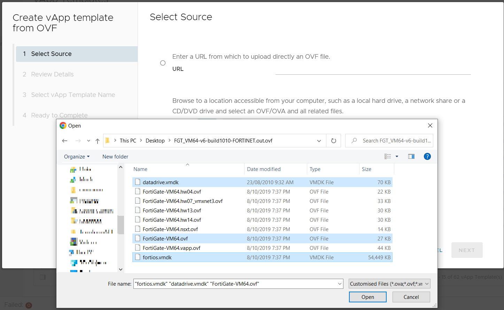

Select **NEXT** to review the detail of the **OVF**.

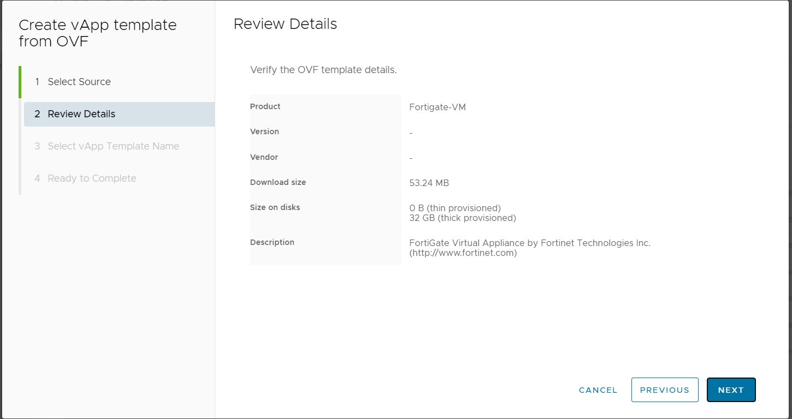

Once again select **NEXT** and then modify the **Name**, **Description** and **Catalog** into which you wish to store the **OVF**.

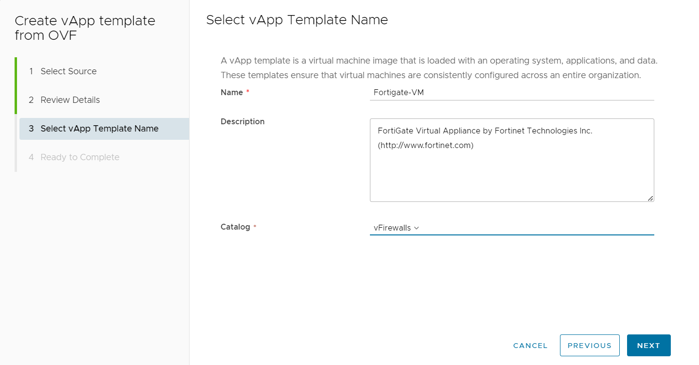

!!! note
        If you have no catalog available for selection you will need to first create one.

!!! note
        There is also an option to upload a OVF via a URL. This option is not recommended and as such is not discussed in this document.

Clicking **NEXT** and finally **FINISH** will see the virtual image uploaded to your **catalog**. You should the following message in your Recent Tasks.

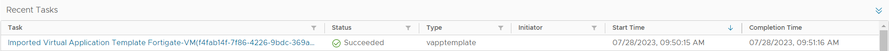

### Deploy BYOFW Networking and Appliance

Login to your AUCloud **Organisation** and then select the **Virtual Data Center** into which you wish to install the BYOFW virtual appliance.

Once you have entered your **Virtual Data Center** you will need to create, for each subnet you want to logically sit behind the BOYFW, **isolated networks**. You will also need to create a **routed network** for transit between the BYOFW device and Edge Gateway.

From the left hand side menu, select **Networks** and then select **NEW**.

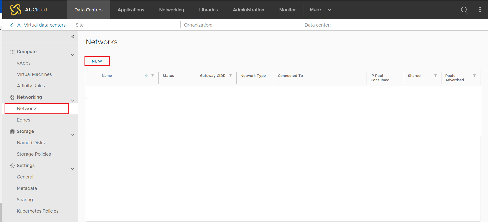

The **New Organisation VDC Network** wizard will open.

Select the **Current Organisational Virtual Data Center** for the **Scope** setting and select **NEXT**.

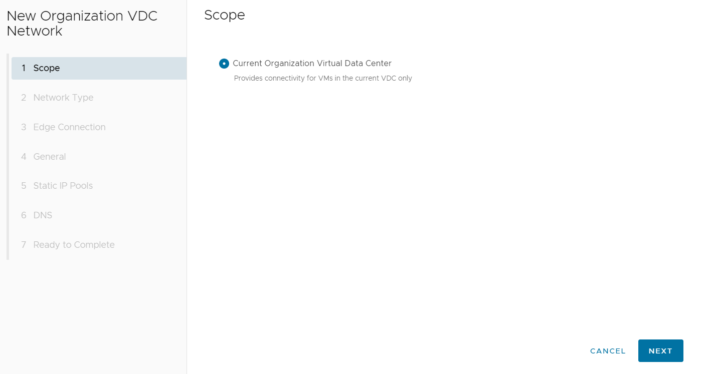

For Network Type, select **Routed** and then select **NEXT**.

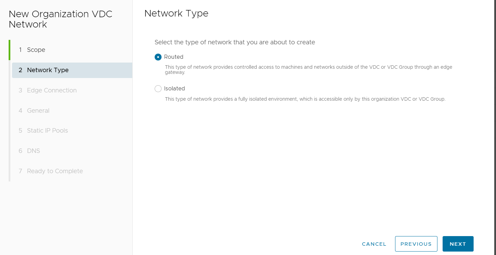

Select the **Edge Gateway** to which the routed network will connect and select **NEXT**.

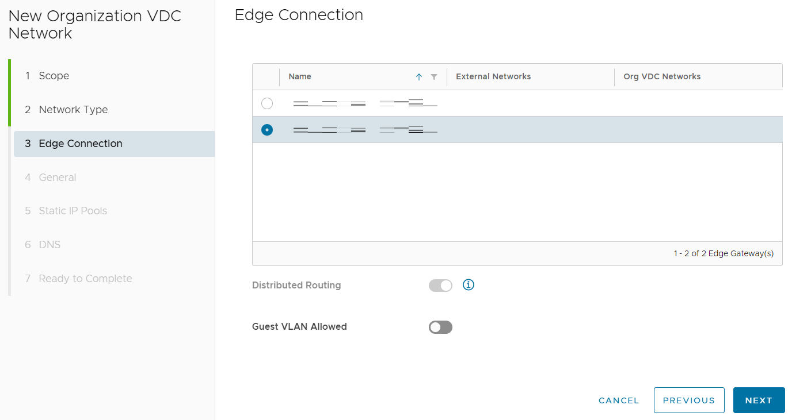

Provide the network with an appropriate name (including the word transit in the name will help keep track of this network's purpose) and **Gateway**.

The **Gateway** address provided will be the **Default Gateway** used by the BYOFW appliance to reach outside networks such as the Internet and will be assigned to the **Edge Gateway**.

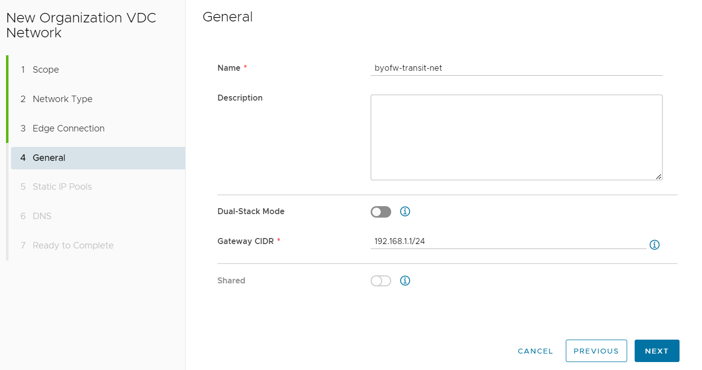

Leave the settings blank under **Static IP Pools** and select **NEXT**. Leave the settings blank under **DNS** and select **NEXT**. Select **FINISH** on the **Ready to Complete** screen.

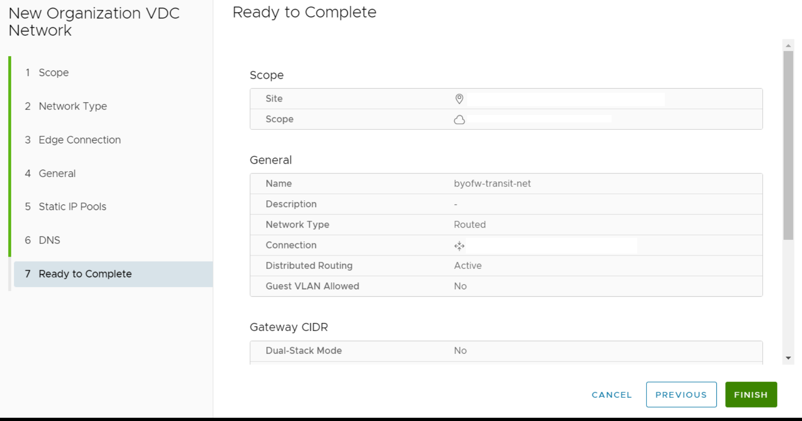

Next create any **isolated networks** for subnets that will sit behind the BYOFW device (such as the Web and Management networks in the topology diagram shown at the beginning of this document).

Select **NEW** under the Networks screen to bring up the **New Organization VDC Network** wizard once more. Select the **Current Organisational Virtual Data Center** for the **Scope** setting and select NEXT.

For the Network Type, select **Isolated** and then select **NEXT**.

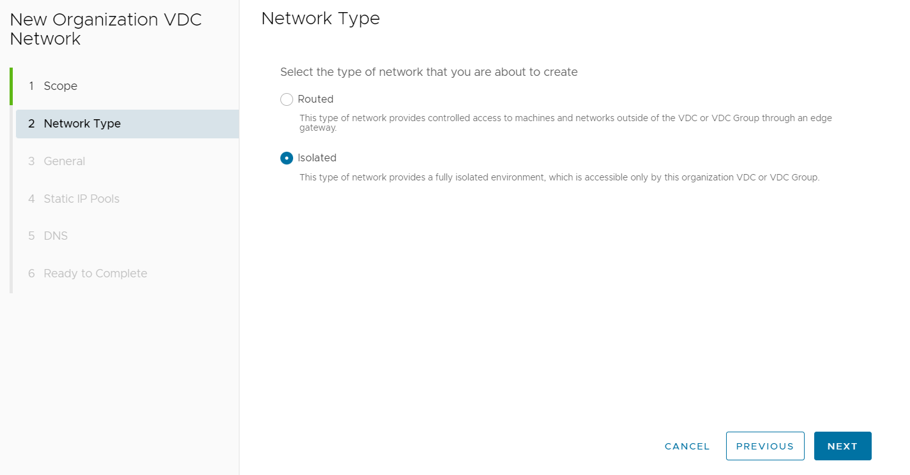

Enter a **Name** and **Gateway** for the network. The **Gateway** will be the IP address you will assign to the BYOFW Virtual appliance on this network. Select **NEXT** once complete.

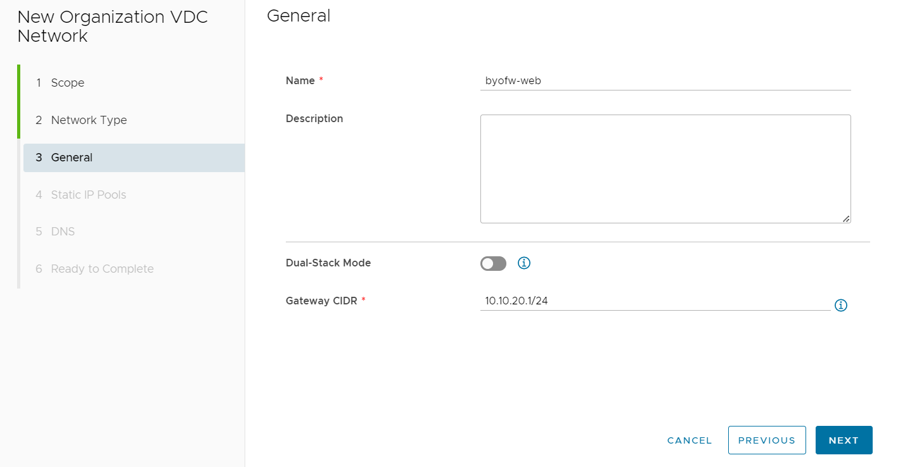

Leave the settings blank under **Static IP Pools** and select **NEXT**. Leave the settings blank under **DNS** and select **NEXT**. Select **FINISH** on the **Ready to Complete** screen.

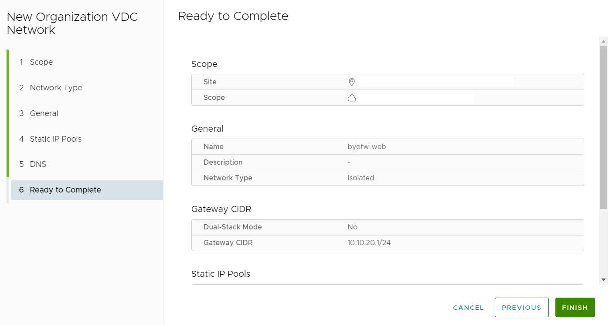

Repeat the above steps to create any additional **isolated networks** required for your particular topology.

An example of a **routed** transit network and two **isolated** networks is shown below.

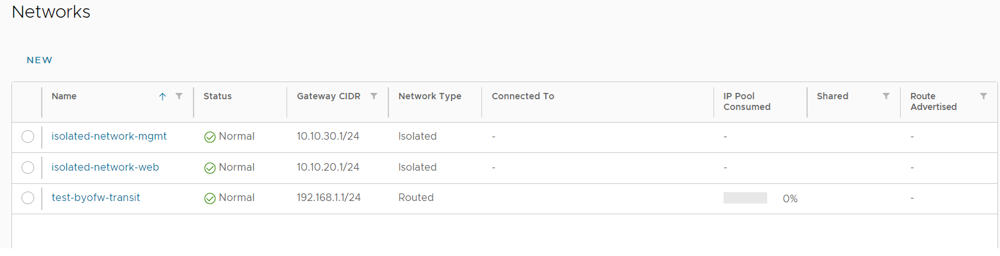

Within the **Canberra Sovereignty Zone (CSZ)** and the **Sydney Sovereignty Zone (SSZ)**, there is a limitation on creating static routes within a tenancy. As such AUCloud personnel must add the required static routes for public IP addressing over the routed transit network. Please raise a support case and advise what public IP addresses will be routed to the **BYOFW** device as well as the **next hop IP address** that should be used (this will be the IP address assigned to the **BYOFW** device on the **routed** transit network. From the example above the **next hop** would be on the **192.168.1.0/24** network and would be the address planned for assignment to the **BYOFW** device. It would **not** be the 192.168.1.1 address as this is assigned to the Edge Gateway).

Within the **Brisbane Sovereignty Zone (BSZ)** and the **Melbourne Sovereignty Zone (MSZ)**, this limitation is not present and static routes can be created within tenancies.

To create a static route, select **Edges** and then the name of your **Edge Gateway**.

On the left hand side menu under **Routing**, select **Static Routes** and then select **NEW**.

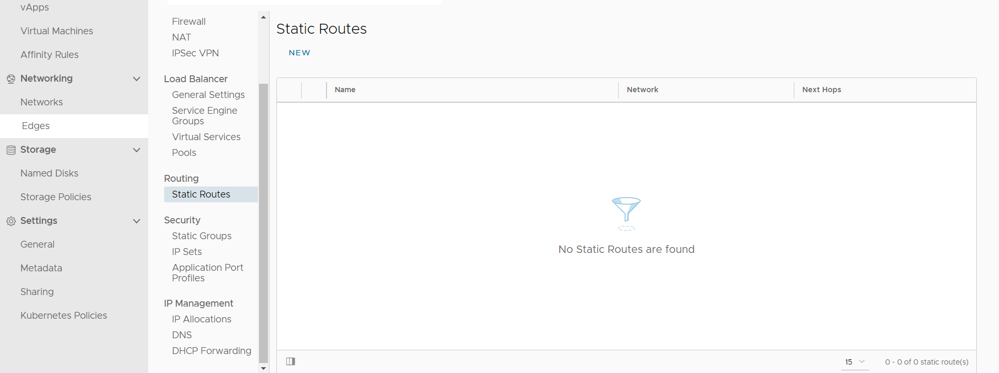

Enter a **Name** and **Network** under General. The **Network** will be one of the public IP addresses you were assigned during on-boarding and must be assigned a prefix-length of /32.

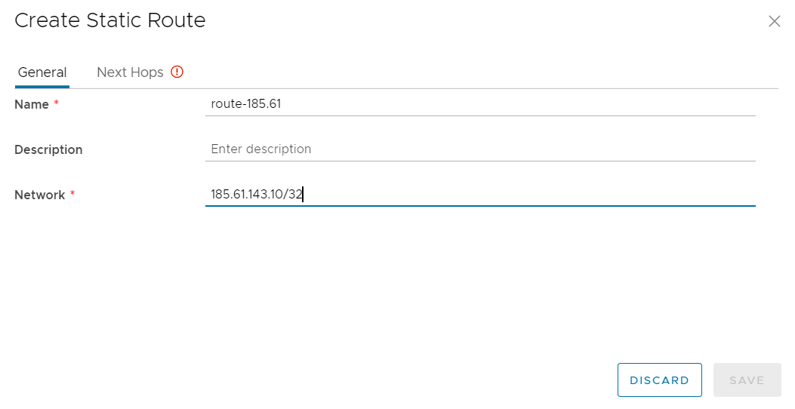

Select **Next Hops** and enter the **IP address of the Next Hop** (which will be the IP address assigned to the **BYOFW** device on the **routed** transit network).

Select a **Scope** of the **routed** transit network created earlier and select **SAVE** once complete.

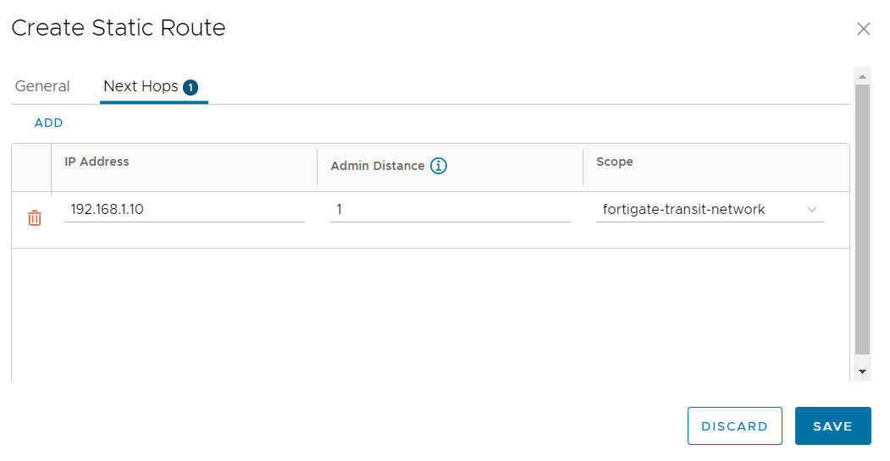

Now that the networks have been deployed it’s time to provision a BYOFW appliance from the previously uploaded image file(s).

Navigate to **Compute>vApps** and select **New>Add vApp From Catalog**. This will present the **Create vApp from Template** configuration wizard.

Under **Select Template to Import** scroll down and select the vApp Template you imported earlier and then select **NEXT**.

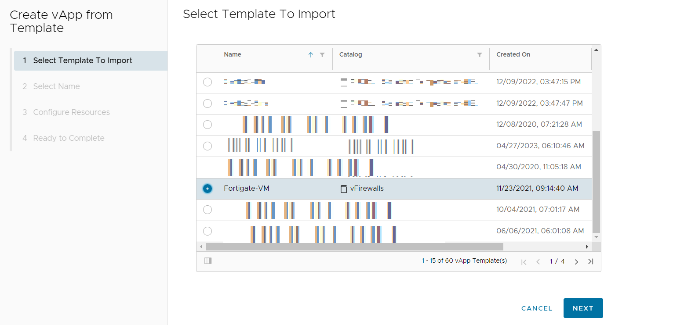

Accept any **EULA** provided by the BYOFW vendor and select **NEXT** (this may not be applicable in every case).

Provide a **Name** for the BYOFW and then select **NEXT**.

Under **Configure Resources** select the amount of storage required and select **NEXT**.

Under **Compute Policies** select the required amount of **CPU** and **Memory**, and then select **NEXT**.

If necessary, make changes to the amount of storage required under the **Customize Hardware** setting.

Under **Configure Networking**, select the appropriate network to connect to each NIC on the BYOFW device. The screenshot below shows the first NIC connecting to the **routed** transit network and the second and third NICs connecting to **isolated networks**. If the BYOFW device lists more NICs than are required, these additional NICs can be deleted before the vApp is powered on, if necessary.

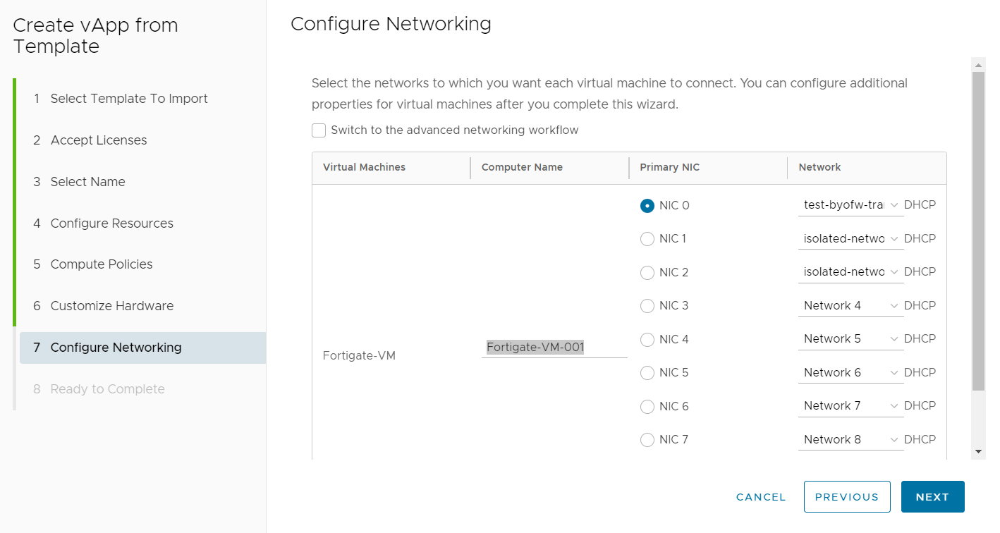

Select **FINISH** under **Ready to Complete** to deploy the BYOFW device.

Once the vApp has been deployed it must be powered on. Select **ACTIONS>Power>Start** to power on the BYOFW vApp.

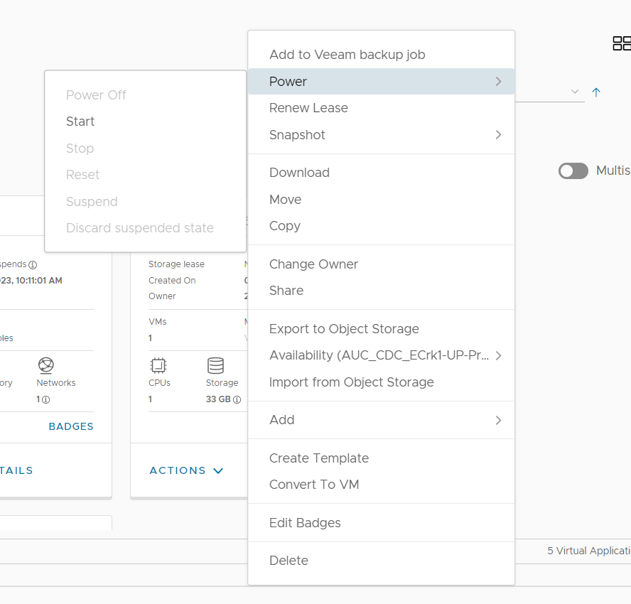

Once powered on you can access the web console of the BYOFW device and complete any configuration necessary to suit your architecture. Assign VMs to the appropriate isolated network located logically behind the BYOFW virtual appliance to obtain all the functionality of the BYOFW solution. The public IP addresses provided can be used in Source and Destination NAT policies, providing the necessary external access from and into the tenancy.
