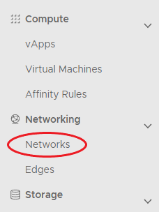
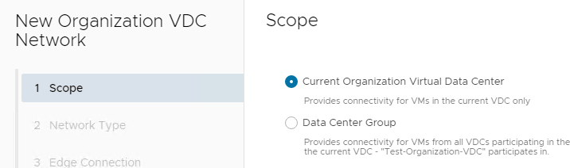

### Overview

An organisation virtual data centre network enables its virtual machines (VMs) to communicate with each other or to provide access to external networks. A single VDC can have multiple networks.

There are two network flavours, isolated and routed:

- An isolated (internally connected) network is one that only VMs within the VDC can connect to. Creation of isolated networks is documented in [Create an Isolated VDC Network.](./create_an_isolated_vdc_network.md)
- A routed network (externally connected) provides access to machines and networks outside the VDC via the edge gateway. You can have up to nine usable routed networks per VDC. This guide describes how to create a routed VDC network.

Additional information can be viewed on VMware Docs - [Add a Routed Organization Virtual Data Center Network.](https://docs.vmware.com/en/VMware-Cloud-Director/10.4/VMware-Cloud-Director-Tenant-Portal-Guide/GUID-74C4D27F-9E2A-4EB2-BBE1-CDD45C80E270.html)

### Creating a Routed VDC Network

To create a Routed VDC Network, use the following steps:

1. In the VMware Cloud Director *Virtual Datacenters* dashboard, select the VDC in which you want to create the network.

1. In the left navigation panel, select **Networks**.

	

1. Click **NEW**.

	

1.  In the *Scope* page of the *New Organization VDC Network* dialog box, select **Current Organization Virtual Data Center** then click **Next**.

	

1.  In the *Network Type* page of the *New Organization VDC Network* dialog box, select **Routed** then click **Next**.

	
	
1. In the *Edge Connection* page, select the edge gateway that you want your network to connect to then click **Next**.

	

1. In the *General* page, enter a **Name** and **Description** for the network. In the **Gateway CIDR** field, the gateway address for the network, then click **Next**.

	

1. In the **Static IP Pools** field, enter a range of addresses to be consumed by the VMs connecting to the network, then click **Add**.

	!!! note
	
		- As an example, if you give the gateway address as 192.168.0.1/24, you may then want to create a Static IP Pool of 192.168.0.10-192.168.0.100. This will give you a pool of 91 IP addresses to assign to machines within your network. You can always increase this later if needed.
		- You can add multiple IP pools.
		
	

1. When you're done, click **Next**.

1. In the *DNS* page, enter DNS information if possible then click **Next**.

	

1. If a *Segment Profile Template* is required, choose the template, and click **Next**.

1. Verify Details and click **Finish**.