## Overview

The ESG included as part of a Virtual Organisation (vOrg) provides connectivity between internal and external Organisation VDC Networks. It is a virtual appliance that provides multiple features, including:

* Dynamic Host Configuration Protocol (DHCP)
* Virtual Private Network (VPN)
* Network Address Translation (NAT)
* Firewall
* Load Balancing

The following diagram shows the ESG acting as a router and a Firewall. Internal networks cannot communicate with external (public) networks unless the ESG has been correctly configured:

Additional information on the Edge Services Gateway can be viewed on VMware Docs - [Managing NSX-T Data Center Edge Gateways.](https://docs.vmware.com/en/VMware-Cloud-Director/10.4/VMware-Cloud-Director-Tenant-Portal-Guide/GUID-45C0FEDF-84F2-4487-8DB8-3BC281EB25CD.html)

## Creating Virtual Network Infrastructure

Virtual compute and networking infrastructure must be created before ESG configuration.

Further information on creating Networks inside the VDC are located:

* [How to create a routed VDC Network](./create_a_routed_vdc_network.md)
* [How to create an isolated VDC Network](./create_an_isolated_vdc_network.md)

    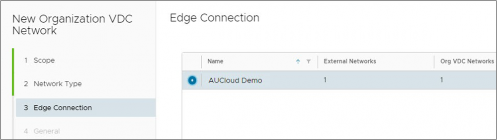

## Working with IP Address Groups

IP address group (IP Set) is a way to group a list of IP addresses or a range of IP addresses. You can use IP address groups while defining Edge Firewall Rules and distributed Firewall Rules.

IP Sets are a group of objects to which the Firewall Rules apply. Combing multiple objects into IP Sets helps reduce the total number of Firewall Rules to be created.

Additional information can be viewed on VMware Docs - [Add an IP Set to an NSX-T Data Center Edge Gateway.](https://docs.vmware.com/en/VMware-Cloud-Director/10.4/VMware-Cloud-Director-Tenant-Portal-Guide/GUID-6A0E39F5-123C-4429-ACAC-31025A364411.html)

To setup an IP set use the following steps:

1. In the VMware Cloud Director *Virtual Datacenters* dashboard, select the VDC in which you want to create the IP Set.

1. In the left navigation panel, click **Edges**.

    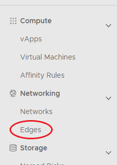

1. Select the ESG for configuration, and a new menu will appear.

    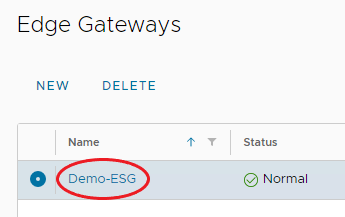

1. You can also select the ESG, via the **Networking** Tab on the top navigation menu, then selecting **Edge Gateways**, and choosing the Edge Gateway.

    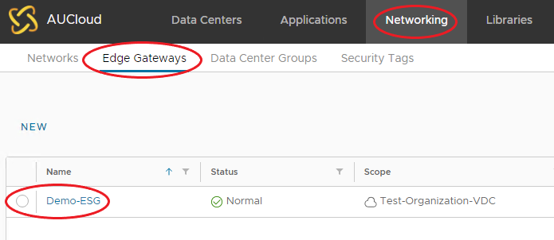

1. From the menu bar on the left under **Security**, select **IP Sets**, then select **New**.

    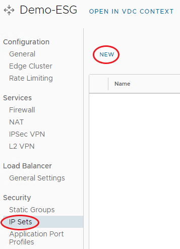

1. Enter a **Name**, optionally a **description**, and **IP Address** information in the following format:

    * IPv4 IP Address
    * IPv6 IP Address
    * IP Range, or CIDR

1. When complete, click **Add**, after all addresses are added, click **Save**.

    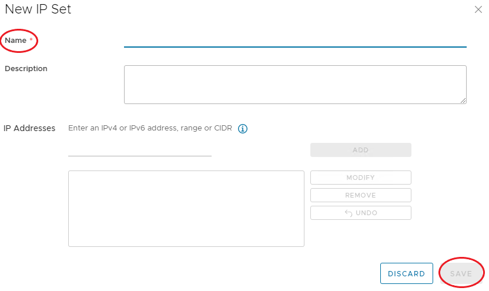

1. Repeat the above steps to create as many IP Sets as required.

## Application Port Profiles

Application port profiles include a combination of a protocol and a port, or a group of ports, that is used for firewall and NAT services on the edge gateway.

In addition to the default port profiles that are pre-configured for NSX-T Data Center, you can create custom application port profiles.

When you create a custom application port profile on an edge gateway, it becomes visible to all the other NSX-T Data Center edge gateways that are in the same organization VDC.

To create custom Application Port Profiles, use the following steps:

1. In the VMware Cloud Director *Virtual Datacenters* dashboard, select the VDC in which you want to create the Application Port Profile.

1. In the left navigation panel, click **Edges**.

    
	
1. Select the ESG for configuration, and a new menu will appear.

    

1. You can also select the ESG, via the **Networking** Tab on the top navigation menu, then selecting **Edge Gateways**, and choosing the Edge Gateway.

    
	
1. From the menu bar on the left under **Security**, select **Application Port Profiles**, under *Custom Applications* select **New**.

    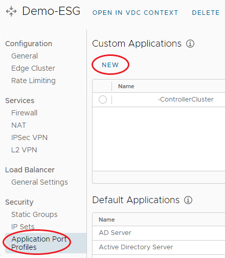
	
1. Enter a **Name**, optionally a **Description**.

1. Choose **Protocol** and enter the required **Ports**.

1. Click **Add Port Profile** to add more ports as required.

1. When complete, click **Save**.

    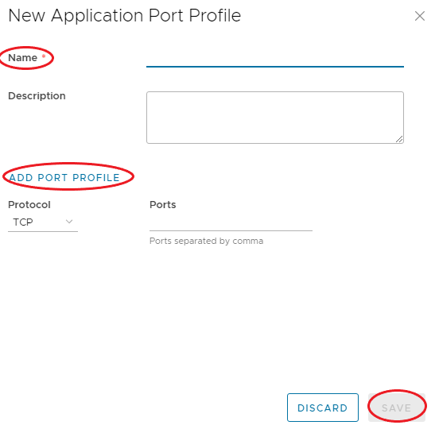

## Firewall Rules

VMware Cloud Director provides a fully featured Layer 3 Firewall (Edge Services Gateway) to control transit from inside to outside security boundary, and within the various virtual datacenters (VDC) networks you create.

Additional information can be viewed on VMware Docs - [Add an NSX-T Data Center Edge Gateway Firewall Rule.](https://docs.vmware.com/en/VMware-Cloud-Director/10.4/VMware-Cloud-Director-Tenant-Portal-Guide/GUID-BE02B1A7-9191-4520-A248-D2A7D2CA640E.html)

When creating Firewall Rules, **IP Sets** are required, information on **IP Sets** is located [above.](#working-with-ip-address-groups)

When creating Firewall Rules, **Application Port Profiles** may be required, information on **Application Port Profiles** is located [above.](#application-port-profiles)

To create Firewall rules, use the following steps:

1. In the VMware Cloud Director *Virtual Datacenters* dashboard, select the VDC that contains the Edge Services Gateway in which you want to create the Firewall Rules.

1. In the left navigation panel, click **Edges**.

    

1. Select the ESG for configuration, and a new menu will appear.

    

1. You can also select the ESG, via the **Networking** Tab on the top navigation menu, then selecting **Edge Gateways**, and choosing the Edge Gateway.

    

1. From the menu bar on the left under **Services**, select **Firewall**, then select **Edit Rules**.

    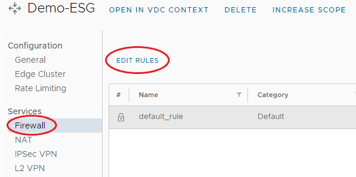

    !!! note

        For the first created Firewall Rule, **New on Top** will be the only available option.

1. For the new Firewall Rule, specify a **Name**.

1. Under applications, click the pencil, enable **Choose a specific application**, choose what is required, and click **Save**.

    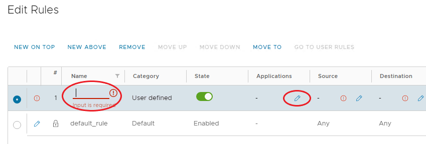
    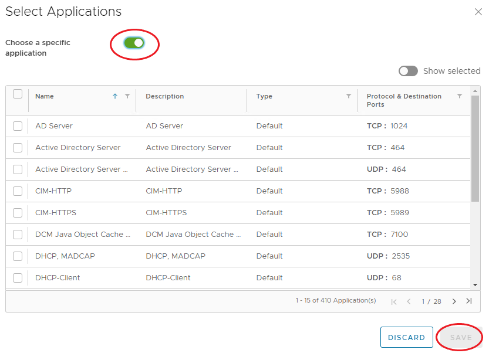

1. Under **Source** and **Destination**, click the pencil, choose the IP Set created above, or enable **Any**, and click **Keep**.

    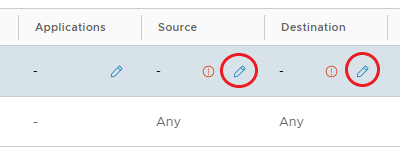
    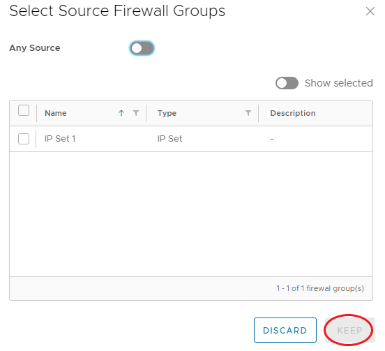

1. Under Action, chose one of the following:

    * Allow
    * Drop
    * Reject

    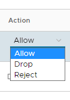

1. Under IP Protocol, chose one of the following:

    * IPv4
    * IPv6
    * IPv4 and IPv6

    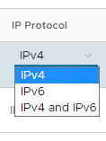

1. Enable Logging if required.

1. Write a Comment if required.

1. Repeat above steps for multiple Firewall Rules, when complete, click **Save**.

## How to find your allocated external IP Address

To route traffic to your external network (for example internet) and configure settings such as NAT rules, you need to know your external IP addresses. AUCloud standard IP address allocation is 2 Public IP addresses per Org vDC.

To find your allocated IP, use the following steps:

1. In the VMware Cloud Director *Virtual Datacenters* dashboard, select the VDC that contains the Edge Services Gateway in which you want to find the external IP Addresses.

1. In the left navigation panel, click **Edges**.

    
	
1. Select the ESG for configuration, and a new menu will appear.

1. You can also select the ESG, via the **Networking** Tab on the top navigation menu, then selecting **Edge Gateways**, and choosing the Edge Gateway.

    
	
1. From the menu bar on the left under **IP Management**, select **IP Allocations**.

1. The Allocated IP will be listed under **IP Range**.

    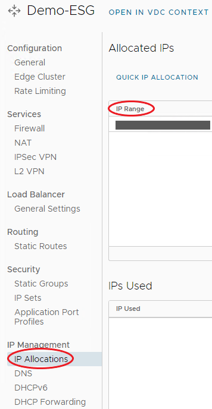

## NAT Rules

Network Address Translation (NAT) allows the source or destination IP address to be changed to enable traffic to transition through a router or gateway.

You can use three types of NAT within your Edge Services Gateway (ESG):

* Destination NAT (DNAT) - changes the destination IP of the packet
* Source NAT (SNAT) - changes the source IP of the packet
* Reflexive (stateless NAT) - source packets undergo destination address rewriting, and destination packets undergo source address rewriting

There are two types of NAT within your Edge Services Gateway (ESG):

* SNAT (required for outbound traffic)
* DNAT (required for inbound traffic)

For a virtual machine (VM) to access an external network resource from its virtual data centre (VDC), the IP address of its network needs translation to the public internet IP addresses provided by AUCloud. (SNAT rule)

!!! note

    For both DNAT and SNAT:

    - The NAT rule will be applied to the ESG, rather than to the internal VDC network.
    - Firewall rules permitting the associated traffic will also need to be created.

Additional information can be viewed on VMware Docs - [Add an SNAT or a DNAT Rule to an NSX-T Edge Gateway.](https://docs.vmware.com/en/VMware-Cloud-Director/10.4/VMware-Cloud-Director-Tenant-Portal-Guide/GUID-9E43E3DC-C028-47B3-B7CA-59F0ED40E0A6.html)

To add NAT rules, use the following steps:

1. In the Cloud Director *Virtual Datacenters* dashboard, select the VDC that contains the Edge Services Gateway in which you want to create the NAT Rules.

1. In the left navigation panel, click **Edges**.

    
	
1. Select the ESG for configuration, and a new menu will appear.

1. You can also select the ESG, via the **Networking** Tab on the top navigation menu, then selecting **Edge Gateways**, and choosing the Edge Gateway.

    
	
1. From the menu bar on the left under **Services**, select **NAT**, then select **New**.

    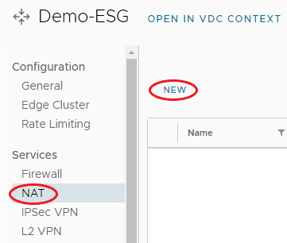
	
1. For the new NAT Rule, specify a **Name**, add a description if required and chose the required **Interface Type**.

    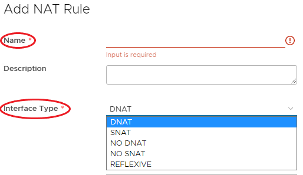
	
1. Enter the **External IP** and **Internal IP**. Enter an **External Port** if required, if an **Application** is required, use the Pencil Icon.

    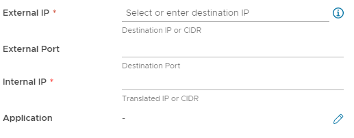

1. Click **Save** once information has been filled out, repeat if further NAT Rules are required.

### DNAT Rule Configuration

When configuring a DNAT rule, you must also navigate to the advanced settings and change the firewall match to "Match **External** Address" in order for the external IP address to be translated to the internal IP.

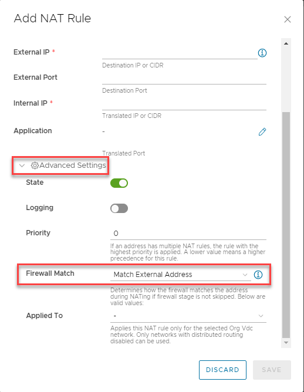

## Static Routes

!!! note

    Static route configuration is currently available only in the Melbourne and Brisbane Sovereignty Zones

Static routing allows you to configure your Edge Services Gateway (ESG) with knowledge of other networks which are not directly connected to it. It is particularly useful if you need to:

- route between virtual data centres (VDCs) in the same virtual organisation (vOrg), or
- route traffic to vApp networks.

For example, you may have a vApp network 192.168.8.0/24 routed to a VDC network called *Front End Network*. You could create a static route to enable traffic to get to the outside IP of the vApp edge at 192.168.4.33 (a NAT will exist there).

Additional information can be viewed on VMware Docs - [Configure Static Routing on an NSX-T Data Center Edge Gateway.](https://docs.vmware.com/en/VMware-Cloud-Director/10.4/VMware-Cloud-Director-Tenant-Portal-Guide/GUID-2E15ADD4-FC60-46B6-B634-481C16C473B9.html#GUID-2E15ADD4-FC60-46B6-B634-481C16C473B9)

To create a Static Route, use the following steps:

1. In the VMware Cloud Director *Virtual Datacenters* dashboard, select the VDC that contains the Edge Services Gateway in which you want to create Static Routes.

1. In the left navigation panel, click **Edges**.

    

1. Select the ESG for configuration, and a new menu will appear.

1. You can also select the ESG, via the **Networking** Tab on the top navigation menu, then selecting **Edge Gateways**, and choosing the Edge Gateway.

    
	
1. From the menu bar on the left under **Routing**, select **Static Routes**, then select **New**.

    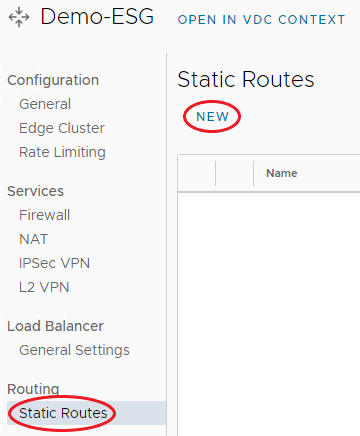
	
1. On the **General** tab, enter a **Name**, a **Description** if required, and a **Network**.

    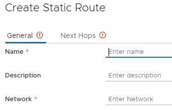
	
1. On the **Next Hops** tab, enter an **IP Address**, alter **Admin Distance** if required, and chose a Network via **Scope** if required. Click Save once complete.

    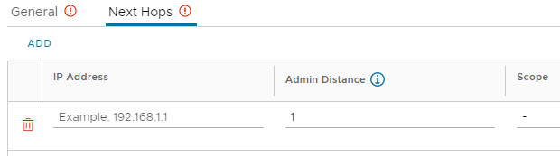
	
## Creating a DHCP Pool

With virtual data centre (VDC) networks, you have the option of creating an IP pool of addresses to be assigned automatically or manually (static IP pool). These addresses are injected into virtual machines (VMs) via VMware Tools during Guest Customisation. They appear in the usual places in Windows and Linux where you would interrogate IP settings and show as static addresses.

In some situations, you may require true DHCP functionality in your VMs to show IP addresses as dynamically defined. As with an IP pool, you are defining a non-overlapping range of IP addresses to use on the network.

Prerequisites:

Network created and joined to the ESG:

- How to create an Isolated VDC Network - **TODO link**
- How to create a routed VDC Network - **TODO link**

To create a DHCP Pool, use the following steps:

1. In the VMware Cloud Director *Virtual Datacenters* dashboard, select the VDC that contains the Networks in which you want to create a DHCP Pools.

1. In the left navigation panel, click **Networks**.

    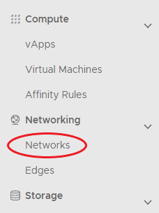
	
1. Chose the required Network.

1. You can also select the Network, via the **Networking** Tab on the top navigation menu, then selecting **Networks**, and choosing the Network.

    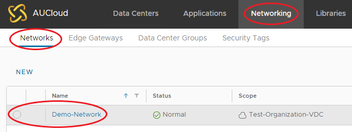
	
1. Under **IP Management**, click **DHCP**.

1. If DHCP is not enabled, click **Activate**.

    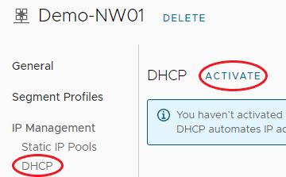
	
1. On the General Settings tab:

	- the **Subnet** will be the Network chosen above.
	- for **DHCP Mode**, chose **Network** for Isolated Networks, or **Gateway/Relay** for Routed Networks.
	- **Listener IP Address** will be set automatically.
	- Adjust the **Lease Time** if required and click Next.
	
		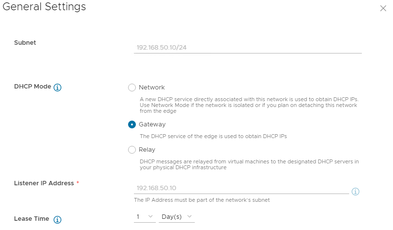
	
1. On the **DHCP Pools** tab:

	- Enter an **IP Range** as required.
	- If further DHCP Pools are required, click **Add**.
	- When complete, click **Next**.
	
		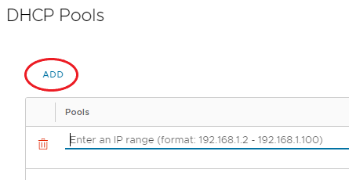
	
1. On the **DNS through DHCP** tab:

	- Enter DNS Server 1 and DNS Server 2 as required.
	- When complete, click **Next**.
	
		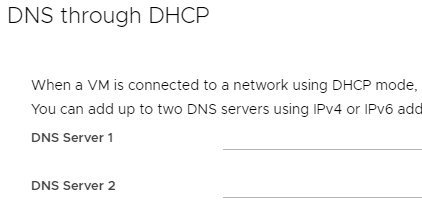

1. On the **Review and Complete** Tab:

	- Verify all settings.
	- When Complete, click **Finish**.
	
1. Repeat if further DHCP Pools are required for the same, or different networks.

## Configuring an IPSec VPN

VMware Cloud Director supports the following types of site-to-site VPN:

- Another edge gateway in the same organisation
- An edge gateway in another organisation
- A remote network offering IPsec VPN endpoint capability

Depending on the type of connection required, you will need to:

- complete IP addressing for both ends together with a shared secret, and
- indicate which virtual data centre (VDC) networks can connect to the VPN link.

!!! note

	The Edge Services Gateway (ESG) supports **site-to-site VPN only** and does not support VPN client or SSL VPN. If a VPN client is required, you will need to deploy a solution for the remote access VPN concentrator such as a Palo Alto, F5 or Fortinet.

Additional information can be viewed on VMware Docs - [Configure NSX-T Policy-Based IPSec VPN.](https://docs.vmware.com/en/VMware-Cloud-Director/10.4/VMware-Cloud-Director-Tenant-Portal-Guide/GUID-90B5FC50-F39E-461B-A854-7AD19353621E.html)

Prerequisites:

- Locate external IP addresses to use as your tunnel endpoint address, documented [above.](#how-to-find-your-allocated-external-ip-address)

To configure an IPSec VPN, use the following steps:

1. In the VMware Cloud Director *Virtual Datacenters* dashboard, select the VDC that contains the Edge Services Gateway in which you want to create the IPSec VPN.

1. In the left navigation panel, click **Edges**.

    
	
1. Select the ESG for configuration, and a new menu will appear.

1. You can also select the ESG, via the **Networking** Tab on the top navigation menu, then selecting **Edge Gateways**, and choosing the Edge Gateway.

    

1. From the menu bar on the left under **Services**, select **IPSec VPN** and click **New**.

    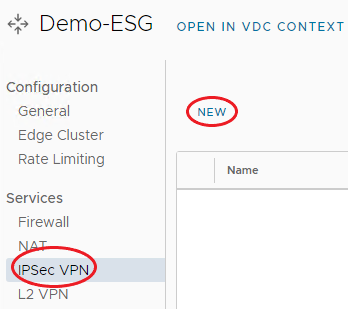
	
1. On the **General Settings** page, enter a **Name**, a **Description** if required, enable **Logging** if required, and click **Next**.

	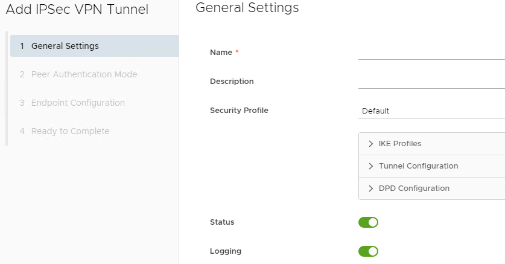

	!!! note

		The **Security Profile** cannot be edited until the IPSec VPN has been successfully created.

1. On the **Peer Authentication Mode** page, for the **Authentication Mode**, chose either a Pre-Shared Key or a Certificate.

	- **Pre-Shared Key** - enter a Pre-Shared key and click **Next**.
	
		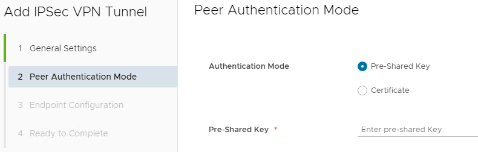
		
	- **Certificate** - chose an uploaded Server Certificate and CA Certificate and click **Next**.
	
		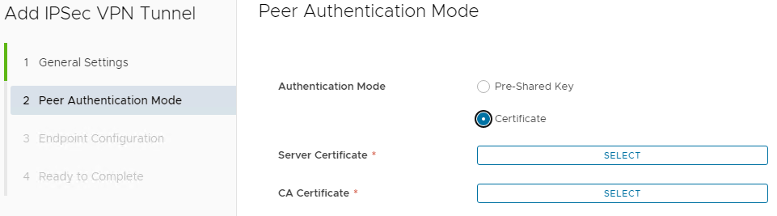
		
1. On the **Endpoint Configuration** page, enter required details, information on configurable fields can be viewed [below.](ipsec-vpn-configurable-options) 

    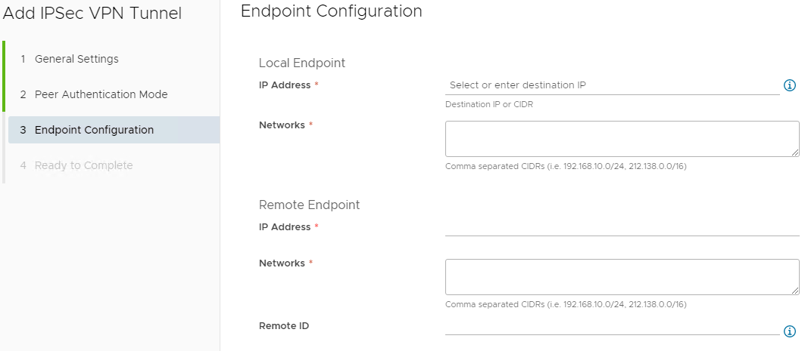

1. Once complete, click **Next**.

1. On the **Ready to Complete** page, review the settings, and click **Finish**, if the tunnel fails to create, review the settings and try again.

    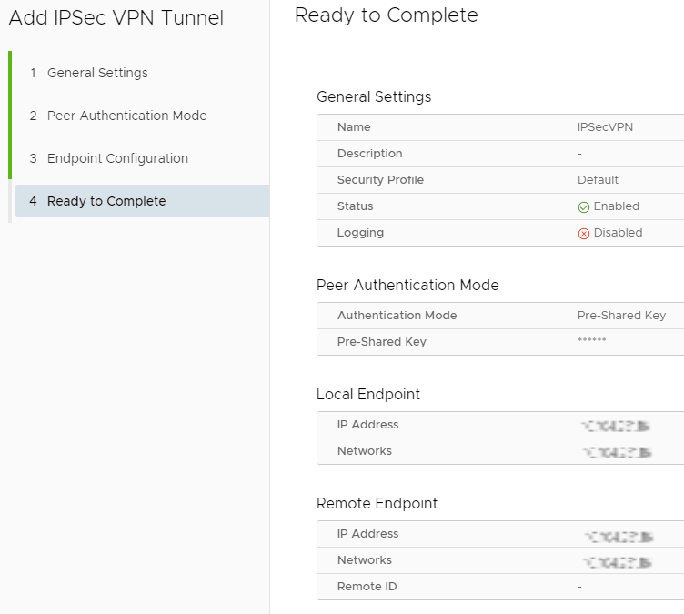

### Customising Security Profile

If the Default Security Profile needs to be edited after the IPSec VPN has been created, use the following steps:

1. On the ESG, under **Services**, Click **IPSec VPN**, you should see the newly created IPSec VPN.

1. Click the IPSec VPN, and click **Security Profile Customization**.

    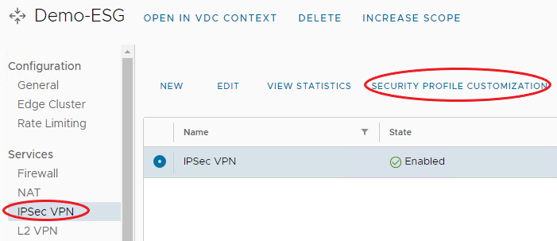
	
1. Editing the required settings using IPSec VPN Configurable Options [below.](#ipsec-vpn-configurable-options)

1. When complete, click **Save**.

    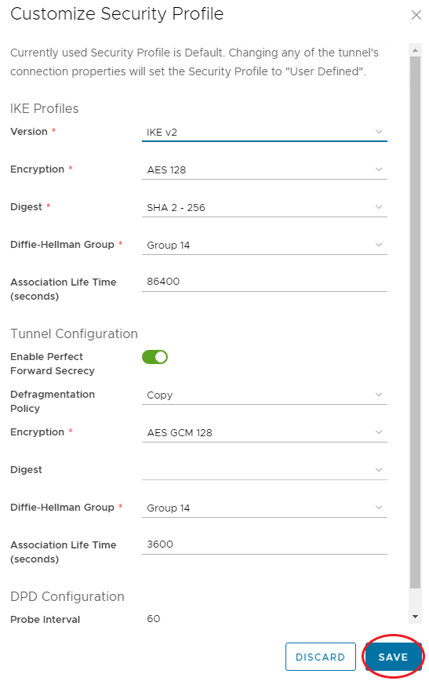

### Creating a second VPN Gateway

You now need to create the endpoint of the VPN tunnel. If this is a different VDC or vOrg, go through the steps described above again to create the tunnel. When completed, you can change your firewall settings and validate the connection. Refer to Firewall rules [above,](#firewall-rules) and Validating the tunnel [below.]#validating-the-tunnel

!!! note

	If you are connecting to an external datacenter, you will need to set up the tunnel on that premises. This is **outside of the scope** of this article and will depend on your specific on-premises network configuration.
	
#### Configure the ESG Firewall

When the VPN tunnel is up and running, you will need to create firewall rules on the ESG for any traffic passing over the tunnel, refer to Firewall Rules [above.](#firewall-rules)

!!! note

	- You need to create a firewall rule for both directions - from datacenter to VDC and from VDC to datacenter.
	- For datacenter to VDC, set:
		- Source as the source IP range for your external VDC/datacenter network
		- Destination as the destination IP range for your VDC network
	- For VDC to datacenter, set:
		- Source as the source IP range for your VDC network
		- Destination as the destination IP range for your datacenter/VDC network
		
### Configure the external datacenter gateway firewall

When the VPN tunnel is up and running, you may need to create firewall rules and routes on your on-premises gateway or other internal firewall for traffic passing over the tunnel.

This is **outside of the scope** of this article and will depend on your specific on-premises network configuration.

### Validating the tunnel

When both ends of the IPSec tunnel are configured, the connection should start without any issues.

To verify the tunnel status in VMware Cloud Director, use the following steps:

1. On the ESG, under **Services**, click **IPSec VPN**, you should see the newly created IPSec VPN.

1. Click the IPSec VPN, and click **View Statistics**.

    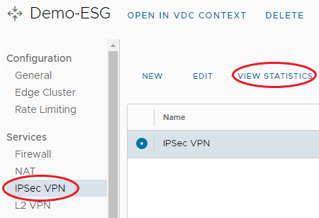
	
1. On the **"IPSec VPN" Statistics** page, you will be able to view the status, and fail reason. There is advanced traffic statistics under **Traffic and Errors**. When done, click **Ok**.

    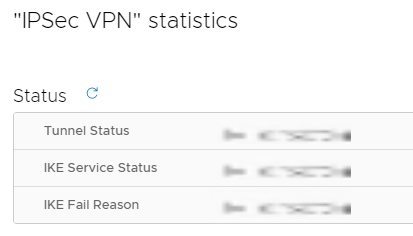

### IPSec VPN Configurable Options

The following tables will outline the configurable options when creating or configuring an IPSec VPN.

Additional information can be viewed on VMware Docs - [Customize the Security Profile of an IPSec VPN Tunnel.](https://docs.vmware.com/en/VMware-Cloud-Director/10.4/VMware-Cloud-Director-Tenant-Portal-Guide/GUID-B2A795E7-32B7-48B7-BEA6-4E311096608E.html)

#### Endpoint Configuration

| Heading             | Field           | Description |
| -----------         | -----------     | ----------- |
| Local Endpoint      | IP Address      | The external IP of your ESG refer to How to find your allocated external IP Address [above.](#how-to-find-your-allocated-external-ip-address) |
|                     | Networks        | The organisation networks that can access the VPN (separate multiple local subnets with commas). Must be entered in CIDR format. |
| Remote Endpoint     | IP Address      | The external IP of your remote site or on-premises firewall or edge where VPN is being set up. |
|                     | Networks        | This is the subnet on your on-premises network that you want to make accessible from your AUCloud VDC. |
|                     | Remote ID       | Unique identifier, will default to the Remote Endpoint IP Address. |

#### Security Profile

| Heading              | Field                | Description |
| -----------          | -----------          | ----------- |
| IKE Profiles         | Version              | The IKE Version. |
|                      | Encryption           | Supported encryption algorithm to use during the Internet Key Exchange (IKE) negotiation. |
|                      | Digest               | Secure hashing algorithm to use during the IKE negotiation. |
|                      | Diffie-Hellman Group | Cryptography scheme that allows the peer site and the edge gateway to establish a shared secret over an insecure communications channel. |
|                      | Associated Life Time | (Optional) number of seconds before the IPSec tunnel needs to reestablish. |
| Tunnel Configuration | Enable Perfect Forward Secrecy | Enable this if your on-premises/remote site has this capability. |
|                      | Defragmentation Policy | Helps to handle defragmentation bits present in the inner packet. Copy - Copies the defragmentation bit from the inner IP packet to the outer packet. Clear - Ignores the defragmentation bit present in the inner packet. |
|                      | Encryption           | Supported encryption algorithm to use during the Internet Key Exchange (IKE) negotiation. |
|                      | Digest               | Secure hashing algorithm to use during the IKE negotiation. |
|                      | Diffie-Hellman Group | Cryptography scheme that allows the peer site and the edge gateway to establish a shared secret over an insecure communications channel. |
|                      | Associated Life Time | (Optional) number of seconds before the IPSec tunnel needs to reestablish. |
| DPD Configuration    | Probe Interval	      | (Optional) default number of seconds for dead peer detection. |

## Configure a Load Balancer

As an Organisation Administrator, by configuring virtual services which distribute traffic across multiple server pools, you can balance the workloads in your datacenters that are backed by NSX-T Data Center.

VMware Cloud Director supports L4 and L7 load balancing that you can configure on an NSX-T Data Center edge gateway.

Level 4 load balancing (L4) directs traffic based on data from network and transport layer protocols, such as IP address and TCP port.

Level 7 load balancing (L7) distributes traffic based on attributes such as HTTP header, uniform resource identifier, SSL session ID, and HTML form data.

Additional information can be viewed on VMware Docs - [Working with NSX Advanced Load Balancing.](https://docs.vmware.com/en/VMware-Cloud-Director/10.4/VMware-Cloud-Director-Tenant-Portal-Guide/GUID-92A0563D-A272-4958-B732-9C35901D9DB8.html)

To enable a load balancer, use the following steps:

1. In the VMware Cloud Director *Virtual Datacenters* dashboard, select the VDC that contains the Edge Services Gateway in which you want to create a Load Balancer.

1. In the left navigation panel, **click Edges**.

    
	
1. Select the ESG for configuration, and a new menu will appear.

    

1. You can also select the ESG, via the **Networking** Tab on the top navigation menu, then selecting **Edge Gateways**, and choosing the Edge Gateway.

    
	
1. From the menu bar on the left under **Load Balancer**, select **General Settings**, then select **Edit**.

    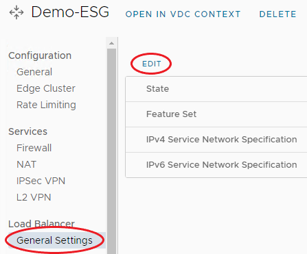
	
1. On the **Edit General Settings** page under **Load Balancer State**, toggle the **Active** slider to Green.

1. If prompted for a **Feature Set**, choose one of the following:

	- **Standard** - The standard feature set provides the load balancing features included in VMware NSX Advanced Load Balancer Basic Edition.
	- **Premium** - The premium feature set provides access to some Premium features, such as, for example, additional load balancing pool algorithm types and pool persistence profiles, virtual service analytics, pool analytics, multiple virtual service ports, and additional virtual service application profile types. 

1. Under **Service Network**, enter the following:
	
	- IPv4 Network, IPv6 Network or both.

	- Use the default IPv4 Network by leaving Use Default check box ticked.

1. Click **Save**.

    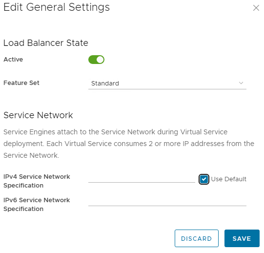
	
1. Once enabled, you will notice on the left menu bar under **Load Balancer**, that additional sub-headings have appeared.

    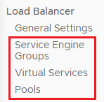
	
### Creating a Service Engine Group

The load balancing compute infrastructure provided by NSX Advanced Load Balancer is organized into service engine groups.

A system administrator can assign one or more service engine groups to an NSX-T Data Center ESG.

Additional information can be viewed on VMware Docs - [Assign a Service Engine Group to an NSX-T Data Center Edge Gateway.](https://docs.vmware.com/en/VMware-Cloud-Director/10.4/VMware-Cloud-Director-Tenant-Portal-Guide/GUID-5712D1CE-5966-48E5-A51F-DA60F956C7AC.html)

To create a Service Engine Group, use the following steps:

1. Under Load Balancer, select Service Engine Groups, and click Add.

    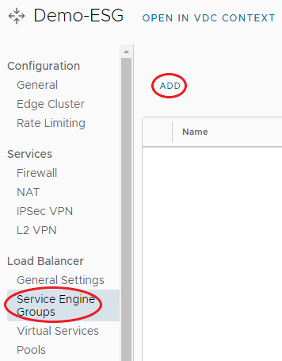

1. Select an available service engine group from the list.

1. Enter a number for the **Maximum Allowed** Virtual Services that can be placed on the ESG.

1. Enter a number for the **Reserved** Virtual Services available to the ESG.

1. When done, click Save.

    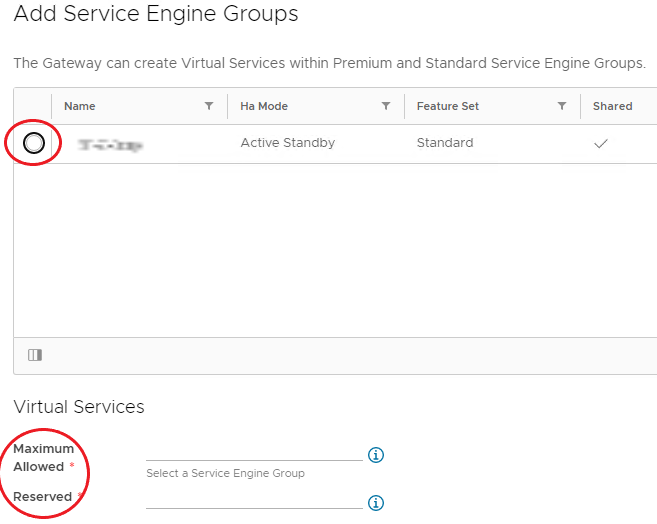
	
### Configuring a Load Balancer Pool

A server pool is a group of one or more servers that you configure to run the same application and to provide high availability.

Additional information can be viewed on VMware Docs - [Add a Load Balancer Server Pool.](https://docs.vmware.com/en/VMware-Cloud-Director/10.4/VMware-Cloud-Director-Tenant-Portal-Guide/GUID-033348E5-435E-4F8F-8A5E-FFA001F659FC.html)

To configure a Load Balancer Pool, use the following steps:

1. Under **Load Balancer**, select **Pools**, and click **Add**.

    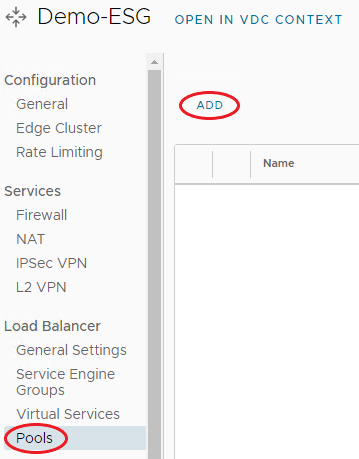

1. Under the **General Settings** tab, enter a **Name** and a **Description** if required.

1. Configure settings as required:

	- **Load Balancer Algorithm** - Least Connections/Round Robin/Consistent Hash
	- **State** - Enable/Disable Load Balancer Pool
	- **Default Server Port** - Destination server port
	- **Graceful Disable Timeout** - Maximum time to gracefully disable a member
	- **Persistence** - Persistence profile for Load Balancer Pool
	- **Active Health Monitor** - Select a value - HTTP/HTTPS/TCP/UDP/Ping 
	
		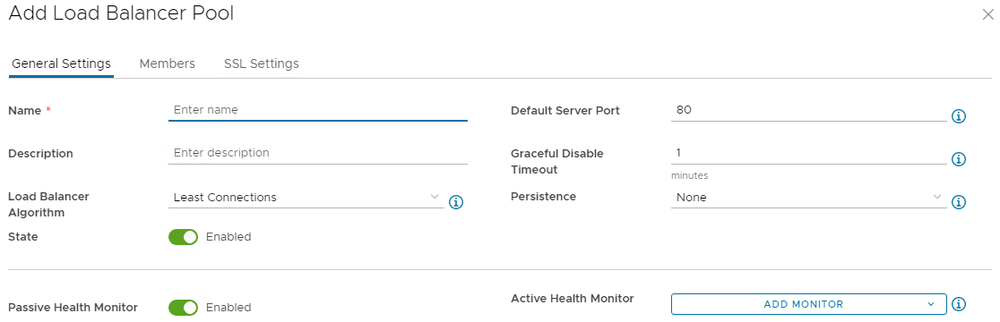

1. On the **Members** tab, click **Add**.

	- Enter **IP Address** for the pool member
	- Toggle on the **State** to enable the pool member
	- (Optional) add a custom **port** for the pool member
	- Enter a **Ratio** for the pool member. A member with 2, gets twice as much traffic as a member with 1.
	
		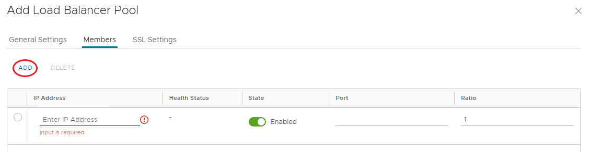

1. On the **SSL Settings** tab:

	- Enable SSL if required with the toggle
	- Enable **Common Name Check** if required and enter up to 10 domain names.
	
		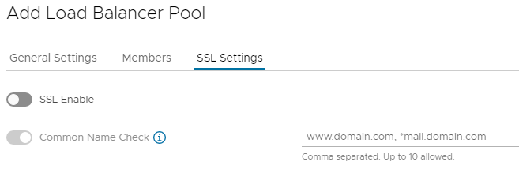

1. Click **Save** when complete.

### Creating a Virtual Service

A virtual service listens for traffic to an IP address, processes client requests, and directs valid requests to a member of the load balancer server pool.

Additional information can be viewed on VMware Docs - [Create a Virtual Service.](https://docs.vmware.com/en/VMware-Cloud-Director/10.4/VMware-Cloud-Director-Tenant-Portal-Guide/GUID-5B04413B-6761-483B-979C-D99F43651284.html)

To create a Virtual Service, use the following steps:

1. Under Load Balancer, select **Virtual Services**, and click Add.

	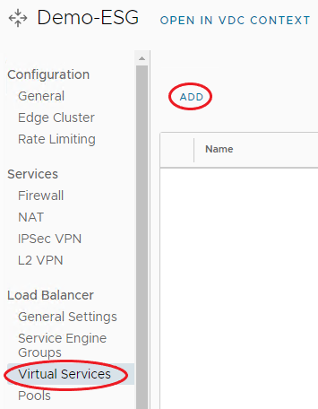
	
1. On the **Add Virtual Service** page, enter a **Name** and a **Description** if required.

	- Ensure **Enabled** is toggled on.
	- Select the **Service Engine Group** created earlier
	- Select the **Load Balancer Pool** created earlier
	- Enter a **Virtual IP Address** for the virtual service, it can be IPv4, IPv6 or both
	- Select a **Service Type** and **Port**
	- Once complete, click **Save**
		
		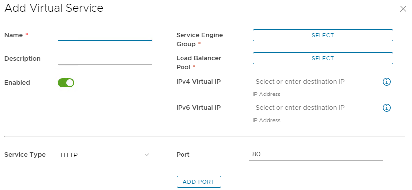
		
## Add a certificate to the Edge Services Gateway

In the VMware Cloud Director certificates library, you can import certificates used when creating entities that you must secure, such as servers, edge gateways, and so on.

The certificate library contains information about single certificates, certificate chains, private keys, certificate expiration dates, the entities that the certificates secure, and so on.

Additional information can be viewed on VMware Docs - [Managing Certificates.](https://docs.vmware.com/en/VMware-Cloud-Director/10.4/VMware-Cloud-Director-Tenant-Portal-Guide/GUID-80B4CB1C-9353-4EB9-8557-4F6705949D0F.html)

You can import certificates of servers that VMware Cloud Director communicates with, such as vCenter Server, NSX Manager, and so on.

Additional information can be viewed on VMware Docs - [Import Trusted Certificates.](https://docs.vmware.com/en/VMware-Cloud-Director/10.4/VMware-Cloud-Director-Tenant-Portal-Guide/GUID-420266CA-8858-4B28-ADE7-1E9FD38FD75E.html)

To import a Trusted Certificate, use the following steps:

1. In the VMware Cloud Director *Virtual Datacenters* dashboard, select the VDC.

1. On the top navigation menu, select the **Administration** tab.

1. On the left navigation menu, under **Certificate Management**, select **Trusted Certificates**, and click **Import**.

	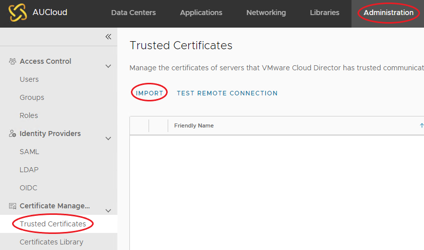

1. On the **Import Certificates** page, browse for the .PEM certificate, by clicking **Select File**.

	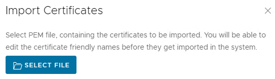
	
1. Once uploaded, enter a **Friendly Name** if required, and click **Import**.

	- The Certificate details can be viewed by clicking the arrow to the left of the certificate.

	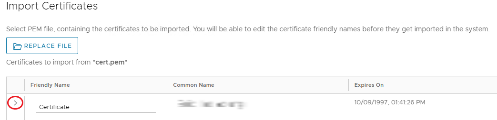
