## Overview

In addition to virtual data centre (VDC) networking, you can create individual vApp networks to have even greater control over your network infrastructure.

vApp networks enable you to create smaller networks within individual vApps that have a vApp edge, like the edge gateway on your VDC. 

Although a vApp edge is not as feature rich as a VDC edge, it enables you to create firewall and NAT rules to separate your VDC networks from your vApp virtual machines (VMs). This means you can create some quite complex networks to satisfy application needs.

Additional information can be viewed on VMware Docs - [Add a Network to a vApp.](https://docs.vmware.com/en/VMware-Cloud-Director/10.4/VMware-Cloud-Director-Tenant-Portal-Guide/GUID-B95FB8AF-C428-4FCB-88DA-5DCA35B19B5A.html)

The vApp network diagram below shows the vApp edge:

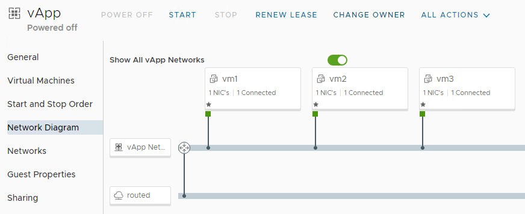

### vApp Network Prerequisites

- Edge Services Gateway (ESG) inside Organisation VDC
- Routed Network attached to ESG - see [Create a Routed VDC Network](./create_a_routed_vdc_network.md) for information.
	
## Creating a vApp Network

1. In the VMware Cloud Director *Virtual Datacenters* dashboard, select the VDC that contains your vApp.

1. In the left navigation panel, select **vApps**.

	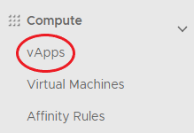
	
1. Select your vApp, select **Networks**, then **New**.

1. Chose Routed.

	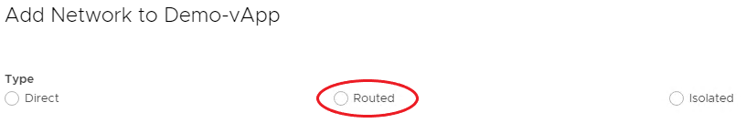
	
1. Connect vApp Network to VDC Network Connection. Enter a **Name** and **Description** if required for the network. In the *Address and DNS* section, fill out the fields as required for your network.

1. When you're done, click **Add**.

	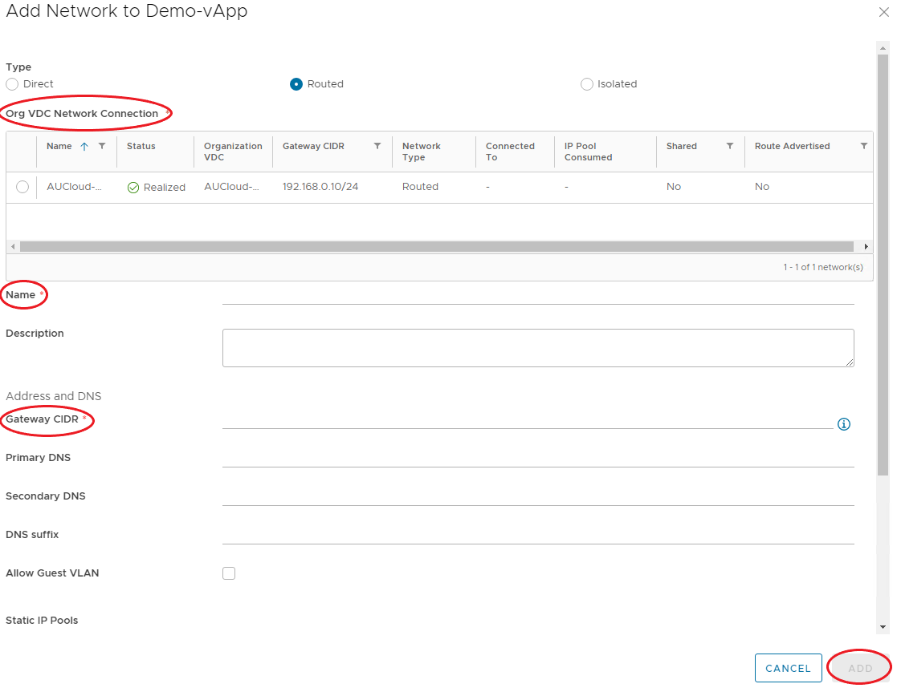

## Connecting a Virtual Machine to a vApp Network

If your vApp is already populated with VMs that are connected to a VDC network, you may want to move them over to the vApp network.

To change the Virtual Machine network to a vApp Network, use the following steps:

1. In the VMware Cloud Director *Virtual Datacenters* dashboard, select the VDC that contains your vApp.

1. In the left navigation panel, select **vApps**.

	
	
1. Select your vApp, then **Virtual Machines**.

	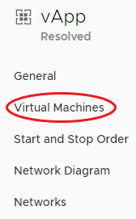
	
1. Click each VM, under *Hardware* and in the *NICs* section, click **Edit**.

	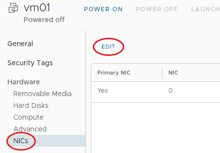

1. Select the vApp network from the **Network** list and ensure the NIC is 'connected'.

	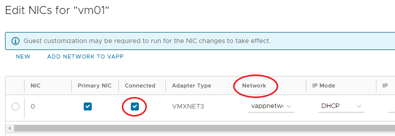

1. If you want to dual-home your Virtual Machine, click the **NEW** button to add a second network.

1. When you're done, click **Save**.

1. Repeat for the remainder of the Virtual Machines that are required to join the vApp Network.

## Viewing and Adjusting vApp Network Settings

When you've created your vApp Network and assigned Virtual Machines to it, you may want to review the vApp Network settings and adjust them if needed.

To edit the Network Settings of a vApp, use the following steps:

1. In the VMware Cloud Director *Virtual Datacenters* dashboard, select the VDC that contains your vApp.

1. In the left navigation panel, select **vApps**.

	 
	
1. Select your vApp, select **Networks**, then select the *vApp Network* to view the Network Settings.

1. The **General** tab displays the general network settings.

1. The **IP Management** heading lists the IP Settings for the network including, Static Pools, DNS, DHCP and IP Allocations. Click Edit on each heading to adjust these settings.

	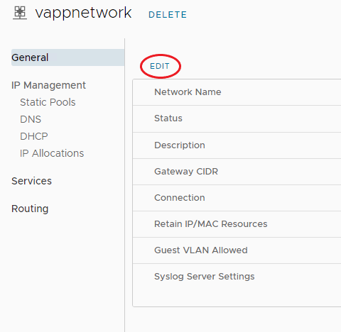
	
1. The **Services** heading enables you to set up Firewall and NAT rules for the vApp Network. For more information, see vApp Network Firewall and NAT Rules [below.](#vapp-network-firewall-and-nat-rules)

1. The **Routing** heading enables you to create static routes for the vApp Network. For more information, see vApp Network Routing [below.](#vapp-network-routing)

## vApp Network Firewall and NAT Rules

For the vApp Network, there will be a rule in place to allow any traffic to traverse the Firewall. You can amend or delete this rule or create new rules.

### vApp Network Firewall Rules

To create a vApp Network Firewall Rule, use the following steps:

1. In the VMware Cloud Director *Virtual Datacenters* dashboard, select the VDC that contains your vApp.

1. In the left navigation panel, select **vApps**.

	 
	
1. Select your vApp, select **Networks**, then select the *vApp Network* to view the Network Settings.

1. Under the **Services** heading, select **Edit**.

	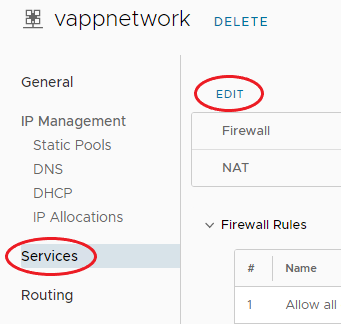 
	
1. On the **Firewall** tab, click **Add**, specify the details for the rule then click **Save**.

	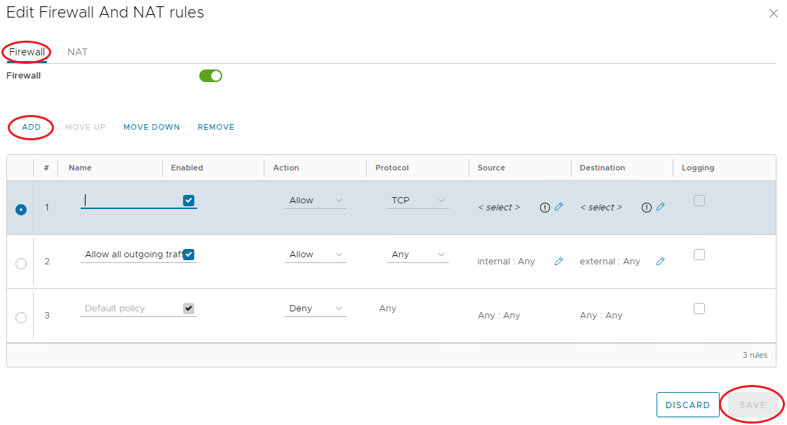 
	
### vApp NAT Rules

NAT rules, enabled by default, enable mapping between internal Virtual Machines interfaces and external IP Addresses.

Additional information can be viewed on VMware Docs - [Add a Port Forwarding Rule to a vApp Network](https://docs.vmware.com/en/VMware-Cloud-Director/10.4/VMware-Cloud-Director-Tenant-Portal-Guide/GUID-DE55A1DD-50F2-454C-86CF-2396B25E052A.html) and [Add an IP Translation Rule to a vApp Network.](https://docs.vmware.com/en/VMware-Cloud-Director/10.4/VMware-Cloud-Director-Tenant-Portal-Guide/GUID-DF4822A4-5797-41B6-865B-13C38E765B8A.html)

To edit the mapping rules for a Virtual Machine, use the following steps:

1. In the VMware Cloud Director *Virtual Datacenters* dashboard, select the VDC that contains your vApp.

1. In the left navigation panel, select **vApps**.

	 
	
1. Select your vApp, select **Networks**, then select the *vApp Network* to view the Network Settings.

1. Under the **Services** heading, select **Edit**.

	
	
1. On the **NAT** tab, click **Add**.

1. In the **VM Interface** field, click the edit (pencil) icon, then select the VM interface for which you want to add the NAT rule.

1. From the **Mapping Mode** list, select the mapping mode.

	!!! note

		The default mapping is Automatic. You can change this to Manual, in which case, enter an External IP address to which the Virtual machine can map.
	
1. When you're done, click **Save**.

	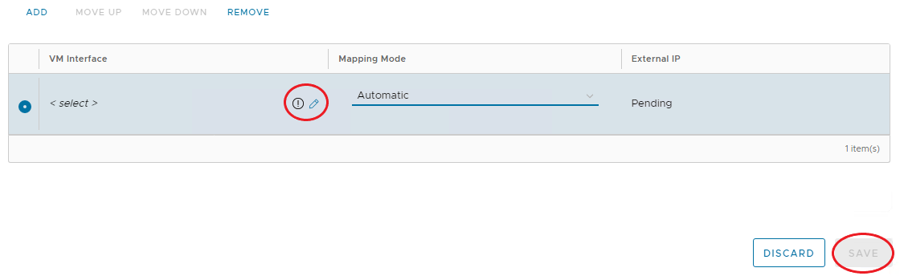
	
1. The External IP Address will be on the same subnet as the VDC network, that connects to the vApp Edge.

## vApp Network Routing

Static Routing at the vApp Network level allows traffic to route between different vApp Networks, across the VDC Networks.

The prerequisites for Static Routing are as follows:

- Static Routing must be enabled for the VDC network you're connecting to, see [Static Routes.](./edge_services_gateway.md/#static-routes)
- The two vApp Networks must be routed to the same VDC Network.
- The vApp Networks must be in vApps that have been started at least once.

Additional information can be viewed on VMware Docs - [Add Static Routing for a vApp Network](https://docs.vmware.com/en/VMware-Cloud-Director/10.4/VMware-Cloud-Director-Tenant-Portal-Guide/GUID-F508B88D-4592-4D96-8D2C-FEA962488D84.html) and [Configure Static Routing for a vApp Network.](https://docs.vmware.com/en/VMware-Cloud-Director/10.4/VMware-Cloud-Director-Tenant-Portal-Guide/GUID-5AAE262D-EDAA-4159-93FA-E81AC07DBBFA.html)

To add a Static Route, use the following steps:

1. In the VMware Cloud Director *Virtual Datacenters* dashboard, select the VDC that contains your vApp.

1. In the left navigation panel, select **vApps**.

	 
	
1. Select your vApp, select **Networks**, then select the *vApp Network* to view the Network Settings.

1. Under the **Routing** heading, select **Add**.

	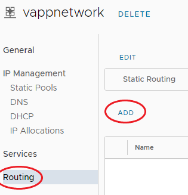 
	
1. In the *Add Static Route* dialog box, enter a **Name** for the Static Route.

1. Enter the following details:

	- **Network CIDR** - The address of the first vApp Network to which you're adding a static route
	- **Next Hop IP** - The external IP address of that vApp Network's router.
	- When you're done, click **Save**.
	
		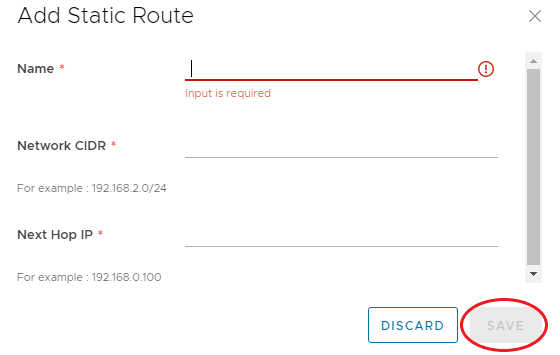 
			
1. Repeat for the second vApp Network.

The table below provides examples of the settings needs to create a Static Route between two vApps:

**Network Information**

| Network Name        | Network Specification | Router External IP Address |
| -----------         | -----------           | -----------                |
| vApp Network 1      | 192.168.1.0/24        | 192.168.0.100              |
| vApp Network 2      | 192.168.2.0/24        | 192.168.0.101              |
| VDC Network Shared  | 192.168.0.0/24        | N/A                        |

**Static Routing Settings**

| Static Route to Network | Route Name    | Network          | Next Hop IP Address |
| -----------             | ---------     | -----------      | -----------         |
| vApp Network 1          | to-vapp1      | 192.168.1.0/24   | 192.168.0.100       |
| vApp Network 2          | to-vapp2      | 192.168.2.0/24   | 192.168.0.101       |