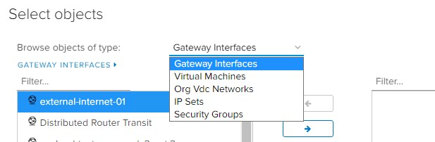
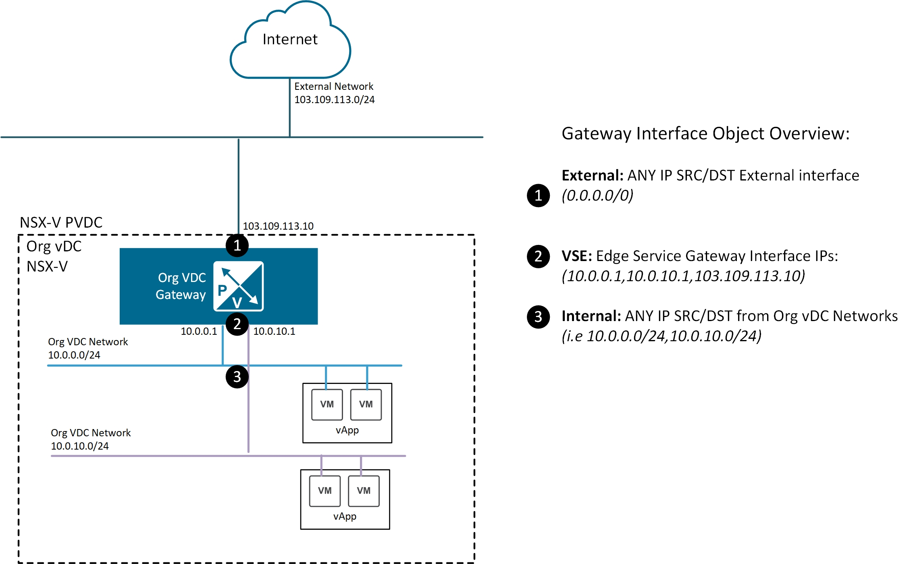

# Prerequisites

## Overview

This page will outline some of the prerequisite actions that may be required before a tenancy can be migrated from NSX-V to NSX-T.  VMware have provided a tool that will migrate tenancies from a NSX-V backed VDC to NSX-T.  The tool makes a lot of network changes across multiple systems (NSX-V, NSX-T, VCD and vSphere) that underpin the AUCloud platform.  Using the migration tool allows for minimal service interruptions and downtime during the migration process.  Full details on the migration tool are found in the links at the bottom of this article.

This article also outlines some caveats and details related to other products integrated to the platform.  These are in relation to:

- Disaster Recovery services provided by **VMware Cloud Directory Availability (VCDA)** and,
- Backup services provided by **Data Protection with Veeam**.

## Assessment

The VMware NSX Migration for VMware Cloud Director will first run a pre-check analysis of a customers tenancy.  The assessment may identify issues that will need to be corrected before the migration can happen and AUCloud migration technical resources will be in direct contact before migration happens for any identified issues.  Below is a list of a few common prerequisites:

- vApps & Virtual Machines
	* Virtual Machines cannot be suspended - they need to be powered on or off.
	* Virtual Machines cannot have media inserted - disconnect all media.
	* vApps cannot be empty - if they are empty, they need to be deleted.
- Network
	* Firewall rules cannot use certain objects (Gateway Interfaces, Virtual Machines or Org Vdc Networks) - change Firewall Rules to IP Sets or Security Groups.
	
		
	
	 	There are three types of gateway interface that can be referenced in firewall policy that require attention, as shown below.

		

		The first type of gateway interface is External, which refers to traffic entering or exiting the edge services gateway via the external interfaces

		The External gateway interface type can be replaced in the firewall rules using one of two options
		
		* Replace with the value of ANY
		* Replace with an IP Set that covers all IP address space excluding the private range (i.e. excluding the RFC1918 ranges). This option can be applied if you do not want private subnets used internally to have access, only sources or destinations that are truly external.

		!!! note
			The following would be included in an IP Set covering all IP address space excluding the private range:
			0.0.0.0/5, 8.0.0.0/7, 11.0.0.0/8, 12.0.0.0/6, 16.0.0.0/4, 32.0.0.0/3, 64.0.0.0/2, 128.0.0.0/3, 160.0.0.0/5, 168.0.0.0/6, 172.0.0.0/12, 172.32.0.0/11, 172.64.0.0/10, 172.128.0.0/9, 173.0.0.0/8, 174.0.0.0/7, 176.0.0.0/4, 192.0.0.0/9, 192.128.0.0/11, 192.160.0.0/13, 192.169.0.0/16, 192.170.0.0/15, 192.172.0.0/14, 192.176.0.0/12, 192.192.0.0/10, 193.0.0.0/8, 194.0.0.0/7, 196.0.0.0/6, 200.0.0.0/5, 208.0.0.0/4, 224.0.0.0/3

		The second type of gateway interface is VSE which refers to traffic sourced from or destined to the Edge Gateway itself.

		The VSE gateway interface type can be replaced in the firewall rules with the specific IP addresses assigned to the Edge Gateway, i.e. 10.0.0.1, 10.0.10.1 or 103.109.113.10 in the above diagram.

		The third type of gateway interface is Internal, which refers to all subnets assigned to Organisation VDC networks attached to the Edge Gateway.

		The Internal gateway interface type can be replaced in the firewall rules using IP Sets that contain all Organisation VDC subnets, i.e. 10.0.0.0/24 and 10.0.10.0/24. 

		Further details around NSX-T Firewalls found [here](../firewall_rules.md).

- Named Disks
	* 'Shared' Named Disks cannot be migrated - they need to be removed.  Non-shared Named Disks are okay.
- VMware Cloud Directory Availability (VCDA) - Disaster Recovery (DRaaS)
	* Virtual Machines that are Protected by VCDA need to have their protection removed and re-created.  This has to happen if either the Source or Destination tenancy is about to undergo NSX-V to NSX-T migration.

## Important Caveats

- Data Protection with Veeam details are found [here](./veeam.md).

## VMware References

Official migration tool documentation:

- [VMware NSX Migration for VMware Cloud Director Documentation](https://docs.vmware.com/en/VMware-NSX-Migration-for-VMware-Cloud-Director/1.4.2/user-guide/GUID-index.html)
	* [Supported Features and Edge Gateway Services](https://docs.vmware.com/en/VMware-NSX-Migration-for-VMware-Cloud-Director/1.4.2/user-guide/GUID-supported-features.html)
	* [Unsupported Features and Edge Gateway Services](https://docs.vmware.com/en/VMware-NSX-Migration-for-VMware-Cloud-Director/1.4.2/user-guide/GUID-unsupported-features.html)
