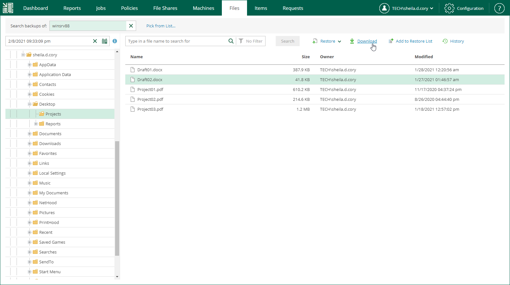
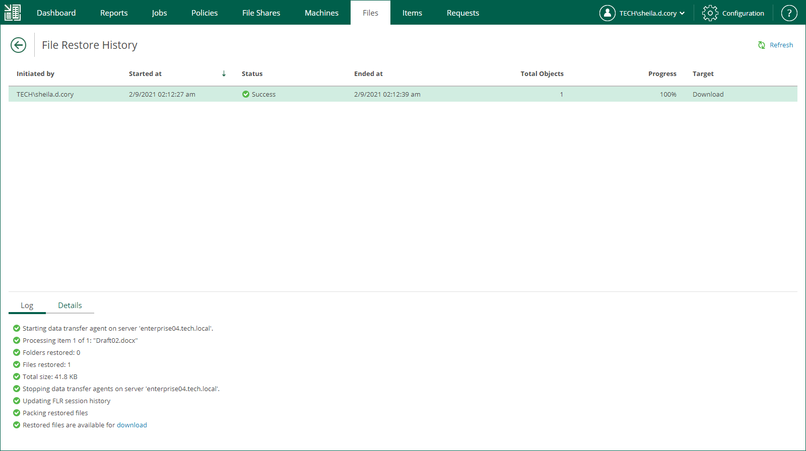
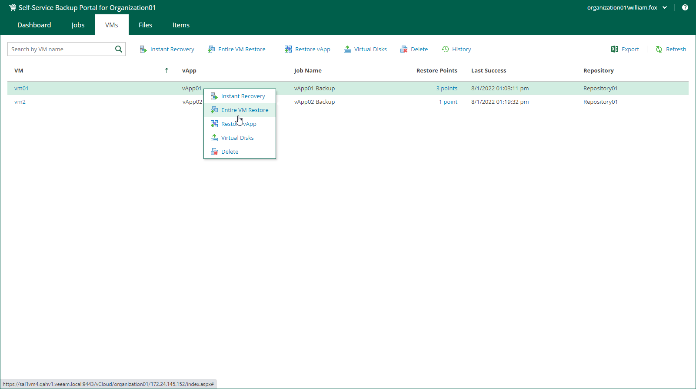
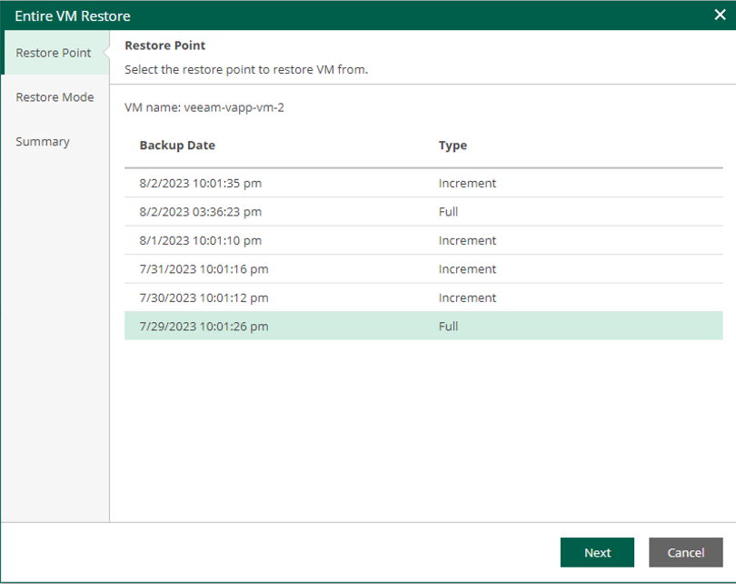
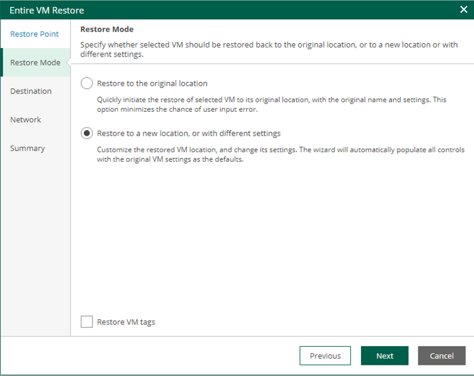
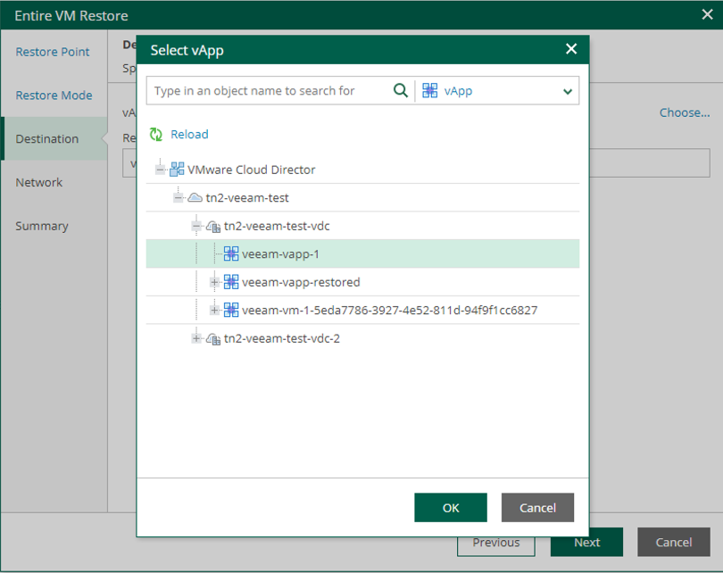
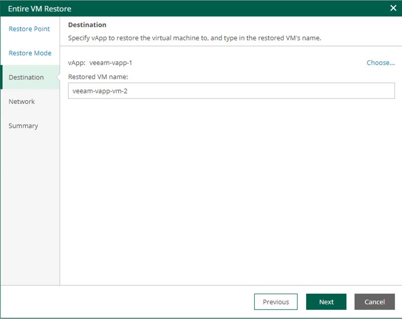
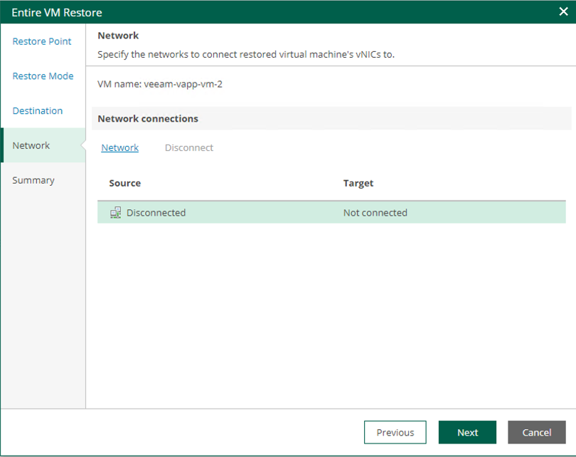
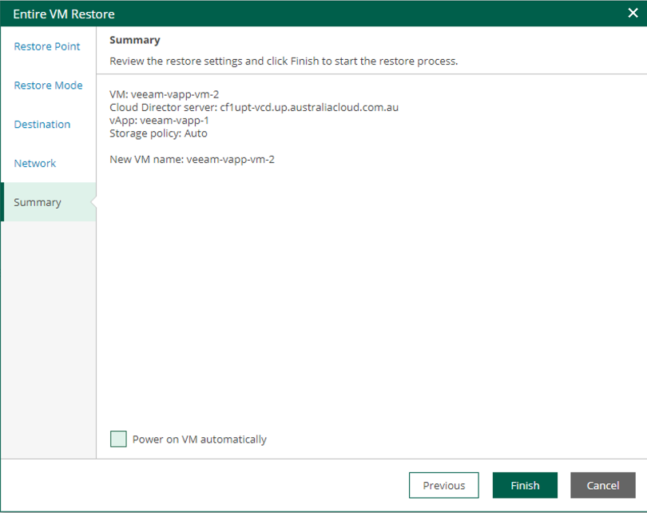

# Veeam Backup Caveats

## Overview

After the migration existing back-up chains will not allow for in-place back-ups to the original location. A new back-up chain will need to be undertaken by choosing from the following options:

1. Keep and disable old job/s and create new jobs with new OrgVDC and migrated vApps/VMs, or

2. Edit and update existing job to point at the new Organization Virtual Data Center (OrgVDC) and migrated vApps/VMs.

AUCloud recommends "Option 1" as this creates a clean backup chain.

Restoration of files and entire VMs from previous backups will require restoration to a new location. Restoration of vApps is not supported from the Self-service portal. Should a vApp restoration be required a job may logged with the help desk. VApp/VMs are also to a new vApp.

## Restoring Guest OS Files

On the Files tab, members of a VMware Cloud Director organization can browse the guest OS file system in a VM backup, search for guest OS files and restore necessary files. You can restore files from indexed and non-indexed guest OS file systems.

After you find the necessary file, you can use Veeam Backup Enterprise Manager to restore it from backup with one click. You can only choose to restore/download it to the local machine.

## Downloading Files to Local Machine

If you choose to download the restored file, Veeam Backup Enterprise Manager interacts with the Veeam backup server to extract the necessary file from a backup. The user who initiated file restore will be able to download the file to the local machine.

To restore a file to the local machine:

1. Locate the necessary file using browse or search possibilities of Veeam Backup Enterprise Manager. For details, see [Browsing Machine Backups for Guest OS Files](https://helpcenter.veeam.com/docs/backup/em/browsing_vm_backups.html) or [Searching Machine Backups for Guest OS Files](https://helpcenter.veeam.com/docs/backup/em/searching_vm_backups.html).

2. Click Download.

    

3. In the displayed window, click Yes.

4. Wait for restore session to complete and for the file to be retrieved from the backup.

5. Select the file from the list.

6. In the Log tab of the File Restore History view, click the download link in the Restored files are available for download record of the session log.

    The file is saved to the default download folder on your local machine.

    If you download a single file, it is also saved in the `%ProgramData%\Veeam\Backup\WebRestore` folder. Multiple files are packed in a ZIP file named `FLR_<date>_<time>.zip` and stored in the same folder. Veeam Backup Enterprise Manager cleans up the folder periodically. Files older than 24 hours are automatically deleted.

    

## Entire VM Restore

To restore an entire VM, do the following:

1. On the VMs tab, select a VM you want to restore. To quickly find the necessary VM, use the search field at the top of the window.

2. On the toolbar, click Entire VM Restore.

    Alternatively, you can right-click the VM and select Entire VM Restore.

    

3. Select a restore point.

    

4. Select a restore mode "Restore to a new location, or with different settings".

    
    
5. Specify destination settings for the recovered VM.

    
    
6. Specify a VM Name.

    
    
7. Configure network mapping.

    
    
8. Review the recovery settings and power state required.

    
    
9. Click Finish.