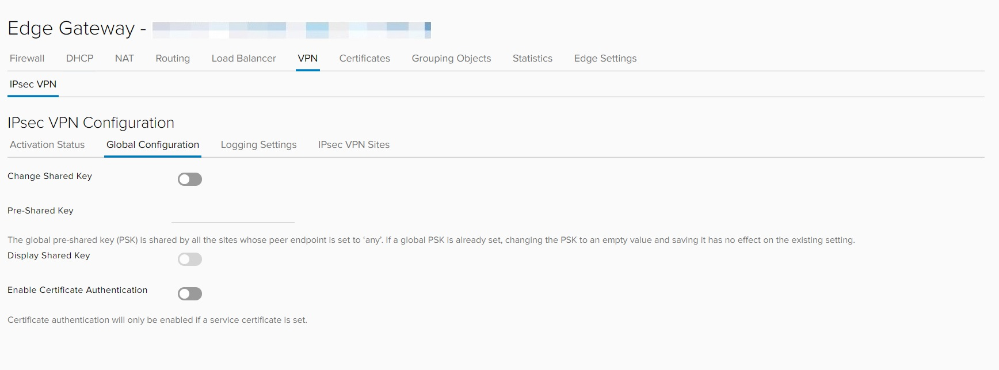
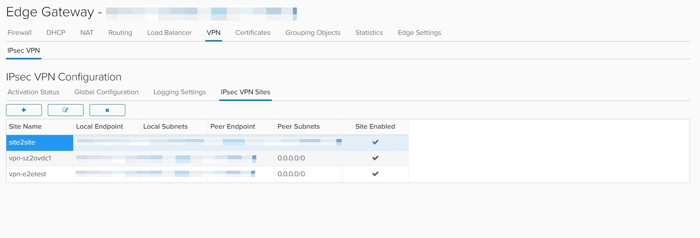
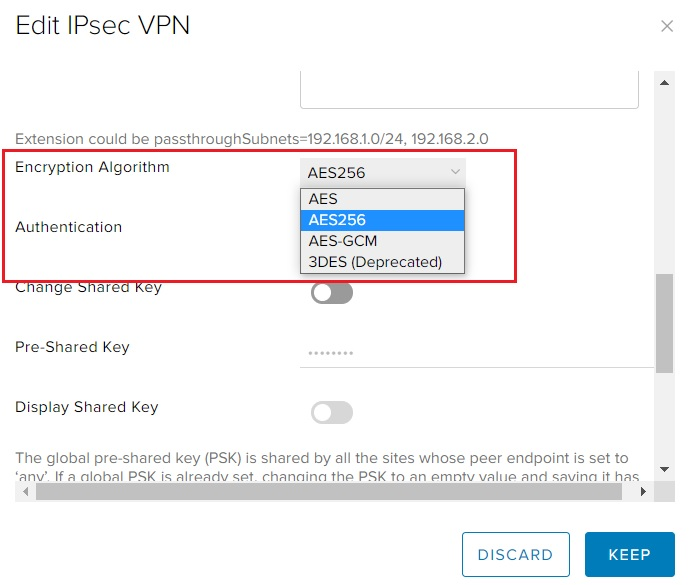
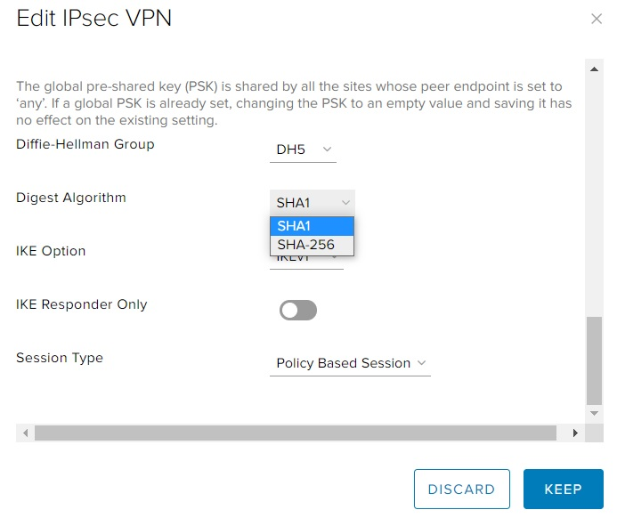
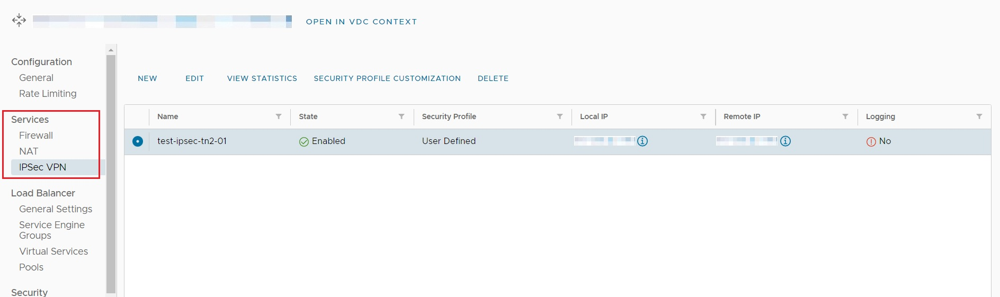
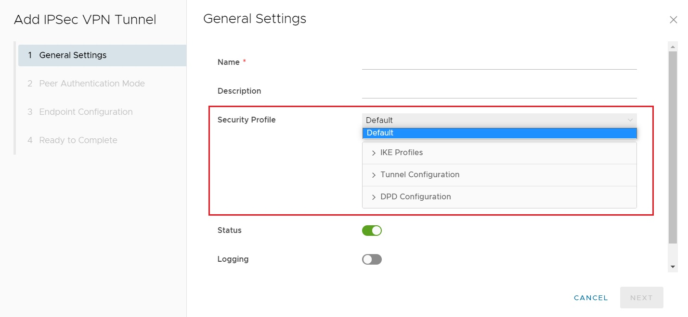
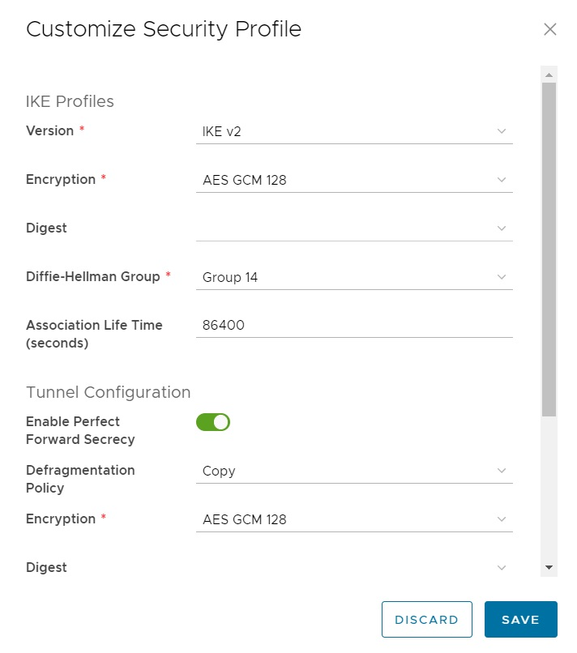

## Overview

IPSec VPN services provided by NSX-T function in much the same manner as with NSX-V. However how they are displayed and configured is different. This includes changes to the options available for encryption and integrity verification.

To assist with the migration to NSX-T, such differences are presented and compared.

!!! note
        For readers unfamiliar with IPSec VPN operation, it is recommended to first read this [guide](https://www.techtarget.com/searchsecurity/definition/IPsec-Internet-Protocol-Security).

## NSX-V

Under NSX-V, IPSec VPN configuration is provided under the SERVICES option of Edge Gateway configuration.

Several options are provided for IPSec VPN configuration, including:

1. Global configuration, where pre-shared keys or certificates used for peer authentication are configured.
2. IPSec VPN Sites, where the endpoints and the specific IPSec VPN settings are configured.

The most important IPsec VPN configuration options exist under IPSec VPN Sites:

When defining an IPSec VPN, four options are available for the encryption algorithm:

1. AES
2. AES-256
3. AES-GCM
4. 3DES (Deprecated)

!!! note
        The 3DES option is deprecated and should not be used other than for compatibility purposes, e.g. the peer endpoint supports only this option.

There are also two options available to define the integrity hash algorithm:

1. SHA1
2. SHA-256

!!! note
        SHA1 is considered deprecated and should not be used other than for compatibility purposes, e.g. the peer endpoint supports only this option.

Example Screenshots:

## NSX-T

Under NSX-T, IPSec VPN configuration is available from the Edge Gateway menu, under IPSec VPN:

When creating an IPSec VPN, the NEW option is selected, resulting in the Add IPSec VPN Tunnel screen:

As highlighted, only a default option for security profile settings is available. The security profile can be customised to match required settings, but this **must** be completed after the IPSec VPN tunnel is first created.

Peer authentication must be configured, using either a pre-shared key or a certificate, under Peer Authentication Mode. Certificates cannot be uploaded in this step and must be uploaded to vCD separately, before VPN configuration has commenced.

!!! note
        To upload a Certificate for use with an IPSec VPN, follow the procedure documented [here](../NSX-T_Networks/edge_services_gateway.md#add-a-certificate-to-the-edge-services-gateway).

Local and remote VPN endpoints must also be configured, along with the traffic to be protected by the VPN, e.g. the networks that exist on both the local and remote side of the VPN tunnel.

Once the configuration has been completed and saved, the IPSec VPN tunnel can be selected using the appropriate radio button. The SECURITY PROFILE CUSTOMISATION option will then become available. This is where the required encryption and authentication parameters are configured.

From this option, custom encryption and integrity digest algorithms can be selected to match the required IPSec VPN settings.

NSX-T provides additional encryption algorithms, including:

1. AES 128
2. AES 256
3. AES GCM 128
4. AES GCM 192
5. AES GCM 256

!!! note
        The 3DES option is no longer supported with NSX-T.

NSX-T also provides additional digest algorithms for verifying integrity, including:

1. SHA1
2. SHA2 - 256
3. SHA2 - 384
4. SHA2 - 512

!!! note
        If a GCM encryption algorithm is selected then the digest algorithm option is disabled and cannot be selected. This is due to GCM algorithms providing built-in integrity checking and as such a separate digest algorithm is not required.

!!! note
        SHA1 is considered deprecated and should not be used other than for compatibility purposes, e.g. the peer endpoint supports only this option.

## Next Steps

Familiarise with the updated NSX-T user interface and IPSec VPN configuration options.

Determine the impact of the migration to NSX-T on any existing IPSec VPN connections.

Consult the [VMware Documentation](https://docs.vmware.com/en/VMware-Cloud-Director/10.4/VMware-Cloud-Director-Tenant-Portal-Guide/GUID-019E8BF7-8669-4A15-B1AE-CDFD04EA77CB.html) for additional information.
