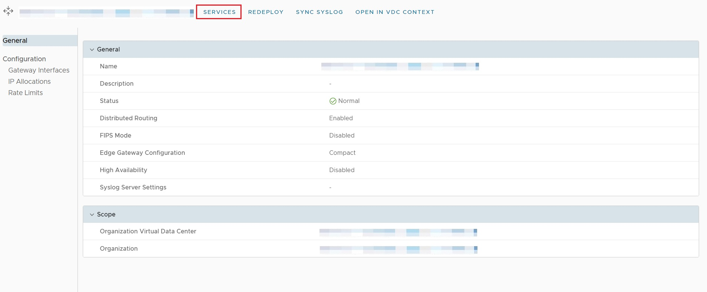
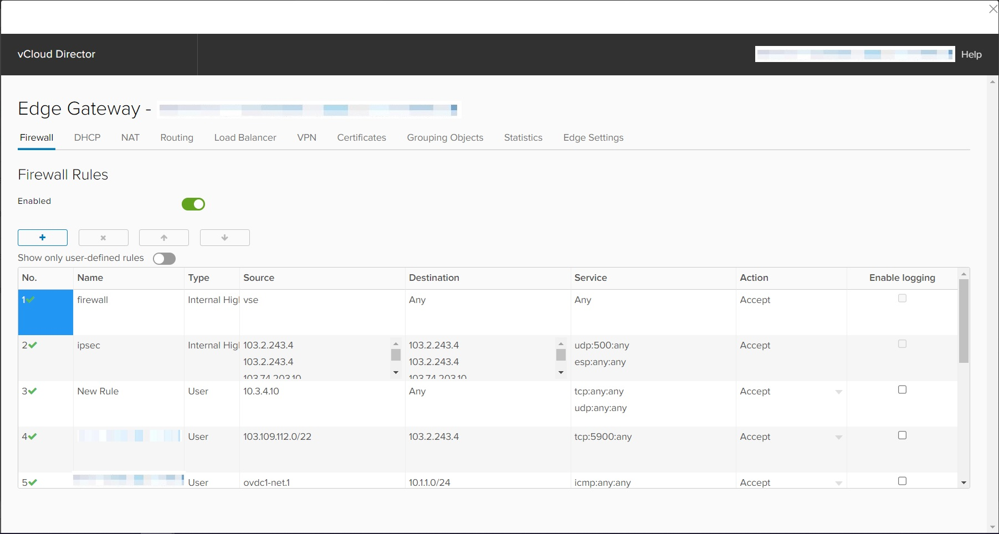
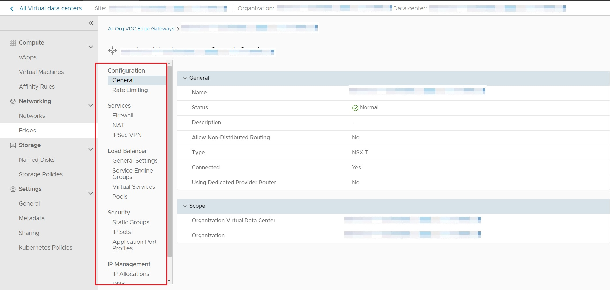

## Overview

The function of the Edge Gateway changes with the migration to NSX-T, alongside noticeable differences to the VMware Cloud Director (vCD) user interface.

To assist with the migration to NSX-T, this page will present and compare these differences.

## NSX-V

Under NSX-V an Edge Gateway is deployed as a virtual appliance. This means that each new Edge Gateway requires a new virtual machine, limiting the potential scale of the solution. The NSX-V Edge Gateway provides services such as routing, North-South Firewall Rules, NAT, IPSec VPN and Load Balancer.  

In the vCD user interface, the following screen is presented when an NSX-V Edge Gateway is selected:

The SERVICES option, when selected, opens a new screen with various options for the configuration of Services, such as Firewall Rules, NAT, IPSec VPN and Load Balancer.

## NSX-T

Under NSX-T the Edge Gateway itself is run as a service available from a pool of such services, deployed on a virtual appliance known as an Edge Transport Node. Edge Gateways no longer require separate virtual machines and are deployed from resources available on existing Edge Transport Nodes. This increases the potential scale of the solution and allows for additional features to be made available.

With NSX-T, once an Edge Gateway is selected in the vCD user interface, there is no longer a specific SERVICES option: instead all services available for configuration are provided in an Edge Gateway menu on the left hand side of the screen.

Each service can be selected individually for configuration from this menu, including Firewall Rules, NAT, IPSec VPN and Load Balancer. It is important to note that while Load Balancing is available for configuration under the Edge Gateway menu, this service is **not** provided directly by the Edge Gateway itself. For more information see the [Load Balancer Page](./load_balancer.md).

## Next Steps

Familiarise with the migrated Edge Gateway user interface.

Consult the changes for each specific Edge Gateway service using the links below:

* [Firewall Rules](./firewall_rules.md)
* [NAT](./nat.md)
* [VPN](./VPN.md)
* [Load Balancer](./load_balancer.md)
