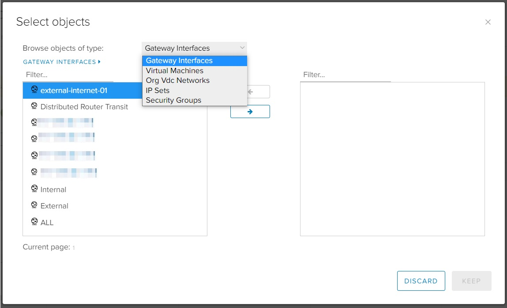
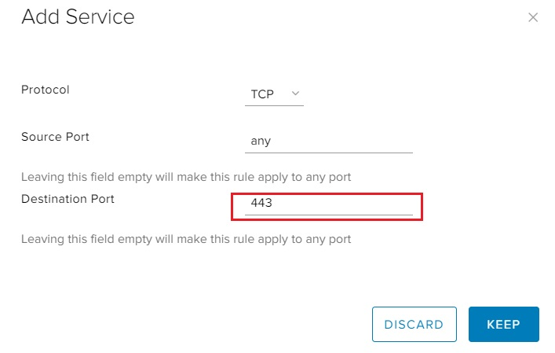
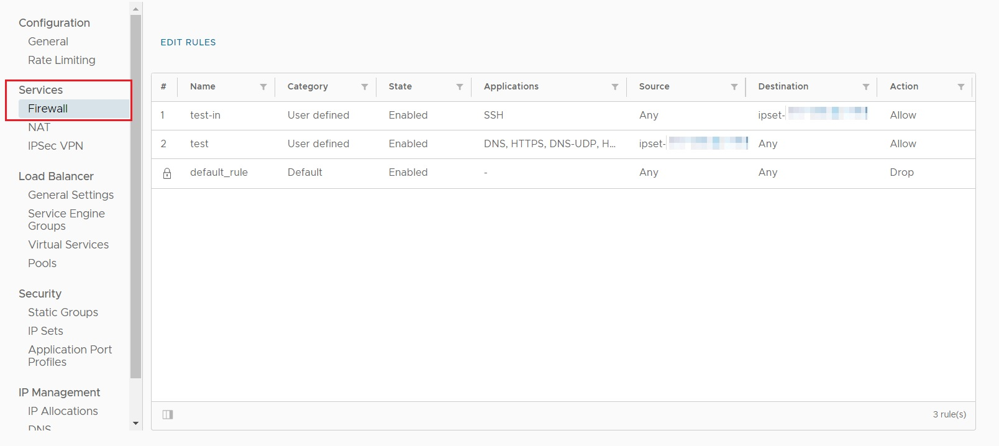
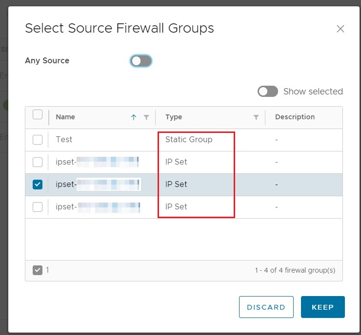
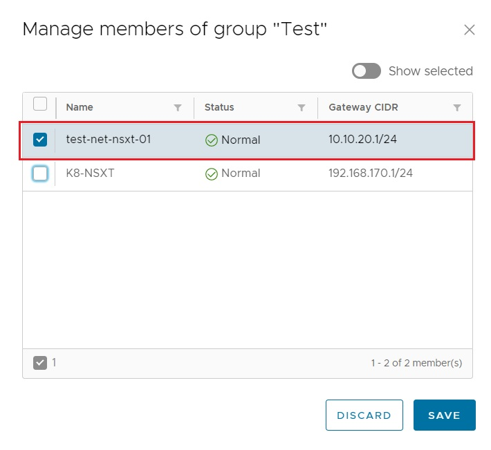
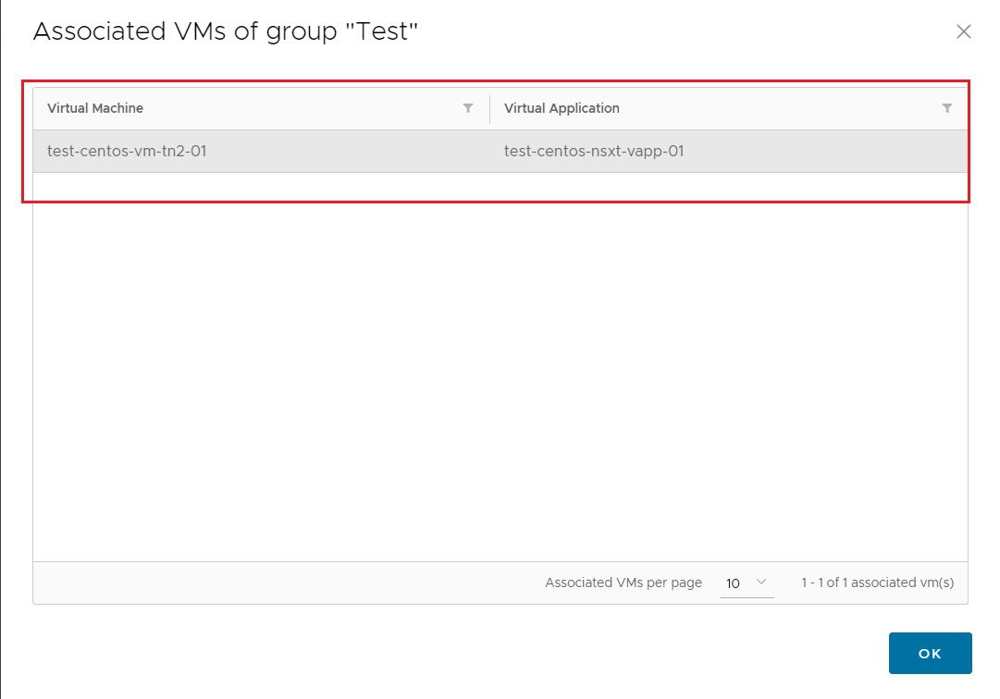
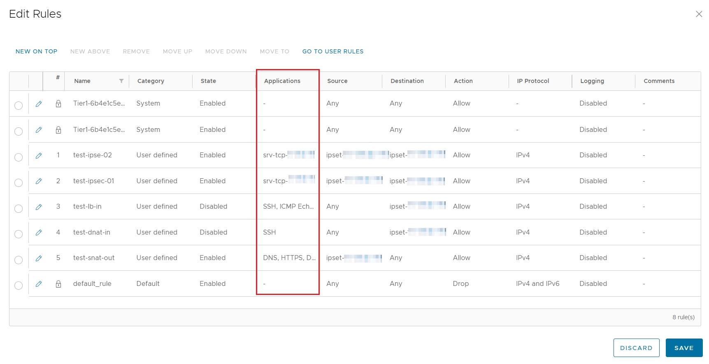
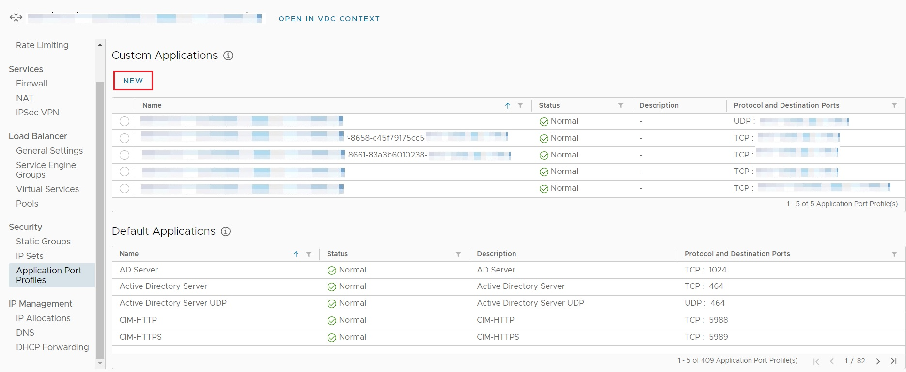

## Overview

Firewall Rules in NSX-T function in much the same manner as with NSX-V (e.g. sources are permitted access to various destinations based on protocol (e.g. TCP or UDP) and port number). However how Firewall Rules are displayed and configured differs from that of NSX-V.

To assist with the migration to NSX-T, such differences are presented and compared.

## NSX-V

With NSX-V, Firewall Rules are available from the SERVICES option and can be added, modified, rearranged or deleted on the screen shown below:

Several options are available for defining the Source or Destination for Firewall Rules, including; IP address, Gateway Interfaces, Virtual Machines, Org VDC Networks, IP Sets and Security Groups.

Source and Destination protocol (e.g. TCP or UDP) and port are set from the Firewall configuration screen under the Service field. Specific source or destination port numbers can be entered directly:

## NSX-T

With NSX-T Firewall Rule configuration is available from the Edge Gateway menu, under the Firewall option.

To add or modify Firewall Rules the EDIT RULES option is used.

Options for defining the Source and Destination are limited to IP Sets and Static Groups.

Static Groups can be used to reference an Org VDC Network and will include all virtual machines connected to that Org VDC Network. However there is no option to associate a single virtual machine by itself with a Static Group.

Example Screenshots:

Source and Destination protocol (e.g. TCP or UDP) and port are set from the firewall configuration screen, under the Applications field.

VMware provide a large number of pre-defined applications for many well-known protocols and ports, including DNS, HTTP, HTTPS and SSH, among many others.

If the appropriate protocol and port can not be found among those pre-defined, then custom Application Port Profiles must be created. These **cannot** be created directly under firewall configuration, but must be configured by selecting the Application Port Profiles option, under Security:

!!! note
        Additional information on custom Application Port Profiles can be found in the [VMware Documentation](https://docs.vmware.com/en/VMware-Cloud-Director/10.4/VMware-Cloud-Director-Tenant-Portal-Guide/GUID-32EC8B59-F042-4891-8A54-23315E565D78.html).

## Next Steps

Familiarise with the updated display and configuration of Firewall Rules.

For additional information on the configuration of firewall rules with NSX-T, consult the [VMware Documentation](https://docs.vmware.com/en/VMware-Cloud-Director/10.4/VMware-Cloud-Director-Tenant-Portal-Guide/GUID-BE02B1A7-9191-4520-A248-D2A7D2CA640E.html).
