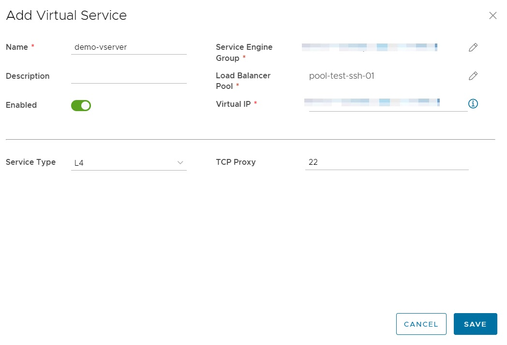

## Overview

NSX-V provides load balancing directly on the Edge Gateway, while NSX-T provides load balancing through a separate system, namely VMware NSX Advanced Load Balancer (ALB). While ALB still connects via the Edge Gateway it is not deployed as a service on the Edge Gateway. This is an important distinction as it affects the operation of load balancing with NSX-T.

With this change the user interface for load balancing has been updated significantly.

To assist with the migration to NSX-T, these changes are presented and compared.

## What is ALB?

VMware NSX Advanced Load Balancer (ALB) is a software defined load balancing solution that operates with two discrete components; the controller and the service engine.

The controller is where all load balancing configuration is made, via a REST API connection with VMware Cloud Director (vCD).

The service engines are where the load balancing function is implemented; it is the service engine that connects to the Edge Gateway in order to expose the load balanced service for consumption.

As part of the changes on migration to NSX-T, ALB service engine groups are made available. Virtual Services configured will then be implemented on a high availability pair of service engines, deployed in a group.

!!! note
    For more information on the ALB architecture, consult the [Documentation](https://avinetworks.com/docs/latest/architectural-overview).

Initially shared service engine groups, where the resources of service engines are shared among multiple tenancies, are provided. Security and isolation is maintained through separation mechanisms such as Virtual Routing Domains (VRF). This ensures that one tenants load balanced service cannot access or affect the load balanced services of any other tenant, through the shared service engines themselves. This ensures that the appropriate security controls, such as Firewall Rules, are not bypassed.

Dedicated service engine groups, where the resources of service engines are dedicated to a single tenancy are available at an additional cost. Multiple service engine groups can be setup per tenancy, allowing the use of both shared and dedicated service engine groups within a single tenancy, as requirements dictate.

Service engine groups available to the tenancy are setup by AUCyber administrators as part of on-boarding and on-going operations. These do not need to be configured by tenants and are made available automatically.

## NSX-V

Under NSX-V, the load balancing function is provided as a service that runs directly on the Edge Gateway and is accessed from the Edge Gateway SERVICES option.

Under the Load Balancer tab, several distinct options are available:

1. Global configuration for enabling or disabling the load balancer
2. Application Profiles for uploading certificates and the configuration of application processing
3. Service Monitoring for the configuration of health monitors to monitor the state of load balanced pools
4. Pools for the configuration of the real servers behind the load balanced service
5. Application Rules for the configuration of application processing rules in the form of scripts
6. Virtual Services for the configuration of Virtual IP addresses and application services

Secure Certificates used in processing HTTPS applications can be uploaded directly under the Application Profiles option.

## NSX-T

Under NSX-T, the load balancing function is provided by a component that is separate and distinct from the Edge Gateway, namely VMware NSX Advanced Load Balancer (ALB).

The configuration of load balancing is provided on the Edge Gateway configuration menu, under Load Balancer. It must be noted that although load balancing is configured under the Edge Gateway menu, the function itself is not provided by the Edge Gateway, but by ALB.

Of the four options presented, only Pools and Virtual Services are available for configuration.

The Pools option is where the configuration of the real servers behind the load balanced Virtual Service are configured.

The ADD option is used to configure a new Pool. To modify or delete an existing pool, select the appropriate radio button and select either the EDIT or DELETE option.

Adding a new pool is achieved from the Add Load Balancer Pool screen, where settings such as server port, load balancing algorithm, health monitor and pool members are available:

!!! note
    When a new pool is added, but has not been associated with a Virtual Service it will appear with a Status of Unknown. This is due to ALB not deploying a pool on a service engine, until it is associated with a Virtual Service.

The Virtual Services option is where the virtual load balanced IP address and application settings are configured.

The ADD option is used to configure a new Virtual Service. To modify or delete an existing pool, select the appropriate radio button and select either the EDIT or DELETE option.

Adding a Virtual Service is achieved from the Add Virtual Service screen, where settings such as server port, Virtual IP, Service, Service Port and Load Balancer Pool are configured:

If a secure certificate is required for processing HTTPS traffic, this must be added separately before being selected during Virtual Service configuration.

!!! note
        To upload a HTTPS Certificate follow the procedure documented [here](../NSX-T_Networks/edge_services_gateway.md#add-a-certificate-to-the-edge-services-gateway).

The Service Engine group is an important setting that differs from what is offered with NSX-V. It must be set to one of the service engine groups made available, as explained in the What is ALB? section.

## Next Steps

Familiarise with the updated NSX-T user interface and Load Balancer configuration options.

Additional information on VMware NSX Advanced Load Balancer can be found [here](https://docs.vmware.com/en/VMware-Cloud-Director/10.4/VMware-Cloud-Director-Tenant-Portal-Guide/GUID-92A0563D-A272-4958-B732-9C35901D9DB8.html) and [here](https://info.avinetworks.com/hubfs/Avi_Website_Resource_Center/avi-vantage-platform-data-sheet.pdf).
