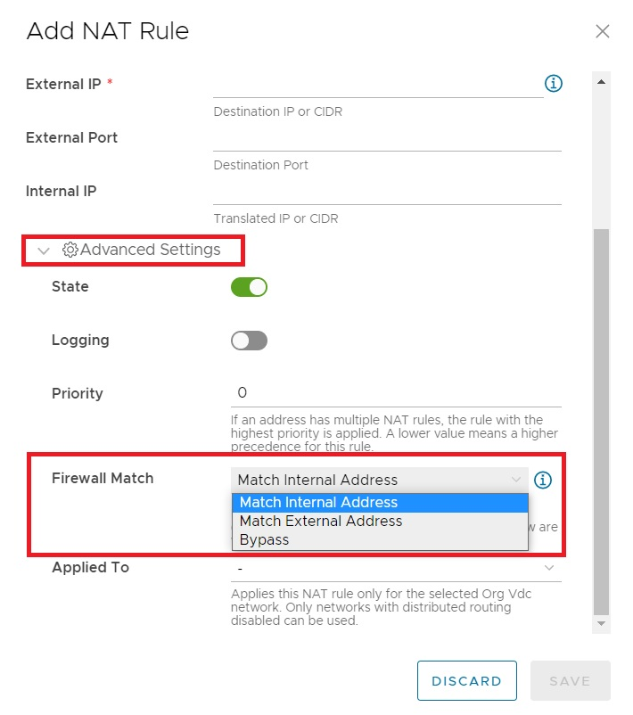

## Overview

NAT services provided by NSX-T function in much the same manner as with NSX-V. However how NAT services are displayed and configured is different. This includes options for additional types of NAT service and for determining how Firewall Rules are applied during the NAT process.

To assist with the migration to NSX-T, such changes are presented and compared.

## NSX-V

The configuration of NAT rules under NSX-V is available from the Edge Gateway SERVICES option, as shown below:

As highlighted above there are two types of NAT rules available; Destination NAT (DNAT) and Source NAT (SNAT).

An SNAT is used to translate the source IP address of packets sent from an organisation VDC network out to an external network.

A DNAT is used to translate the IP address and, optionally, the port of packets received by an organisation VDC network, that are coming from an external network.

## NSX-T

With NSX-T, NAT configuration is available from the NAT option, under the Edge Gateway menu, as shown below.

A NAT rule can be added using the NEW option; An existing rule can be modified or deleted by selecting the appropriate radio button and using one of the EDIT or DELETE options:

There are five types of NAT rules available with NSX-T:

- Source NAT (SNAT)
- Destination NAT (DNAT)
- No Source NAT (No SNAT)
- No Destination NAT (No DNAT)
- Reflexive

The SNAT and DNAT options are the same as in NSX-V and are not discussed further.

The No SNAT option disables source address translation for particular sources. This can be useful in scenarios where certain sources within a particular range must not be translated, while all other sources within the same range require translation. In this case the appropriate No SNAT rule would be placed above the appropriate SNAT rule.

Similarly the No DNAT option disables destination address translation for particular destinations.

Reflexive is used to translate a single internal IP address to a single translated IP address, in a one-to-one mapping. Reflexive NAT is stateless and as such cannot be associated with specific TCP or UDP ports; all other types of NAT are stateful.

NSX-T also provides an Advanced Settings option for NAT configuration. This includes an option to determine how Firewall Rules are applied during the NAT process.

Three options are available:

1. Match Internal Address, which applies Firewall Rules to the internal address of a NAT rule
2. Match External Address, which applies Firewall Rules to the external address of a NAT rule
3. Bypass, which bypasses the firewall entirely

To further explain the options above, imagine that an SNAT rule is configured to translate an internal source IP subnet of 10.10.10.0/24 to an external source IP address of 103.74.200.10. In the case of the Match Internal Address option, a firewall rule permitting a source of 10.10.10.0/24 would be required. In the case of the Match External Address option, a firewall rule permitting a source of 103.74.200.10 would be required.

Now imagine that a DNAT rule is configured to translate an external destination IP address of 103.74.200.11 to an internal destination IP address of 10.10.20.20. In the case of the Match Internal Address option, a firewall rule permitting a destination of 10.10.20.20 would be required. In the case of the Match External Address option, a firewall rule permitting a destination of 103.74.200.11 would be required.

Finally the Bypass option does not require the configuration of a matching firewall rule as the firewall is bypassed entirely.

!!! note
    The Bypass option should only be used under rare circumstances as it disables the standard security function provided by the firewall. Only use this option temporarily and when troubleshooting NAT related issues.

!!! note
    If no option is selected for the Firewall Match, the default setting of Match Internal Address is applied. It is important to consider if this default setting will match existing firewall policy. If firewall policy is based on matching External IP addresses, this default must be modified.

## Next Steps

Familiarise with the updated display and configuration of NAT rules provided by NSX-T, and determine the impact of any changes upon the NAT configuration within your tenancy.

For additional information on the configuration of NAT rules in NSX-T consult the [VMware Documentation](https://docs.vmware.com/en/VMware-Cloud-Director/10.4/VMware-Cloud-Director-Tenant-Portal-Guide/GUID-9E43E3DC-C028-47B3-B7CA-59F0ED40E0A6.html).
