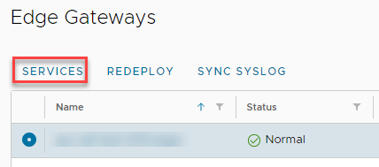
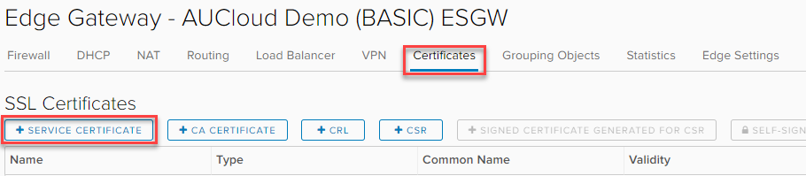
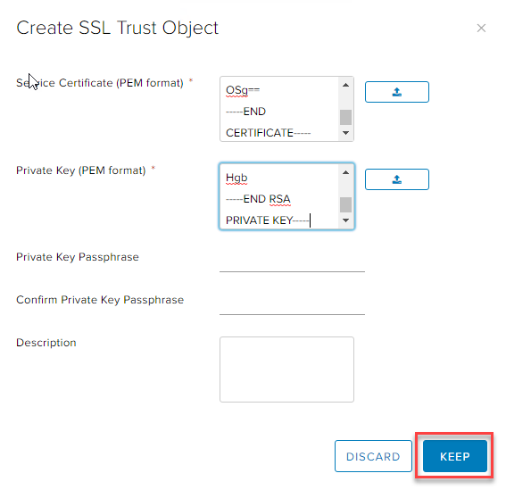
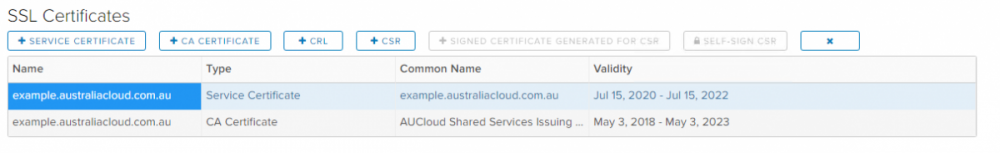
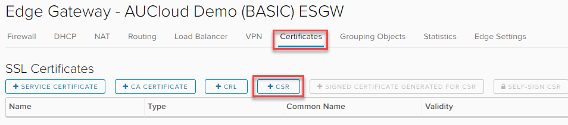
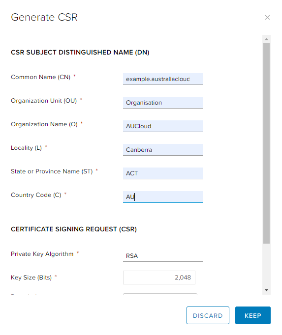
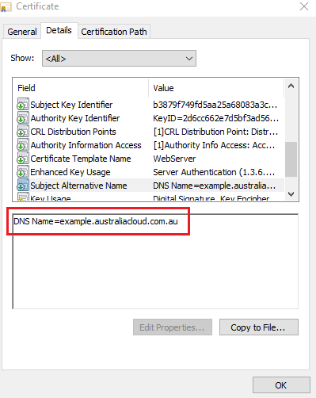
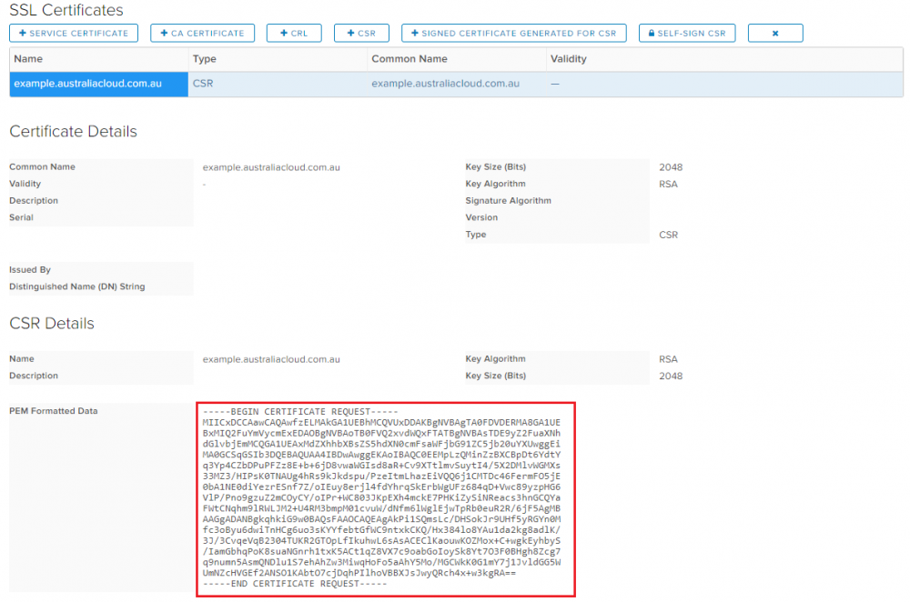
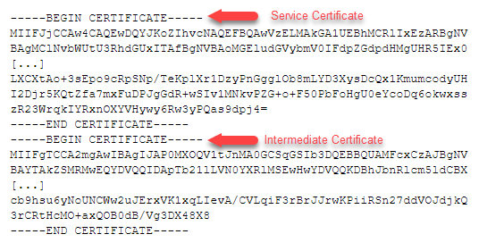

## Overview

The Edge Services Gateway (ESG) requires certificates when configuring some services, most commonly when configuring TLS load balancer capability.

There are two methods to upload certificates (PEM format only) into the ESG:

- **Upload an issued Certificate and Private Key; or**
- **Generate a CSR directly from the ESG to get a certificate issued and signed by a Public/Private Certificate Authority.**

    !!! note

        There is no method to export the certificate or the private key from the ESG once it is uploaded. Therefore, creating the CSR from the ESG will not provide the ability to download the certificate and private key. AUCloud recommends generating the CSR via an alternate method to the ESG so that the certificate and private key can be saved in an appropriate secure vault in case it needs to be accessed in the future.

        For both certificate upload methods, there is a specific way in which the Service Certificate needs to be uploaded to include the Intermediate Certificate as outlined in the VMware KB [here](https://kb.vmware.com/s/article/2113945). As explained, if the certificate is uploaded without the Intermediate Certificate then the ESG will not send the Intermediate Certificate as part of the TLS handshake and in most cases will cause certificate chain trust warnings in the browser.

## Upload an issued Certificate and Private Key

1. In the relevant Org vDC, navigate to **Networking** > **Edges.**

    

1. Select the ESG, and click **Services.**

    

1. Select the **Certificates** tab, and click **+Service Certificate.**

    

1. In the **Service Certificate** field, either copy in the PEM formatted certificate or choose to upload from file:

    !!! warning

        As discussed at the start of the procedure, if the Intermediate Certificate needs to be sent as part of the TLS handshake then it needs to be added as part of this process. If this is required but not performed, then the certificate will need to be deleted and the upload process performed again as discussed in the VMware KB [here](https://kb.vmware.com/s/article/2113945)

    An example of a PEM formatted Service and Intermediate Certificate would look like this:  
    

1. In the **Private Key Passphrase** field, either copy in the PEM formatted RSA private key or choose to upload from file.

1. To finish, click **KEEP**  

      

1. The certificate will now be listed in the **SSL Certificates** list as type **Service Certificate**. If an Intermediate Certificate was also included, it will display as a separate certificate as type **CA Certificate**.  

      

1. You can now reference this certificate in ESG configuration, particularly in Load Balancer Application Profiles.

## Generate a CSR directly from the ESG to get a certificate issued and signed by a Public/Private Certificate Authority

1. In the relevant Org vDC navigate to **Networking** > **Edges**.

    

1. Select the ESG, and click **Services.**

    

1. Select the **Certificates** tab, and click **+CSR.**

    

1. Fill out all the Certificate Fields with the desired certificate information.  

      

    !!! tip
    
        The use of the Common Name (CN) in certificates has been deemed obsolete for sometime and since roughly 2016, major browsers ceased to support certificates that only had a Common Name (CN) without a valid subject alternative name (SAN). So for the majority of browsers, certificates that do not have a valid SAN will display a certificate warning.
        
        The ESG CSR generation process does not provide the ability to include a SAN attribute as part of the creation. Therefore this certificate attribute will need to be included as part of the CA signing process on the CA server. Otherwise, the certificate will not include a SAN and will not be valid as discussed above.

    An example of a valid SAN attribute in a certificate looks like this:  

      

1. Once all fields have been defined, click **KEEP.**

1. A new entry will appear in the **SSL Certificates** List with type **CSR**. Select the certificate and the CSR will be available in PEM format. Copy the PEM Formatted Data to get signed by the certificate authority.

      

1. Once the certificate has been issued by the CA, navigate back to the ESG **Certificates** Tab.  

1. Select the CSR entry for which the issued certificate is associated and click **+Signed Certificate Generated for CSR.**  

1. In the *Signed Certificate* field, either copy in the PEM formatted certificate or choose to upload from file:

    !!! warning
    
        As discussed at the start of the procedure, if the Intermediate CA needs to be sent as part of the TLS handshake then it needs to be added as part of this process. If this is required but not performed, then the certificate will need to be deleted and a new CSR generated and signed by the CA as discussed in the VMware KB [here](https://kb.vmware.com/s/article/2113945)

    An example of a PEM formatted Service and Intermediate Certificate would look like this:  

    

1. Once the PEM formatted data has been entered, click **KEEP.**

1. The certificate will now be listed in the **SSL Certificates** list as type **Service Certificate**. If an Intermediate Certificate was also included it will display as a separate certificate as type **CA Certificate**.  

    

1. You can now reference this certificate in Load Balancer Application Profiles.
