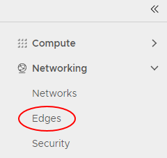

## Overview

One of the functions of the Edge Services Gateway (ESG) is to act as a basic Layer 3 load balancer, distributing IP traffic to a pool of servers while appearing as a single virtual server. The load balancing methods offered are round-robin, IP hash, URI, HTTP header or least connected.

!!! note

    The ESG load balancer is quite basic. If you have more complex requirements, you will need to provide your own third-party virtual load balancer.

## Configure a load balancer

To configure a load balancer:

1. In the VMware Cloud Director _Virtual Datacenters_ dashboard, select the VDC that contains the ESG which requires load balancer configuration.

1. In the left navigation panel, click **Edges**.

    

1. Select the ESG for configuration, and click **Services**.

    

1. Select the **Load Balancer** tab.

      

1. On the **Global Configuration** tab, enable the **Enabled** option.

1. If you have a syslog server configured, enable the **Enable Logging** option.

1. To finish, click **Save changes**.

### Configure a pool server

Pool servers are the real servers that will be masked by the load balancer.

1. Select the **Pools** tab.

    

1. Click the **+** button.

    

1. In the _Add Pool_ dialog box, enter a **Name** and **Description**. The pool name should not include any spaces.

1. From the **Algorithm** list, select the load balancing algorithm to use.

1. From the **Monitors** list, select the monitors policy.

1. Enable the **Transparent** option if you want IP addresses to be transparent.

      

1. In the _Members_ section, click **+**.

      

1. In the _Add Member_ dialog box, in the **Name** field, enter the server **Name**, **IP Address**, **Port** and **Weight**. To finish, click **Keep**.

      

1. Add more pool members as required and when completed, click **Keep**.

1. To view the status of pool members, click **Show Pool Statistics**.

### Configure a virtual server

A virtual server masks the pool of real servers and presents a single IP address.

1. Select the **Virtual Servers** tab.

    

1. Click the **+** button.

    

1. In the _Add Virtual Server_ dialog box, enable the **Enable Virtual Server** option.

1. Enter a **Name** for the virtual server, assign it a virtual **IP Address**, and assign it to the server pool you want to mask. You can also choose which services you want to apply to the virtual server. To finish, click **Keep**.

    

## Next steps

In this article you have learned how to configure a load balancer. For other ESG configuration tasks, see:

- [How to create firewall rules](./how_to_create_firewall_rules.md)
- [How to create a DHCP pool](./how_to_create_a_dhcp_pool.md)
- [How to configure IPsec VPN](./how_to_configure_ipsec_vpn.md)
- [How to create a static route](./how_to_create_a_static_route.md)
- [How to create NAT rules](./how_to_create_NAT_rules.md)
