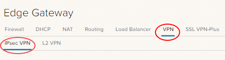
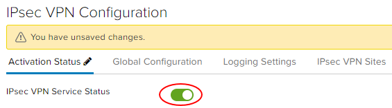
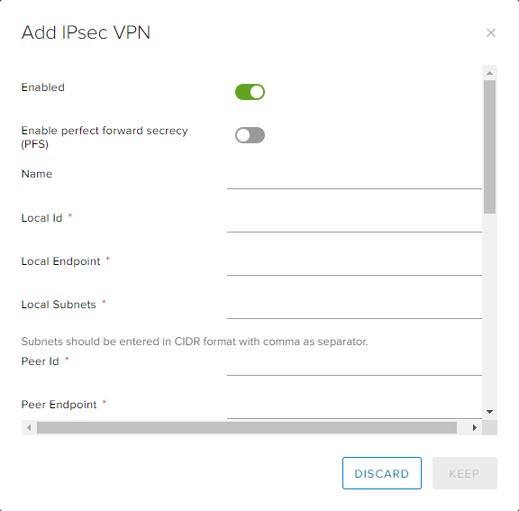

## Overview

VMware Cloud Director supports the following types of site-to-site VPN:

- Another edge gateway in the same organisation
- An edge gateway in another organisation
- A remote network offering IPsec VPN endpoint capability

Depending on the type of connection required, you will need to:

- complete IP addressing for both ends together with a shared secret, and
- indicate which virtual data centre (VDC) networks can connect to the VPN link.

!!! note

    The Edge Services Gateway (ESG) supports **site-to-site VPN only** and does not support VPN client or SSL VPN. If a VPN client is required, you will need to deploy a solution for the remote access VPN concentrator such as a Palo Alto, F5 or Fortinet.

## Pre-requisite

- Locate external IP addresses to use as your tunnel endpoint address (refer to [How to find your allocated external IP addresses](how_to_find_allocated_external_ip_addresses.md))

## Configure IPsec VPN settings settings

1. On the _Edges_ page, select the ESG for configuration, and click **Services**.

    

1. Select the **VPN** tab, then the **IPsec VPN** tab.

      

1. On the **Activation Status** tab, enable the **IPsec VPN Service Status** option.

      

1. Select the **IPsec VPN Sites** tab.

1. Click the **+** icon.

1. In the _Add IPsec VPN_ dialog box, enable the **Enabled** option.

1. Complete the configuration as follows:

    | **Field** | **Description**|
    | --- | --- |
    | Enable perfect forward secrecy (PFS) | Select this if your on-premises/remote site has that capability.|
    | Name (Optional)| Enter a name for the connection.|
    | Local ID | Enter the external IP address of the local ESG instance, which is the public IP address of the ESG. The IP address is the one used for the peer ID in the IPsec VPN configuration on the remote site.|
    | Local Endpoint| The external IP of your ESG (refer to [How to find your allocated external IP addresses](./how_to_find_allocated_external_ip_addresses.md)).|
    | Local Subnets| Enter the organisation networks that can access the VPN (separate multiple local subnets with commas). Must be entered in CIDR format.|
    | Peer ID| Enter a peer ID to uniquely identify the peer site. The peer ID is an identifier that uniquely identifies the remote device that terminates the VPN connection, typically its public IP address.|
    | Peer Endpoint | The external IP of your remote site or on-premises firewall or edge where VPN is being set up.|
    | Peer Subnets | This is the subnet on your on-premises network that you want to make accessible from your AUCloud VDC. For example, if your on-premises networks sit inside the `10.20.0.0/16` range, you could enter `10.20.0.0/16` here or limit your entry to a smaller subnet of that, for example `10.20.0.0/25`.|
    | Encryption Algorithm | Select the most secure protocol that is supported by your on-premises gateway. We suggest the best encryption algorithm to use would be AES-GCM |
    | Authentication | Select the authentication method that is supported by your on-premises gateway. If you want to use certificates, then you need to configure those first on the **Certificates** tab.|
    | Pre-Shared Key | The shared secret used to authenticate and encrypt the connection. It must be an alphanumeric string between 32 and 128 characters that includes at least one uppercase letter, one lowercase letter and one number. This must be the same on both sites.|
    | Diffie-Hellmann Group | We recommend setting this to DH14 or higher if your on-premises environment can support it. Ideally, DH15 or DH16 are most secure.|
    | Digest Algorithm | SHA256 is the more secure one |
    | IKE Options | IKEv2 is a newer protocol but you can use either |  

    

1. To Finish, click **Keep** to create the edge end of the VPN tunnel then click **Save changes**.  

## Create the second VPN gateway

You now need to create the endpoint of the VPN tunnel. If this is a different VDC or vOrg, go through the steps described above again to create the tunnel. When completed, you can change your firewall settings and validate the connection (see steps for 'Configure the ESG firewall' and 'Validating the tunnel' below).

!!! note

    If you are connecting to an external data centre, you will need to set up the tunnel on that premises.

## Creating an external data centre VPN gateway

Although we cannot provide specific instructions on setting up an external data centre gateway to connect to the edge gateway, we have provided information about some configuration requirements below.

### IKE Phase 1 and Phase 2

IKE is a standard method for arranging secure, authenticated communications.

#### Phase 1 parameters

Phase 1 sets up mutual authentication of the peers, negotiates cryptographic parameters, and creates session keys. The supported Phase 1 parameters are:

- Main mode
- AES/AES256/AES-GCM (user configurable)
- Diffie-Hellman Group
- Pre-shared secret (user configurable)
- SA lifetime of 28800 seconds (eight hours) with no kbytes re-keying
- ISAKMP aggressive mode disabled

#### Phase 2 parameters

IKE Phase 2 negotiates an IPSec tunnel by creating keying material for the IPSec tunnel to use (either by using the IKE phase 1 keys as a base or by performing a new key exchange). The supported IKE Phase 2 parameters are:

- AES/AES256/AES-GCM (Will match the Phase 1 setting)
- ESP tunnel mode
- Diffie-Hellman Group
- Perfect forward secrecy for re-keying (only if it was turned on in both endpoints)
- SA lifetime of 3600 seconds (one hour) with no kbytes re-keying
- Selectors for all IP protocols, all ports, between the two networks, using IPv4 subnets

## Configure the ESG firewall

When the VPN tunnel is up and running, you will need to create firewall rules on the ESG for any traffic passing over the tunnel, refer to [How to create firewall rules](./how_to_create_firewall_rules.md).

Key points to note:

- You need to create a firewall rule for both directions - from data centre to VDC and from VDC to data centre.
- For data centre to VDC, set:  
        •  Source as the source IP range for your external VDC/data centre network  
        •  Destination as the destination IP range for your VDC network
- For VDC to data centre, set:  
        •  Source as the source IP range for your VDC network  
        •  Destination as the destination IP range for your data centre/VDC network

## Configure the external data centre gateway firewall

When the VPN tunnel is up and running, you may need to create firewall rules and routes on your on-premises gateway or other internal firewall for traffic passing over the tunnel. This is **outside of the scope** of this article and will depend on your specific premises network configuration.

## Validating the tunnel

When both ends of the IPSec tunnel are configured, the connection should start without any issues.

To verify the tunnel status in VMware Cloud Director:

1. On the _Edges_ page, select the edge that you want to configure and click **Configure Services**.
2. Select the **Statistics** tab and then the **IPsec VPN** tab.
3. For each configured tunnel, if a tick is visible then the tunnel is up and running, and operational. If any other status is shown, you will need to review your configuration and any firewall rules.
4. You should now be able to send traffic via the VPN.

## Next steps

In this article you have learned how to configure IPsec VPN. For other ESG configuration tasks, see:

- [How to create firewall rules](./how_to_create_firewall_rules.md)
- [How to create a DHCP pool](./how_to_create_a_dhcp_pool.md)
- [How to configure a load balancer](./how_to_configure_a_load_balancer.md)
- [How to create a static route](./how_to_create_a_static_route.md)
- [How to create NAT rules](./how_to_create_NAT_rules.md)
