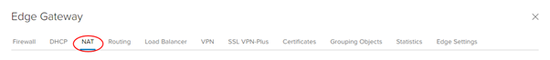
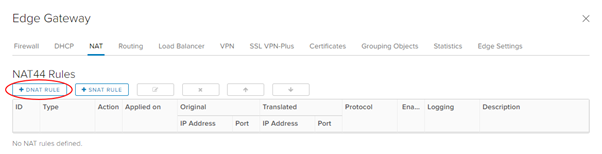
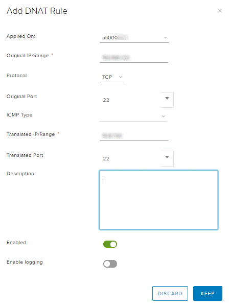
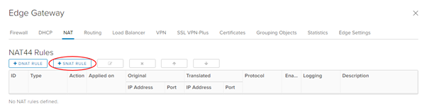

## Overview

Network Address Translation (NAT) allows the source or destination IP address to be changed to enable traffic to transition through a router or gateway.

You can use three types of NAT within your Edge Services Gateway (ESG):

- **Destination NAT (DNAT)** \- changes the destination IP of the packet,
- **Source NAT (SNAT)** \- changes the source IP of the packet; and
- **NAT64** \- allows access from IPv6 networks to IPv4.

For a virtual machine (VM) to access an external network resource from its virtual data centre (VDC), the IP address of its network needs translation to the public internet IP addresses provided by AUCyber.

Note for both DNAT and SNAT:

- The NAT rule will be applied to the ESG, rather than to the internal VDC network.
- The firewall needs to be open for NAT rules.

## Create a DNAT rule

DNAT changes the destination IP address of a packet and performs the reverse function for any replies. You can use DNAT to publish a service located in a private network on a public IP address.

1. In the VMware Cloud Director _Virtual Datacenters_ dashboard, select the VDC that contains the ESG that requires the DNAT rule.

1. In the left navigation panel, click **Edges**.

    

1. Select the ESG for configuration, and click **Services**.

    

1. Select the **NAT** tab.

    

1. In the _NAT44 Rules_ section, click **+DNAT Rule**.

    

1. In the _Add DNAT Rule_ dialog box, from the **Applied On** list, select the interface on which to apply the rule. Unless you have special requirements, this will be the external network (usually named `nti\*` or `nft\*`).

1. Enter an **Original IP/Range** and a **Translated IP/Range**.

1. Select the **Protocol**, **Original Port** and **Translated Port**.

1. Make sure the **Enabled** option is selected.

1. If you have a syslog server configured, select the **Enable logging** option.

    

1. To finish, click **Keep** then **Save changes**.

## Create a SNAT rule

SNAT changes the source IP address of a packet and performs the reverse function for any replies. When connecting to an external network, such as the internet, to access services (for example, DNS), you need to define a SNAT rule to translate your internal address into something available on the external network (for example, PSN, internet).

1. In the VMware Cloud Director _Virtual Datacenters_ dashboard, select the VDC that contains the ESG that requires the SNAT rule.

1. In the left navigation panel, click **Edges**.

    

1. Select the ESG for configuration, and click **Services**.

    

1. Select the **NAT** tab.

    

1. In the _NAT44 Rules_ section, click **\+ SNAT Rule**.

    

1. In the _Add SNAT Rule_ dialog box, from the **Applied On** list, select the interface on which to apply the rule. Unless you have special requirements, this will be the external network (usually named `nti\*` or `nft\*`).

1. Enter an **Original Source IP/Range** and a **Translated Source IP/Range**.

1. Make sure the **Enabled** option is selected.

1. If you have a syslog server configured, select the **Enable logging** option.

    

1. To finish, click **Keep** then **Save changes**.

## Next steps

In this article, you have learned how to create DNAT and SNAT rules. For other ESG configuration tasks, see:

- [How to create firewall rules](./how_to_create_firewall_rules.md)
- [How to create a DHCP pool](./how_to_create_a_dhcp_pool.md)
- [How to configure IPsec VPN](./how_to_configure_ipsec_vpn.md)
- [How to configure a load balancer](./how_to_configure_a_load_balancer.md)
- [How to create a static route](./how_to_create_a_static_route.md)
