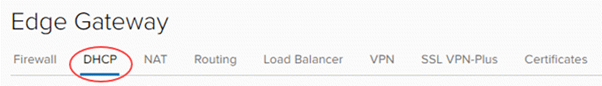
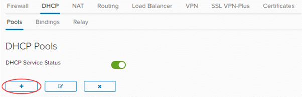
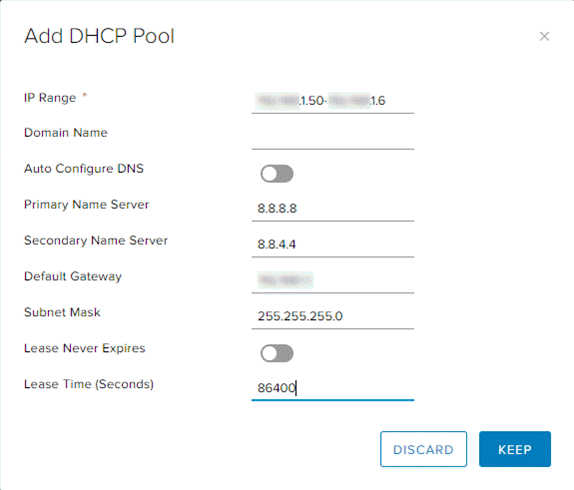

## Overview

With virtual data centre (VDC) networks, you have the option of creating an IP pool of addresses to be assigned automatically or manually (a.k.a. static IP pool). These addresses are injected into virtual machines (VMs) via VMware Tools during Guest Customisation. They appear in the usual places in Windows and Linux where you would interrogate IP settings, and show as static addresses.

In some situations, you may require true DHCP functionality in your VMs to show IP addresses as dynamically defined. As with an IP pool, you are defining a non-overlapping range of IP addresses to use on the network.

## Create a DHCP pool for an advanced gateway

To create a DHCP pool:

1. In the VMware Cloud Director _Virtual Datacenters_ dashboard, select the VDC that contains the Edge Services Gateway (ESG) that requires the DHCP pool.

1. In the left navigation panel, click **Edges**.

    

1. Select the ESG for configuration, and click **Services**.

    

1. Select the **DHCP** tab.

      

1. In the **Pools** tab, click the **+** button.

      

1. Select the network to which you want to apply the DHCP pool, then define an IP range for the pool. You can leave the lease times as default or change them.

      

1. To finish, click **Keep**.

## Next steps

In this article you have learned how to create a DHCP pool. For other ESG configuration tasks, see:

- [How to create firewall rules](./how_to_create_firewall_rules.md)
- [How to configure IPsec VPN](./how_to_configure_ipsec_vpn.md)
- [How to configure a load balancer](./how_to_configure_a_load_balancer.md)
- [How to create a static route](./how_to_create_a_static_route.md)
- [How to create NAT rules](./how_to_create_NAT_rules.md)
