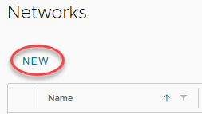
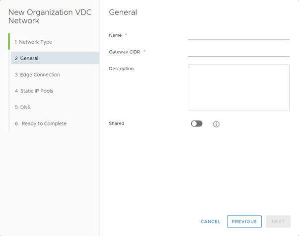
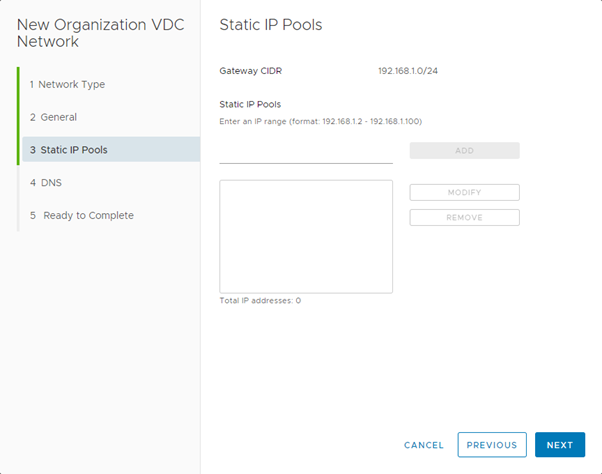
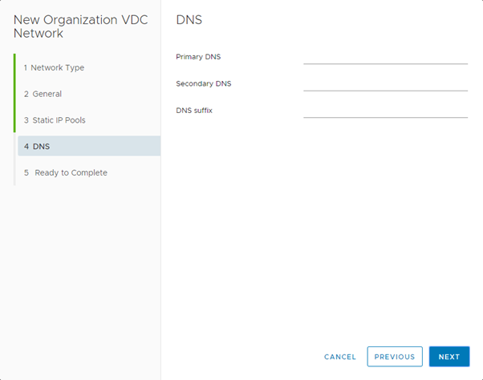

### Overview

An organisation virtual data centre network enables its virtual machines (VMs) to communicate with each other or to provide access to external networks. A single VDC can have multiple networks.

There are two network flavours, isolated and routed:

- An isolated (internally connected) network is one that only VMs within the VDC can connect to. This guide describes how to create an isolated VDC network.
- A routed network (externally connected) provides access to machines and networks outside the VDC via the edge gateway. You can have up to nine usable routed networks per VDC. Creation of routed networks is described in [How to create a routed VDC network](./how_to_create_a_routed_vdc_network.md).

## Creating an isolated network

1. In the *VMware Cloud Director Virtual Datacenters* dashboard, select the VDC in which you want to create the network.

1. In the left navigation panel, select **Networks**.

    

1. Click **New**.

    

1. In the *Network Type* page of the New Organization VDC Network dialog box, select **Isolated** then click **Next**.

    

1. In the *General* page, enter a **Name** and **Description** for the network.

1. In the **Gateway CIDR** field, the gateway address for the network.

1. Select the **Shared** option to make the network available to other VDCs within the same region.

    

1. Click Next.

1. In the **Static IP Pools** field, enter a range of addresses to be consumed by the VMs connecting to the network, then click **Add**.

    As an example, if you give the gateway address as `192.168.1.1/24`, you may then want to create a **Static IP Pool** of `192.168.1.10-192.168.1.100`. This will give you a pool of 91 IP addresses to assign to machines within your network. You can always increase this later if needed.

    You can add multiple IP pools.

    

1. When you're done, click **Next**.

1. In the *DNS* page, enter DNS information if possible then click **Next**.

    

1. On the *Ready to Complete* page, review your selections then click **Finish**.
