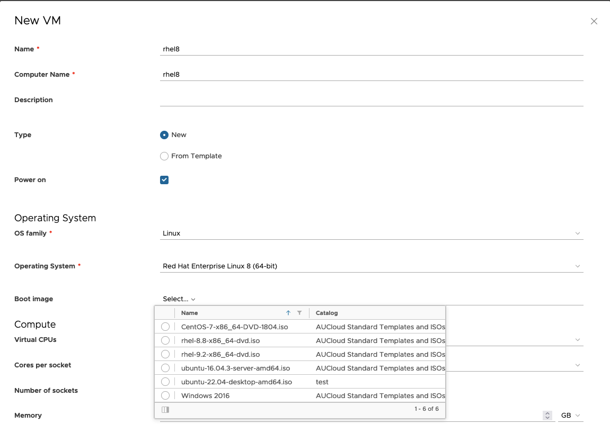

## Overview  

To receive Red Hat Enterprise Linux (RHEL) updates while on AUCloud VCD infrastructure you will need to configure your guest OS with a client configuration RPM entitlement.
This will install AUClouds YUM repositories and copy entitlement certificates to your desired RHEL guest OS.  

!!! note "RedHat Enterprise Linux available versions"
    Only RedHat Enterprise Linux 8 and 9 are available for update distribution. Further packages or operating systems please contact your CSM or raise a case via the portal.

## Firewall rules and DNS configuration
The AUCloud YUM repositories are at `rhui.australiacloud.com.au`. This domain is in public DNS records and your RHEL box, when installed, will need to be able to resolve the address.

In order to consume updates the RHEL virtual machines will need to be able to reach `rhui.australiacloud.com.au` over TCP 443.
Users will need to appropriately configure edge gateway firewalls for their VMware Cloud Director tenancies to allow access outbound to `rhui.australiacloud.com.au`

!!! note: "3rd party internet gateways"
    Access to the RHUI infrastructure is explicitly limited to the public IP range allocated to tenancies in AUCloud.
    3rd Party internet gateways may inhibit access.


## Accessing and provisioning from RHEL ISOs

Users can provision VM's from ISO's in AUCloud's standard catalog.
VM's are provisioned from ISO's using type 'NEW' rather than type 'From Template'.




Currently the two ISOs available are:

- RHEL 8.8: `rhel-8.8-x86_64-dvd.iso`
- RHEL 9.2: `rhel-9.2-x86_64-dvd.iso`

AUCloud will update as appropriate the latest minor versions. Once running through the RHEL installer users will need to provision the entitlements.

!!! warning "Licensing configuration"
    Do not directly register with Red Hat for your licenses.


## Installing RHEL entitlements

Depending on your version of RHEL, download the appropriate version to the desired guest OS ie `/tmp`  

- [RedHat Enterprise Linux 8 entitlement](./assets/RHE8-2023-06-26-1.0-1.noarch.rpm)
- [RedHat Enterprise Linux 9 entitlement](./assets/RHE9-2023-06-26-1.0-1.noarch.rpm)

To install run the following appending the version

```bash
#Example RHE8

sudo rpm -i /tmp/RHE8-2023-06-26-1.0-1.noarch.rpm

#Example RHE9
sudo rpm -i /tmp/RHE9-2023-06-26-1.0-1.noarch.rpm

```

## Uninstalling RHEL entitlements

To uninstall you uninstall based on the RPM name *NOT THE FILE*

```bash
#Example RHE8

sudo rpm -e RHE8-2023-06-26-1.0-1.noarch

#Example RHE9
sudo rpm -e RHE9-2023-06-26-1.0-1.noarch

```

!!! note "Upgrading entitlements"
    To upgrade simply uninstall using the above commands then install the new RPM.