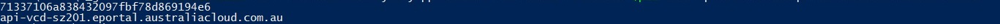

## Overview

VMware PowerCLI is a Microsoft PowerShell based command line interface tool which was developed by VMware to manage and automate tasks on various VMware platforms such as vSphere, VMware Cloud Director, Horizon, etc.

The latest version of PowerCLI is available from the [VMware website.](https://developer.vmware.com/powercli)

If your system has connection to the internet, you can perform the following to install the PowerCLI module:

``` > Install-Module VMware.PowerCLI -Scope CurrentUser ```

To connect to the AUCyber platform via PowerCLI, you need the API-URL, Org-ID, and User-ID which can be found by:

1. Logging into the AUCyber Portal
2. Selecting API Management under your User ICON in the top right menu
3. Select the Cloud Services tab.

Below are screenshots for details:  


The API Url is listed in `https://<address\>` format and the Username is listed in `User-Id_@_Org-Id` format.

!!! note

        There are two methods to authenticate with VMware Cloud Director using PowerCLI: username/password or session token. Both methods are discussed in this document.

To establish a connection to AUCyber platform via username and password, perform the following command:

``` > Connect-CIServer -Server <API-Url> \-org <Org-Id> \-User <User-Id> \-Password <Portal\_Password> ```

!!! note

    **API-Url** :  remove `https://` from the API Url listed on the AUCyber Portal API

    **User-Id** :  enter the _User-Id_ without _@Org-Id_

    **Org-Id** : enter the _Org-Id_ listed under username

To establish a connection to the AUCyber platform via session token, first, a session token must be generated. This can be achieved using the following PowerShell module :

``` powershell
$Global:Authorization = ""
 
$Global:Accept = "application/*+xml;version=36.3"
 
$Global:xvCloudAuthorization = ""
 
Function New-CloudToken($Username,$Password,$URL)
 
{  
     
    $Pair = "$($Username):$($Password)"
 
    $Bytes = [System.Text.Encoding]::ASCII.GetBytes($Pair)
 
    $Base64 = [System.Convert]::ToBase64String($Bytes)
 
    $Global:Authorization = "Basic $base64"
 
    $headers = @{ Authorization = $Global:Authorization; Accept = $Global:Accept}
 
    $Res = Invoke-WebRequest -Method Post -Headers $headers -Uri "https://$($URL)/api/sessions"
 
    $Global:Server = $($URL)
 
    $Global:SessionID = $res.headers["X-Vcloud-Authorization"]
 
    Write-Output "$SessionID"
 
    Write-Output "$Server"
 
}
```

To use the above module, copy and paste the above code into a local file named New-CloudToken.psm1. Then in a new PowerShell window, enter the following command :

```> Import-Module <Path to .psm1 file> ```

!!! note

      The above command imports the module for the current session **only**.
    
      To import the module for all sessions, update your PowerShell profile to include the above command as documented by  [Microsoft.](https://learn.microsoft.com/en-us/powershell/module/microsoft.powershell.core/about/about_profiles?view=powershell-7.3)

Using the username (including the Org-ID) and the API-URL copied from the Portal earlier, along with your Portal Password, generate a new Session Token using the imported module :

``` > New-CloudToken -User <User-Id@Org-Id> \-Password <Portal\_Password> \-Server <API-Url> ```

!!! note

    **API-Url** :  remove `https://` from the API URL listed on the AUCyber Portal API

    **User-Id** :  enter the _User-Id_ including _@Org-Id_

A new session token, along with the API-URL will be the output of this command : 



In the example above, "71337106a838432097fbf78d869194e6" is the Session-Token and "api-vcd-sz201.eportal.australiacloud.com.au" is the API-URL.

Using this information, you can then establish a connection to the AUCyber platform by performing the following command.

```> Connect-CIServer -Server <API-URL> -Session <Session-Token> ```

Once connected, you can start using PowerCLI commands to retrieve information/manage the ecosystem within your vDC Organisation. To verify that you have logged in to the environment successfully, you can perform a simple command line to retrieve all VMs in your tenancy by running the command below :

``` > Get-CIVM ```

Example of the output:


