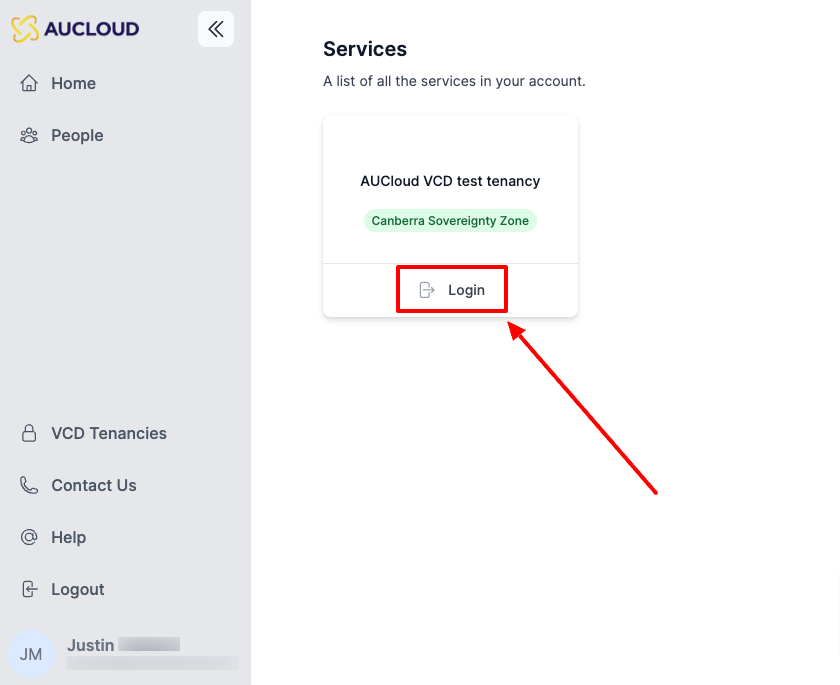

# Retrieve your VMWare Cloud Director (VCD) Organization name

This guide details the steps required to obtain the Organization name of your VCD organization.  This is the unique identifier that is required for managing objects inside that organization via VCD APIs, CLIs, Terraform, etc. 

## Steps

1. Log in to the [AUCloud Portal](https://app.aucloud.com.au)
1. Log in to the tenancy that you want to connect to:

    

1. Navigate to "Administration":

    

1. Click on "General" under "Settings".  The Organization name will be displayed:

    