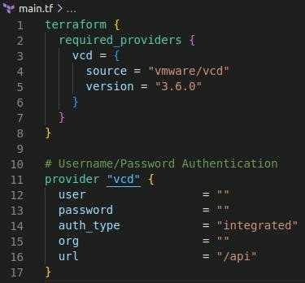

## Overview

In order to configure your AUCloud IaaS tenancies using Terraform, you must first pass the necessary authentication information to the VMware Cloud Director (vCD) Terraform provider.

There are currently 2 supported authenticated methods:

1. Connecting as Org Admin, or
1. Connecting with a bearer token

## Connecting as Org Admin

1. To establish as an Org Admin you will need a "local" VCD user with "Organization Administrator" permissions. Follow [the steps outlined here](./vcd_local_user_setup.md) to create a "local" VCD user if you have not already done so.
1. [Retrieve the unique name of your VCD tenancy](./retrieve_tenancy_name.md)
1. Retrieve the API server URL for your VCD tenancy from [the list of AUCloud VMware Cloud Director API Endpoints](../../reference_urls.md#vmware-cloud-director-api-endpoints)
1. Connect to VCD with Terraform

    The [VMware Cloud Director Terraform Provider](https://registry.terraform.io/providers/vmware/vcd/latest/docs) requires the following inputs in order to connect as a VCD Organization Administrator:

    - **`auth_type`**: must be `"integrated"`
    - **`user`**: username of your "local" VCD user
    - **`password`**: password of your "local" VCD user
    - **`org`**:  unique name of your VCD tenancy
    - **`url`**: API URL of your VCD instance + `"/api"`, e.g. `https://api-vcd-sz201.portal.australiacloud.com.au/api`

    Once you have these values you can fill in the missing provider configuration:

    

## Connecting with a bearer token

1. Generate a bearer token through one of the following methods:
    1. [Using username + password credentials of a local VCD user.](./authentication_methods.md#use-username-password)
    1. [Using a manually generated VCD API token.](./authentication_methods.md#use-vcd-api-token)
1. [Retrieve the unique name of your VCD tenancy](./retrieve_tenancy_name.md)
1. Retrieve the API server URL for your VCD tenancy from [the list of AUCloud VMware Cloud Director API Endpoints](../../reference_urls.md#vmware-cloud-director-api-endpoints)
1. Connect to VCD with Terraform

    - **`auth_type`**: must be `"token"`
    - **`user`**: must be `"none"`
    - **`password`**: must be `"none"`
    - **`token`**: The API token you created in step 1
    - **`org`**:  unique name of your VCD tenancy
    - **`url`**: API URL of your VCD instance + `"/api"`, e.g. `https://api-vcd-sz201.portal.australiacloud.com.au/api`           

    
