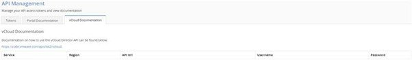
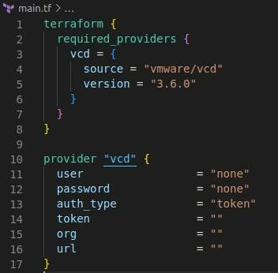
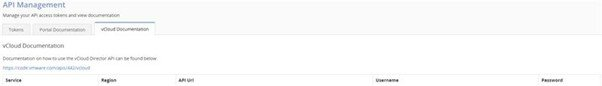
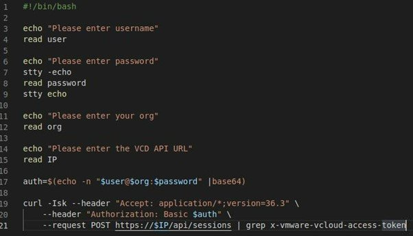

## Overview

In order to configure your AUCyber IaaS tenancies using Terraform, you must first pass the necessary authentication information to the VMware Cloud Director (vCD) Terraform provider.

There are currently 2 supported authenticated methods:

1. Connecting as Org Admin, or
1. Connecting with authorization or bearer token.

## Connecting as Org Admin

In the above example, there are 4 arguments you must populate using information obtained from one of the [Portal API endpoints](../../reference_urls.md#vmware-cloud-director-api-endpoints)

1. The required **user** argument can be found under the Username column aligned with the Service you wish to configure. It consists of the rational number before the @ symbol.

1. The **password** argument is identical to that which you use to login to the portal. It is for this reason that we recommend that you either secure your source code or pass the argument in as a variable.

1. The **org** argument consists of the string to the right of the @ symbol in the Username column.

1. The **API** argument must be the URL listed under the API URL column with /api appended to the end of the string.

    Once these arguments have been correctly defined, you may start configuring or importing vCD resources using Terraform.

    !!! note

        If you have more than one service, all of the above values must be drawn from the record associated with the service you wish to configure

## Connecting with authorization or bearer token

In the above example, there are 2 arguments you must populate using information obtained from one of the [Portal API Endpoints](../../reference_urls.md#portal-api-endpoints)

There is also an additional value, **token**, which needs to be obtained from an API call outside of Terraform.

1. The **org** argument consists of the string to the right of the @ symbol in the Username column.

1. The **API** argument must be the URL listed under the API Url column with /api appended to the end of the string.

In order to obtain the necessary value for the token argument, you must make an **HTTP POST request** to the API URL appended with /api/sessions associated with your VCD service. In this POST request you must represent your full username (including the @ symbol) and password as a base64 encoding in an Authorization header.

See [https://developer.vmware.com/apis/1245/vmware-cloud-director/doc/doc/operations/POST-Login.html](https://developer.vmware.com/apis/1245/vmware-cloud-director/doc/doc/operations/POST-Login.html "https://developer.vmware.com/apis/1245/vmware-cloud-director/doc/doc/operations/post-login.html")

A successful request will return a `x-vmware-vcloud-access-token` which can be inserted into the Terraform token argument.

Below is a simple bash script to obtain this information:

