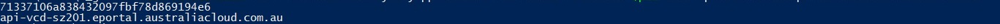
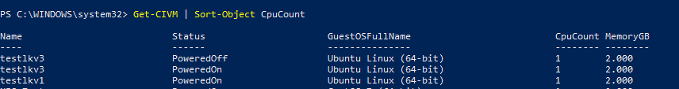

> :warning: **Effective from Dec 1st, 2023**

## Overview

VMware PowerCLI is a Microsoft PowerShell based command line interface tool which was developed by VMware to manage and automate tasks on various VMware platforms such as vSphere, VMware Cloud Director, Horizon, etc.

The latest version of PowerCLI is available from the [VMware website.](https://developer.vmware.com/powercli)

If your system has connection to the internet, you can perform the following to install the PowerCLI module:

``` > Install-Module VMware.PowerCLI -Scope CurrentUser ```

To establish a connection to AUCloud platform using PowerCLI you will need a local user, and the API server URL of the VMWare Cloud Director instance that you want to connect to. 

### Connect to AUCloud using username/password

1. [Create a local user in VMware Cloud Director](./vcd_local_user_setup.md)
1. [Retrieve the unique name of your VCD tenancy](./retrieve_tenancy_name.md)
1. Retrieve the API server URL for your VCD tenancy from [the list of AUCloud VMware Cloud Director API Endpoints](../../reference_urls.md#vmware-cloud-director-api-endpoints)
1. Run the following command to establish the connection:

    ```
    > Connect-CIServer -Server <API-Url> \-org <Org-Id> \-User <User-Id> \-Password <Password>
    ```

    !!! note

        **API-Url** :  API URL you just retrieved

        **Org-Id** : unique name of your VCD tenancy

        **User-Id** :  username of the user you just created

        **Password** : password of the user you just created

### Connect to AUCloud using session token

1. Create a session using the following PowerShell module:

    ``` powershell
    $Global:Authorization = ""
    
    $Global:Accept = "application/*+xml;version=36.3"
    
    $Global:xvCloudAuthorization = ""
    
    Function New-CloudToken($Username,$Password,$URL)
    
    {  
        
        $Pair = "$($Username):$($Password)"
    
        $Bytes = [System.Text.Encoding]::ASCII.GetBytes($Pair)
    
        $Base64 = [System.Convert]::ToBase64String($Bytes)
    
        $Global:Authorization = "Basic $base64"
    
        $headers = @{ Authorization = $Global:Authorization; Accept = $Global:Accept}
    
        $Res = Invoke-WebRequest -Method Post -Headers $headers -Uri "https://$($URL)/api/sessions"
    
        $Global:Server = $($URL)
    
        $Global:SessionID = $res.headers["X-Vcloud-Authorization"]
    
        Write-Output "$SessionID"
    
        Write-Output "$Server"
    
    }
    ```

    To use the above module, copy and paste the above code into a local file named New-CloudToken.psm1. Then in a new PowerShell window, enter the following command :

    ```> Import-Module <Path to .psm1 file> ```

    !!! note

        The above command imports the module for the current session **only**.
        
        To import the module for all sessions, update your PowerShell profile to include the above command as documented by  [Microsoft.](https://learn.microsoft.com/en-us/powershell/module/microsoft.powershell.core/about/about_profiles?view=powershell-7.3)

1. Run the following command to establish the connection:

    ```
    > New-CloudToken -User <User-Id@Org-Id> \-Password <Password> \-Server <API-Url>
    ```

    !!! note

        **API-Url** :  API URL you just retrieved

        **Org-Id** : unique name of your VCD tenancy

        **User-Id** :  username of the user you just created

        **Password** : password of the user you just created

    A new session token, along with the API-URL will be the output of this command : 

    

    In the example above, `71337106a838432097fbf78d869194e6` is the Session-Token and `api-vcd-sz201.eportal.australiacloud.com.au` is the API-URL.

1. Using this token you can establish a connection to the AUCloud platform by performing the following command.

    ```
    > Connect-CIServer -Server <API-URL> -Session <Session-Token>
    ```

1. Once connected, you can start using PowerCLI commands to retrieve information/manage the ecosystem within your vDC Organisation. To verify that you have logged in to the environment successfully, you can perform a simple command line to retrieve all VMs in your tenancy by running the command below :

    ```
    > Get-CIVM
    ```

    Example of the output:

    
