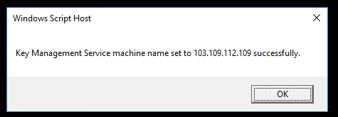
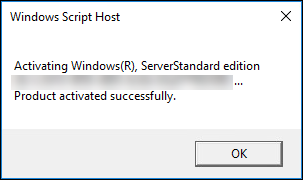
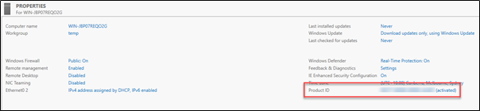

## Overview

Windows Server licensing for VMs in shared environments must be provided by AUCyber via the Microsoft Service Provider License Agreement (SPLA).

VMs using the Windows Server OS need to connect to AUCyber’s KMS server to activate the product key to validate that the license has been applied.

## Activating Windows Licensing on AUCyber Server templates

After deploying your server from the templates, ensure your VM is connected to the Edge Services Gateway (ESG) via a Routed network.

Configure the Firewall settings on your ESG to connect with the AUCyber KMS Server using following rule:

| Source | Destination | Service | Action |
| -----  | -----       | ----    | ----   |
|VM's IP Address | 103.109.112.109 | TCP:1688 | Accept |

!!! note

    The above destination IP address is for Canberra (CSZ). 
    If your VM(s) are located in Sydney (SSZ), please use the Sydney KMS server target of 103.2.240.109

Configure a SNAT rule to ensure your VMs IP is translated to the Public IP (if not done previously)

| Applied On | Original Source IP/Range | Translated Source IP/Range |
| ---------  | -----------------------  | ------------------------  |
| External-internet-01 | VMs IP Address | Public IP Address |

Login to the target server with Administrator privileges In Command Prompt enter the following command to set the path to the KMS Server:

`slmgr.vbs /skms 103.109.112.109`
(or use the Sydney KMS server target if applicable)

Confirmation will be received that the KMS machine name has been set successfully

Initiate the activation by entering the following:

`slmgr.vbs /ato`

Confirmation will be received that the product has been activated successfully

The Server license key has now been activated, to verify the activation, enter the following:

`slmgr.vbs /dlv`

The output will display a window detailing the server’s licensing configuration.

On the dashboard of the local server, the Product ID will be displayed

## If your VM has an existing MAK Key, change this to KMS.

To change to a KMS activation from your MAK type:

Run these commands:

`slmgr /ipk` (insert Generic Volume Licence Key - see [here](https://docs.microsoft.com/en-us/windows-server/get-started/kms-client-activation-keys) for reference)
`slmgr.vbs /skms` (insert Canberra or Sydney KMS Server [IP](../../reference_urls.md#aucyber-microsoft-kms-server))
`slmgr.vbs /ato`
