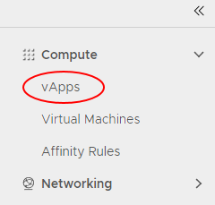
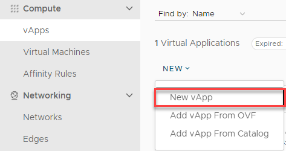
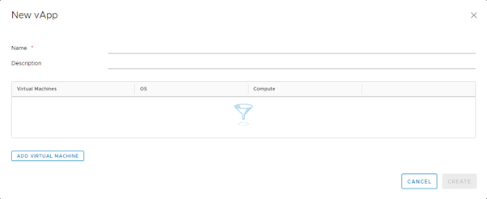

## Overview

VMware Cloud Director uses vApps to make virtual machine (VM) creation and management easy and flexible. vApps are essentially containers for VMs and can be used in many ways. One of the most common uses of a vApp is to group similar VMs together for easy management. Or you can put VMs that form a multi-tier application into the same vApp for greater control. Up to 128 vApps can be created within a virtual data centre (VDC) and intelligently networked to create complex architectures that can be managed easily.

In this guide we'll look at how to create a vApp from scratch.

1. In the VMware Cloud Director _Virtual Datacenters_ dashboard, select the VDC in which you want to create the vApp.

1. In the left navigation panel, select **vApps** to view a list of vApps within the VDC.

    

1. Click **New vApp**.

    

1. In the _New vApp_ dialog box, enter a **Name** and **Description** for your vApp. The name should be something that will easily identify it if you're building a large environment with multiple vApps.

    

1. You can now click **Add Virtual Machine** to populate the vApp with VMs. There are several ways to create a VM:

    - From an existing template see [How to create a VM from a template](./how_to_create_a_vm_from_a_template.md).
    - Catalog creation is covered in [How to create a catalog](../Catalogs/how_to_create_a_catalog.md).
    - From scratch, without using a template see [How to create an empty VM](how_to_create_an_empty_vm.md).

1. When you've finished creating your vApp, click **Create**.

1. When your vApp has finished deploying, in the card for the vApp, select **Actions, Power** then **Power On** to power it on.
