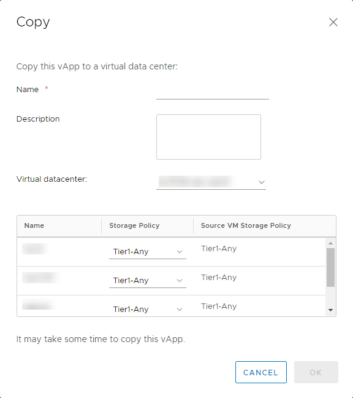
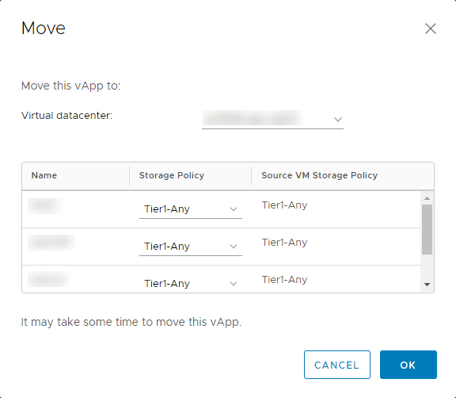

### Overview

If you have multiple virtual data centres (VDCs), you may find that you want to migrate vApps from VDC to VDC; whether that be from a test and dev environment into production or between VDCs with different service levels.

There are two ways to migrate vApps between VDCs: 

- copy, and 
- move

This article describes how to use these different methods to migrate your VDCs.  

### Copying a vApp

You may want to copy your vApp from one VDC to another VDC, leaving the original vApp in the source VDC that you can continue to use. You can perform the vApp copy operation on running vApps.

To copy a vApp:

1. In the VMware Cloud Director _Virtual Datacenters_ dashboard, select the VDC that contains the vApp you want to copy.

1. In the left navigation panel, click **vApps**.

1. In the card for the vApp that you want to copy, select **Actions** then **Copy**.

1. In the _Copy_ dialog box, enter a **Name** for the copied vApp and select which VDC you want to migrate it to. You can also change the storage policy for each virtual machines (VMs) within the vApp.

    

1. When you're happy with the configuration, click **OK** to begin the copy operation.  

## Moving a vApp

You may want to completely move your vApp from one VDC to another VDC. This will remove the vApp from the source VDC and move it to the destination. To perform this operation, the vApp must be powered off.

To move a vApp:

1. In the VMware Cloud Director _Virtual Datacenters_ dashboard, select the VDC that contains the vApp you want to move.

1. In the left navigation panel, click **vApps**.

1. In the card for the vApp that you want to move, select **Actions** then **Move to**.

1. In the _Move_ dialog box, select which VDC you want to migrate the vApp to. You can also change the storage policy for each VMs within the vApp.

    

1. When you're happy with the configuration, click **OK** to begin the move operation.

1. When the move operation is complete, power the vApp back on by selecting **Actions** then **Power On**.