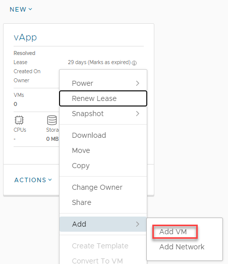
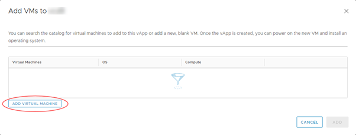
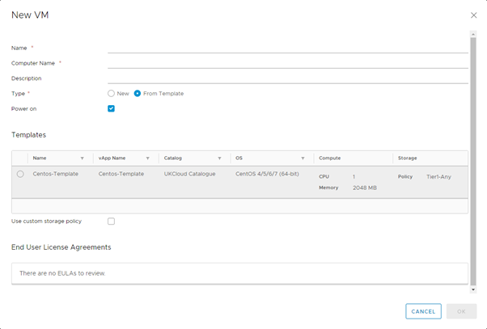
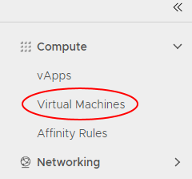
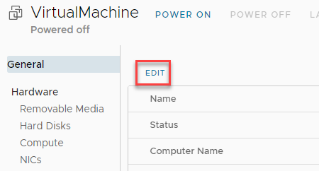
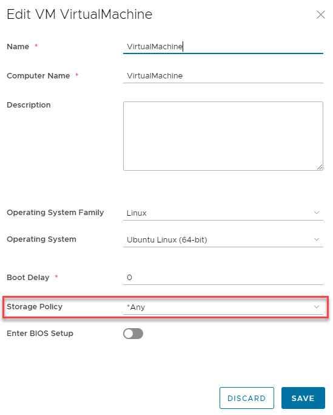

## Overview

To simplify the process of creating a VM, you can use a pre-built VM template from a catalog.

For information about creating a VM from scratch, see [How to create an empty VM](./how_to_create_an_empty_vm.md).  

## Creating a VM from a template

1. In the VMware Cloud Director _Virtual Datacenters_ dashboard, select the VDC that contains the vApp in which you want to create the VM.

1. In the left navigation panel, select **vApps** to view a list of vApps within the VDC.

1. In the card for the vApp in which you want to create the VM, select **Actions** then **Add VM**.

    

1. In the _Add VMs_ dialog box, click **Add Virtual Machine**.

    

1. In the _New VM_ dialog box, from the **Type** radio buttons, select **From Template**.

1. Enter a **Name**, **Computer Name** and **Description** for your VM.

1. In the _Templates_ section, select the template that you want to use for your VM, depending on your required operating system and VM size.

    

1. When you're done, click **OK**.

1. Back in the _Add VMs_ dialog box, you can create more VMs or click **Add** when you're done.

    You can monitor progress in the _Add VMs_ dialog box or click **Cancel** to return to the list of vApps while the VM is created in the background.

1. In the left navigation panel, select **Virtual Machines** to view a list of VMs within the VDC.

    

1. In the card for your new VM, select **Details**.

1. In the _General_ section, from the **Storage Policy** list, select a storage policy to assign the VM to. The storage policy will be assigned when your account is initially created.

    

    

1. View the _Hardware_ section.

    Here, you can:

    - Configure _CPU_ and _Memory_.
    - In the _Storage_ section, you can configure storage or **Add** more disks.
    - In the _NICs_ section, you can **Add** the VM to a network and select an **IP Mode** to determine how IP addresses are assigned:  
        **•  DHCP** VMware Cloud Director interacts with the OS via VMware Tools to use DHCP rather than static IPs. You'll need to define a DHCP server on your edge gateway.  
        **•  Static - IP Pool** is the usual method, which injects an IP address into the VM via VMware Tools from a list of available IP addresses. The address may vary with each boot, but there is a check box to keep IP address assignments elsewhere within the UI once the VMs are created.  
        **•  Static - Manual** is like IP Pool, but you need to enter a valid **IP Address** from the pool, which the VM will then keep.

1. When you're done, click **Save**.
