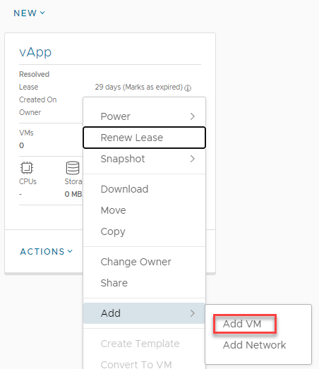
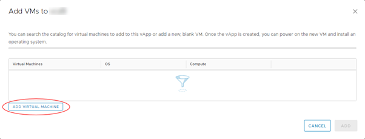
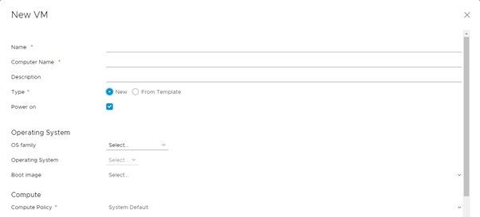
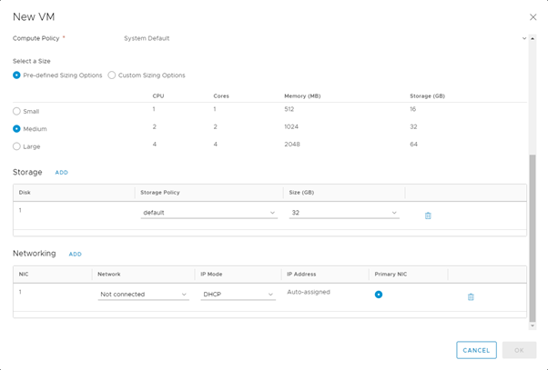
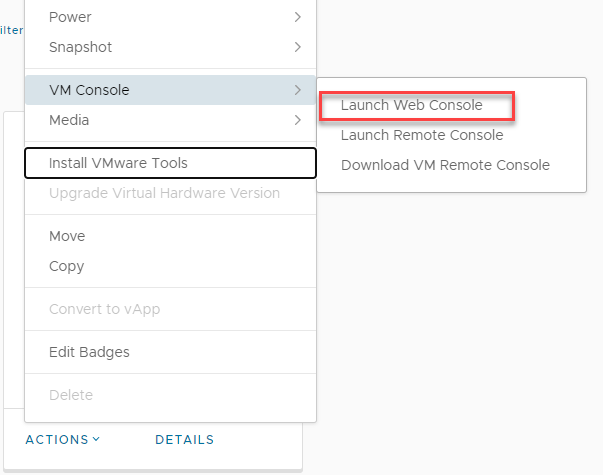
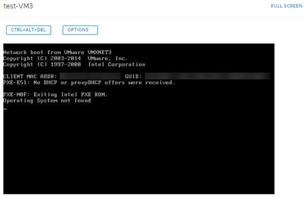
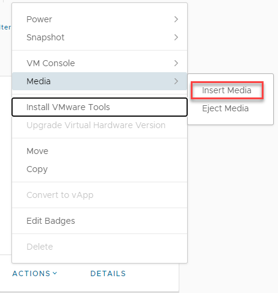
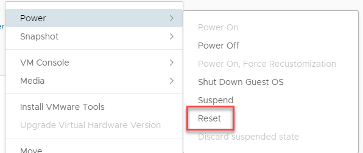
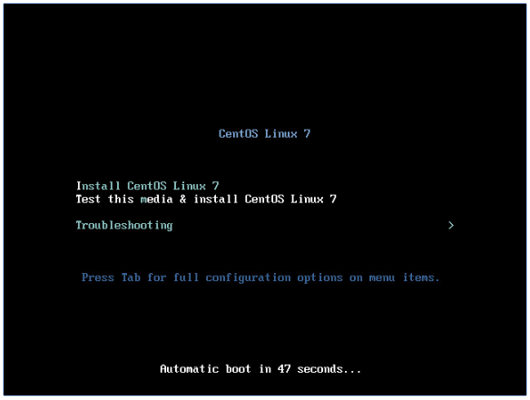

## Overview

As well as deploying pre-built VMs from a catalog, you can build your own VMs from scratch, as you would do on a physical machine, using an ISO image in place of a physical CD or DVD.

For information about creating a VM from a template, see [How to create a VM from a template](./how_to_create_a_vm_from_a_template.md).

## Creating an empty VM

1. In the VMware Cloud Director _Virtual Datacenters_ dashboard, select the VDC that contains the vApp in which you want to create the VM.

1. In the left navigation panel, select **vApps** to view a list of vApps within the VDC.

    

1. In the card for the vApp in which you want to create the VM, select **Actions** then **Add VM**.

    

1. In the _Add VMs_ dialog box, click **Add Virtual Machine**.

    

1. In the _New VM_ dialog box, from the **Type** radio buttons, select **New**.

1. Enter a **Name**, **Computer Name** and **Description** for your VM. The computer name can only contain alphanumeric characters and hyphens.

1. Select the **OS Family** to use for your VM, then from the **Operating System** list, select the specific OS that you want to use.

    

1. Select a **Size** for your VM based on the number of vCPUs and cores you require.

    You can select from **Pre-defined Sizing Options** or select **Custom Sizing Options** to enter specific compute, memory and storage settings.

1. If you want to run virtualisation servers as a VM, you can edit the properties of the VM after it has been deployed and, in the _Hardware_ section, select the **Expose hardware-assisted CPU virtualisation to guest OS** check box.

    For example, you can run a Windows 2008 or 2012 server with Hyper‑V, or a VMware ESX host.

1. In the _Storage_ section, set the **Storage Policy** and **Size** (in GB) of storage for the VM. You can also add more disks.

1. In the _Network_ section, specify which **Network** to connect the VM to and select an **IP Mode** to determine how IP addresses are assigned:

    - **DHCP** VMware Cloud Director interacts with the OS via VMware Tools to use DHCP rather than static IPs.  

    - **IP Pool** is the usual method, which injects an IP address into the VM via VMware Tools from a list of available IP addresses. The address may vary with each boot, but there is a check box to keep IP address assignments elsewhere within the UI once the VMs are created.  

    - **Manual IP** is similar to IP Pool, but you need to enter a valid **IP Address** from the pool, which the VM will then keep.  

    

1. When you're done, click **OK**.

1. Back in the _Add VMs_ dialog box, you can add more VMs or click **Add** when you're done.

    You can monitor progress in the _Add VMs_ dialog box or click **Cancel** to return to the list of vApps while the VM is created in the background.

    The VM will be deployed without any operating system.

### **Installing an operating system into the VM**

1. On the card for the vApp that contains the VM, click **Actions >** **Power** then select **Power On**.

    This starts the vApp and all the VMs within it. The vApp shows a status of **Powering on**, then **Running**.

1. In the left navigation panel, select **Virtual Machines** to view a list of VMs within the VDC.

1. In the card for your VM, click **Actions > VM Console  > Launch** **web console**.

    

1. As with a physical server, no virtual CD or DVD is available at first boot, so the server will attempt to PXE boot.

    

1. In the main VMware Cloud Director interface (not the console), in the card for the VM you want to work with, select **Actions, Media** then **Insert Media**.

    

1. Select the ISO image you want to mount from a catalog, then click **Insert**.

1. In the card for the VM, select **Actions, Power** then **Reset** to reset the VM so that it picks up the virtual CD/DVD.

    

    After a short while the VM will start the boot process and pick up the CD/DVD. Resize the VM console if necessary or go to full screen.

    

1. Carry out the operating system install as normal. When you've finished, remember to install VMware Tools.

For more information, see [VMware Tools Installation](./vmware_tools_installation.md).
