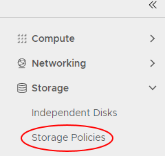
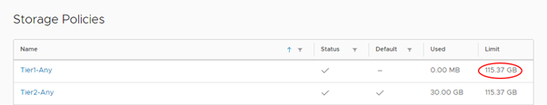
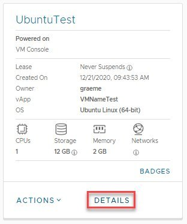
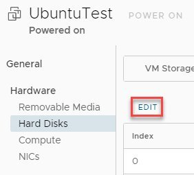
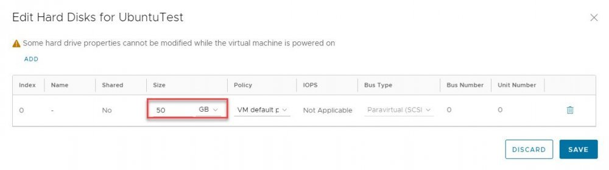
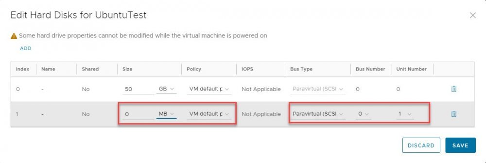

## Overview

You can increase the block storage available for a virtual machine (VM) by expanding an existing HDD or by adding an additional drive.

## Before you begin

Before increasing the size of block storage for a VM, consider the following:

- If the VM has a snapshot, you'll need to remove this before making changes to the hard disk size. You may need to perform a re-scan from the OS level.
- We recommend disk sizes are kept under 2TB as disks larger than 2TB attached to a VM can cause performance issues and may impact the ability to take backups.

## Checking storage allocation

Before increasing block storage for a VM, you can check the storage allocation for its VDC:

1. In the VMware Cloud Director _Virtual Datacenters_ dashboard, select the VDC that contains your VM.

1. In the left navigation panel, select **Storage Policies**.

    

1. In the row for the appropriate storage policy, check the **Limit** column. If you need to increase the disk size beyond the storage limit, please contact your Customer Success Manager or AUCloud Support to request an increase to your storage limit. See: [AUCloud Support.](../../../Platform_Overview/support).

    

## Increasing storage for a virtual machine

To increase the amount of block storage for your VM:

1. In the VMware Cloud Director _Virtual Datacenters_ dashboard, select the VDC that contains your VM.

1. In the _Virtual Machines_ page, in the card for your VM, click **Details**.

    

1. Locate and _select_ the _General - Hardware -_ _Hard Disks_ section and click **EDIT**.

    

1. In the _Hard Disks_ section, in the row for the hard disk that you want to increase, enter the new value in the **Size** field.

    

1. Click **Save**.

## Adding additional disks to a virtual machine

1. You can add more hard disks to your VM by clicking **Add** and specifying the details for the new disk.

    

    - **Size** – enter the size of the new disk in binary
    - **Policy** – select the storage policy (in most cases this will be the VM default policy)
    - **Bus Type** – select the Bus Type (we recommend para-virtual SCSI)
    - **Bus Number** – Select a bus number. If selecting a different bus type to the original disk, a unique bus number needs to be applied.
    - **Unit Number** – select a unit number which is not the same as the existing disk.

1. When you're done, click **Save**.
