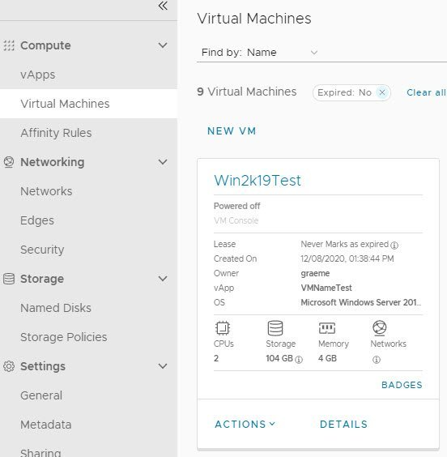
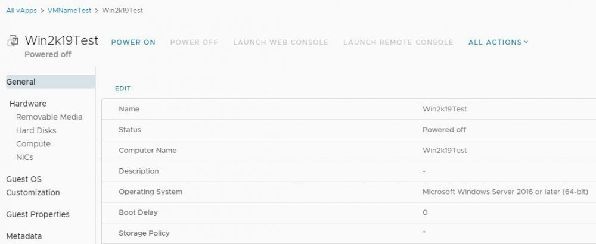
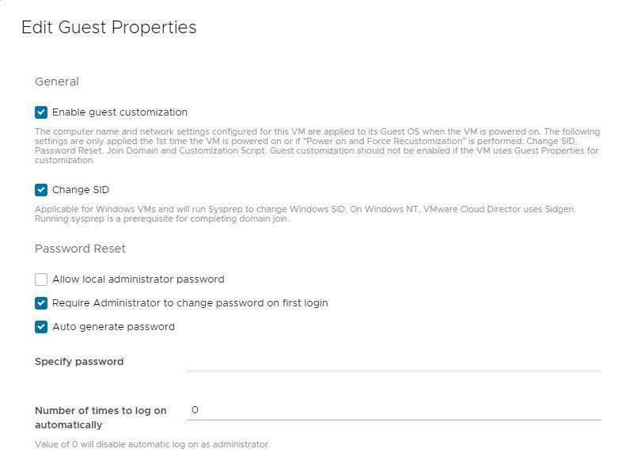
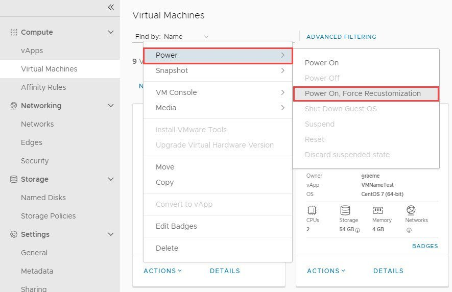
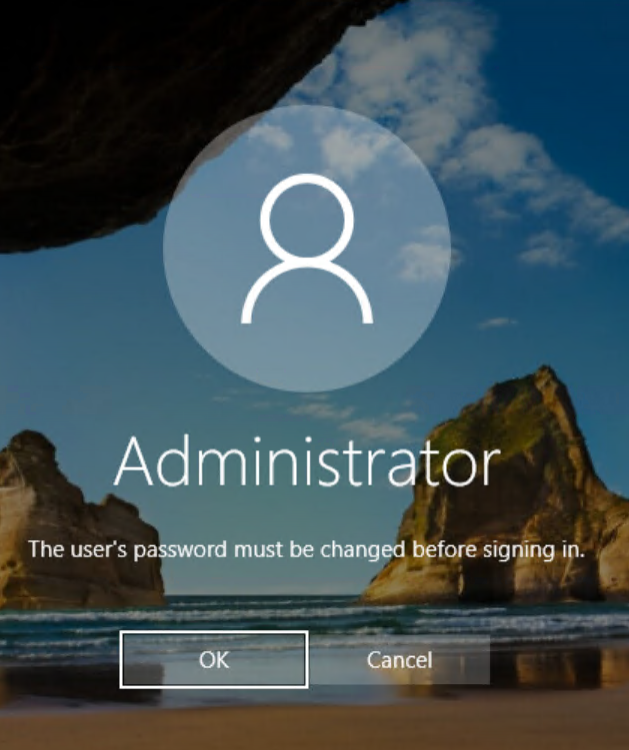

### Overview

This article is to provide a step by step procedure to perform guest customisation on the newly built VM from a template.
By default, the vApp templates provided by AUCyber in vCD catalog have guest customisation enabled.

### Process

Prior performing guest customisation, check the VM has been configured accordingly by going through following:

1. Navigate to Compute - Virtual Machines - Select the newly built VM - Details link  

    

1. Under General section, ensure the Computer Name is configured accordingly - as this will be the actual server name for the Guest OS  

    !!! note

    The Name field is the Virtual Machine Name - in general administrators normally configured the VM name and Computer (Guest OS) Name with the same name.  

      

1. Then under Hardware - NICs - if you wish to use a static IP address, make sure Static - Manual is selected and enter the IP address accordingly

    

1. Navigate to Guest OS Customization section, click edit, and ensure the following are enabled :  

    

    !!! note

        The option "Require Administrator to change password on first login" is only applicable for Windows VM.  

1. Once happy with all the settings, click **Save** button  

Once the VM configured, navigate back to Compute - Virtual Machine. Then select Actions on the VM and choose the "**Power On and Force Re-customization"**  
  

This will then Power On the VM and configure the guest OS with the correct server name and IP address.  
  
For Windows VM, administrator user will be prompted to change the password upon initial login.

Click on OK and enter the new password for the guest OS.
