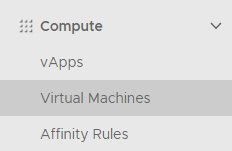
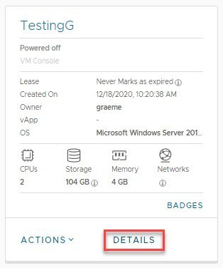
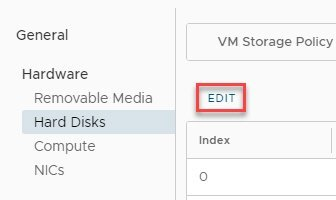
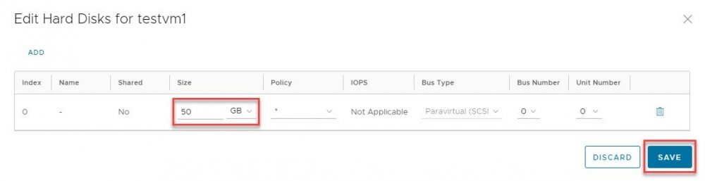
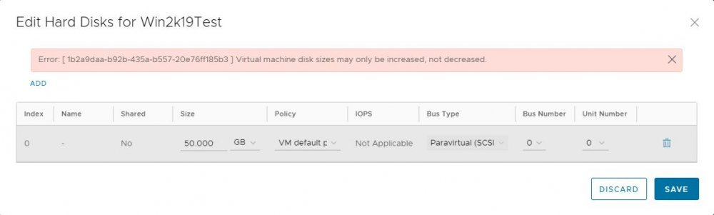

### Overview

AUCloud provides a public catalog which contains VM templates with various OS flavours. Each of these VM templates is configured with 1 Hard Disk with the following default disk sizes :  

| OS  | Disk Size | VM Size |
| --- | --- | --- |
| Linux Centos / Ubuntu | 10GB |  Mini |
| Linux Centos / Ubuntu | 50GB |  Small / Medium / Medium Plus / Large / Larger / Largest |
| Windows Server 2016 /2019 | 100GB |  Small / Medium / Medium Plus / Large / Larger / Largest |
  
It is recommended to utilise this Hard Disk as a dedicated OS drive/partition and create additional disks to store data, logs, applications installation, etc. To resize (increase) the disk drive / partition, the following need to be performed :

1. Resize the disk from the VM level first
1. Expand the disk / partition from the OS level.

### Process

The following steps provides guidance on how to resize VM level disk on AUCloud:

1. Once you are logged in VMware Cloud Director through the portal, navigate to the Virtual Datacentre - _Compute - Virtual Machines_:  

    

1. Select the VM which required its disk(s) to be resized, click on **DETAILS**.

    

1. Then navigate to _General - Hardware - Hard Disks_ section, click **EDIT**.  

    

1. Adjust the disk size on the relevant disk.  

    

1. **Warning** You can only increase the disk size. If you try to decrease the disk size, the following alert will pop up and the disk size will not be updated:  

    

1. Then click on **Save** button.

Once the above steps completed, the next thing to be performed is expand the disk from the OS level.

!!! note

    - for Linux VM, rebooting the server may be required if the re-scan of the scsi devices did not pick up the new disk size
    - for Windows VM, to expand the disk, perform a re-scan on the Disk Management (in Computer Management) then perform extend volume
