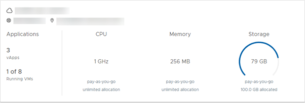

### Overview

Before allocating more disk space in your AUCyber for VMware account, it is useful to check how much of your allocated space has been used.  

### Viewing your storage usage (VMware Cloud Director)

1. In the VMware Cloud Director _Virtual Datacenters_ dashboard, go to the card for your data centre.

2. The _Storage_ section shows how much storage you're currently using as well as the amount of allocated storage.

    

### Viewing your storage usage (VMware Cloud Director API)

To check your storage profile usage programmatically, you need to call the appropriate VMware Cloud Director REST API endpoint.

The example assumes that you have set up the following three environment variables to hold your user credentials:

- `VCD\_ORG`
- `VCD\_USERNAME`
- `VCD\_PASSWORD`

The example makes two calls to the API. The first call authenticates the session:

`application/*+xml;version=5.6" -X POST -i https://api.vcd.portal.skyscapecloud.com/api/sessions`

Having authenticated successfully and received an ``x-vcloud-authorisation`` header in the response, the second call passes the authentication token as a header on the request:

`curl -H "x-vcloud-authorization: a1b2c3d4e5f6a7b8c9d0e1f2a3b4c5d6" -H "Accept: application/*+xml;version=5.6" -i https://api.vcd.portal.skyscapecloud.com/api/query?type=orgVdcStorageProfile`

This call returns an XML structure, in which you can see an `OrgVdcStorageProfileRecord` element containing the following properties:

`storageLimitMB="512000" storageUsedMB="65536"`

The GitHub repository also provides a ruby example. Again, the script assumes the above environment variables have been set up with your user credentials.

You can use the ruby script by running:

`ruby storage_profile.rb`

The output will look similar to the following:

`Name        Used GB   Total GB   Percent   VDC`

`BASIC-Any   192       500        38.5%     XXXX`
