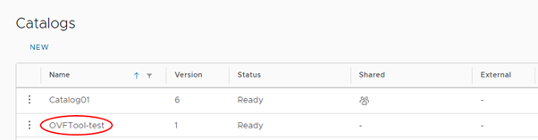
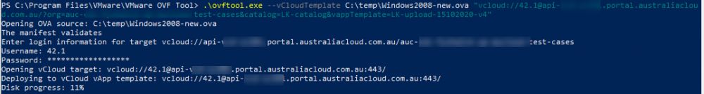
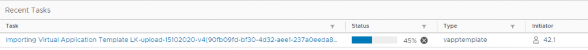
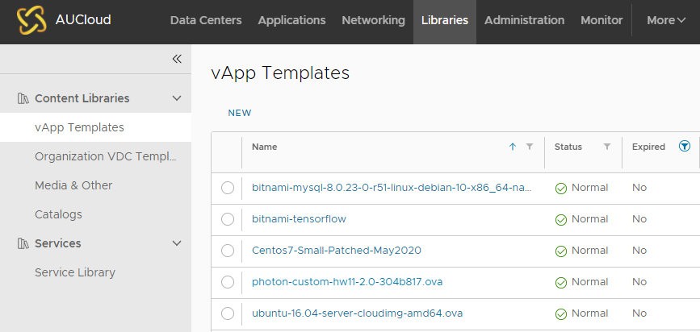
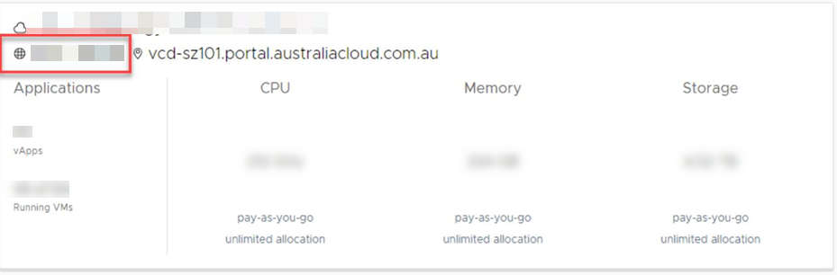
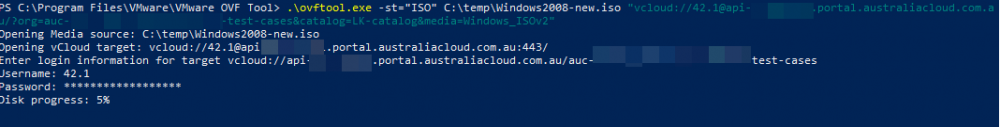

### Overview

The VMware OVF Tool is a conversion program freely downloadable from VMware that assists in the distribution of virtual machines (VMs) and vApps, converting them between OVF, VMX and OVA formats. It also includes a command‑line facility to import and export OVF packages between environments or from third party suppliers. The OVF Tool is a command‑line interface (CLI) tool only.

- **OVF (Open Virtualisation Format)** is a packaging standard created by leading virtualisation vendors. It is a platform independent, efficient, open packaging and distribution format for virtual machines.

- **VMX (the VM configuration file)** is a simple text file with various parameters relating to the guest Virtual Machine.

- **The OVA file extension** is associated with Open Virtual Machine Format. Compared to the OVF file format, the OVA format contains all VM files and \*.ovf files compressed into one single OVA archive file instead of many files in a folder.

This method is the preferred method for uploading template/media larger than 1GB in size.

### Downloading the OVF Tool

You can download the OVF Tool via the following link:

[https://code.vmware.com/tool/ovf](https://code.vmware.com/tool/ovf)

You will need to have a VMware account to download the tool. You can download the OVF Tool for Windows 32-bit and 64-bit, Linux 32-bit, 64-bit and ARM64, or Mac OS X.

After downloading and installing the OVF Tool, go to the directory in which you installed the tool to run it. There is no icon or program logo on your desktop for the OVF Tool, so to launch it, you must use the command prompt. Go to the installation folder and run:

`ovftool`

### Getting started with the OVF Tool

The OVF Tool is a CLI tool, so some level of familiarity with CMD commands helps in using the tool. There are a number of help commands, which are a good source of information:

`ovftool --help`

`ovftool --help examples`

`ovftool --help locators`

`ovftool --help config`

You can also find the OVF Tool User Guide at:

[https://code.vmware.com/tool/ovf](https://code.vmware.com/tool/ovf)

### Basic import/upload and export/download commands

You will mainly use the OVF Tool to import (deploy/upload) and export (download) VMs or appliances into and out of your AUCyber environment.

The basic syntax to do this using the OVF Tool is:

`ovftool <source> <target>`

Refer to the OVF Tool User Guide for further commands and switches.

### Uploading a VM template (OVF or OVA format) to a Catalog in VMware Cloud Director

To upload an ovf/ova file:

1. In your AUCyber environment, create a catalog to contain the vApp template.

    

    For detailed instructions, see [How to create a catalog](../Catalogs/VCD%2010.4.x/how_to_create_a_catalog.md) for VCD 10.4.x. Note: for VCD 10.5.x, the catalog creation is covered in [here](../Catalogs/VCD%2010.5.x%20(new)//how_to_create_a_catalog.md).

1. Make sure you are in the correct directory, that is, the directory containing the file you want to import. For ovf files, ensure all the files such as `\*.mf` , `\*.ovf`, `\*.vmdk` and `\*.nvram` files are in the same directory

1. Run the following command:

    `ovftool --vCloudTemplate <filename> "vcloud://<username>@<apiURL>?org=<computeServiceID>&catalog=<catalogName>&vappTemplate=<newTemplate>"`

    Where:

    - vCloudTemplate indicates that you're uploading a new vApp template
    - acceptAllEulas indicates that you accept all end user licence agreements
    - overwrite indicates that you're replacing an existing vApp with the new one being uploaded
    - filename is the name of the .vmx file that are importing
    - username is your AUCyber Portal user ID
    - apiURL is your VMware Cloud Director API URL. This URL is different depending on the region in which your environment is located. For more information, see [API Management in the AUCyber Portal](../../../Platform_Overview/portal/api_management.md).
    - computeServiceID is the ID of your AUCyber compute service (sometimes also called an org or vOrg)
    - vappTemplate is the ID of the vApp template
    - `catalogName` is the Name of the catalog in which the vApp template is located

    For example:
    `ovftool --vCloudTemplate C:\temp\Windows2008-new.ova "vcloud://123.1@api.xxx.portal.australiacloud.com.au:443?org=szxxx-xx-xx&catalog=LK-catalog&vappTemplate=LK-upload-15102020-v4"`

    **TIP:** Make sure you use double quotes (") rather than single quotes (').
    vCloudTemplate and vappTemplate flags are case sensitive.

1. The ovf file is uploaded as a vApp template into your environment.

    

    In VMware Cloud Director, expand the _Recent Tasks_ section to check the status.

    

    You can also see the progress from Libraries - vApp Templates view. Once, the upload is completed successfully, the green tick icon  will appear next to the vapp template name.

    

### Uploading an .iso file to a Catalog in VMware Cloud Director

To upload an ISO image:

1. Make sure you are in the correct directory, that is, the directory containing the ISO file you want to import.

1. Run the following command:

    `ovftool -sourceType="ISO" "<path>\<filename>.iso" "vcloud://<username>@<apiURL>?org=<computeServiceID>&catalog=<catalogName>&media=<name>"`

    Where:

    - `sourceType` (or `st`) indicates the type of the source file: `ISO`
    - `path\\filename.iso` is the full location of the source `.iso` file you want to import
    - `username` is your AUCyber Portal user ID
    - `apiURL` is your VMware Cloud Director API URL. This URL is different depending on the region in which your environment is located. For more information, see [API Management in the AUCyber Portal](../../../Platform_Overview/portal/api_management.md).
    - `computeServiceID` is the ID of your AUCyber compute service (sometimes also called an org or vOrg)
    - `name` is the name to display for the file in VMware Cloud Director
    - `catalogName` is the Name of the catalog to which you want to upload the file

    For example:

    `ovftool -st="ISO" "C:\temp\Windows2008-new.iso" "vcloud://123.1@api.xxx.portal.australiacloud.com.au:443?org=xxx-1-23&catalog=LK-catalog&media=Windows_ISOv2"`

    **TIP:** Make sure you use double quotes (") rather than single quotes (')

    !!! note

        Your **computeServiceID** can be found in your vOrg tile in VMware Cloud Director

    

1. When the `ovftool` command has finished, the source and target locations are listed and then you will be prompted for your username and password. When you are authenticated, the upload process is initiated.

    
