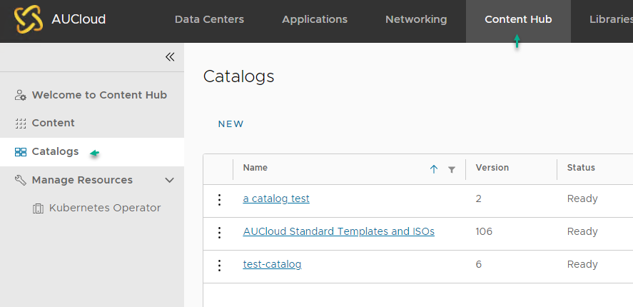
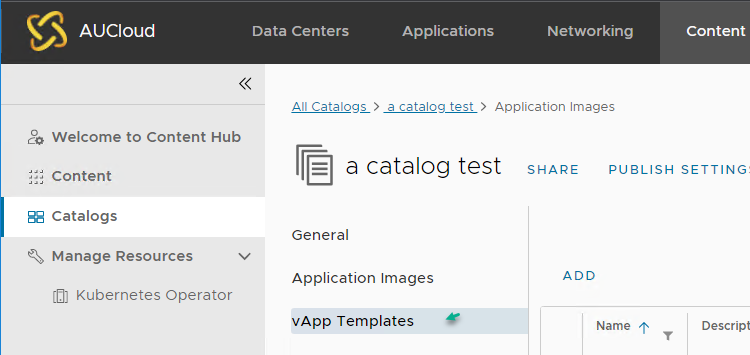
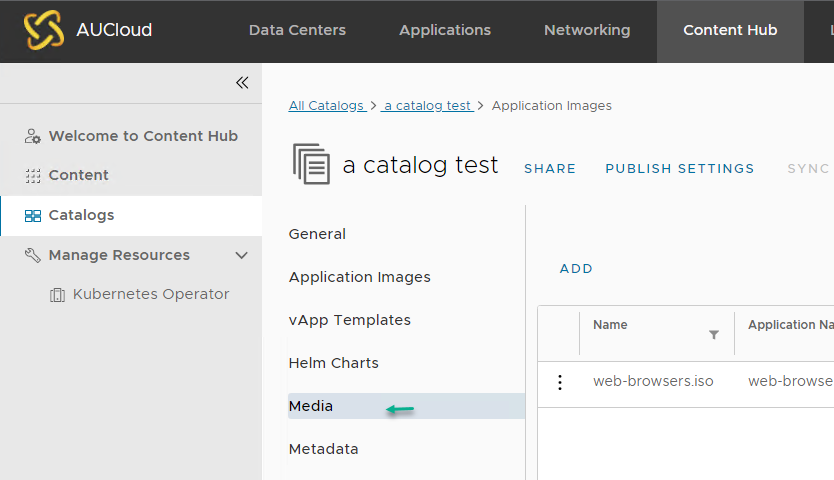
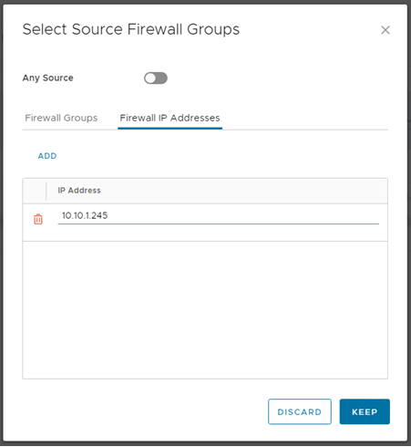
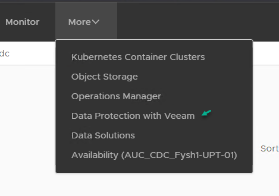

# 											FAQ

## Do you have questions?

The answers to your questions could be found below! If after intensive search, you still cannot find the answer you are looking for, feel free to [contact us](mailto:support@aucyber.com.au) and we will do our best to assist.

### 1. Where is my catalog? I can't find it in Libraries anymore

   This is because VMware Cloud Director 10.5.x launches a new user experience for accessing application images such as vApp Templates, ISO files and container application images. To access your catalog with the new version of VCD , navigate to **Content Hub** then select **Catalogs**.

   

   If you wish to view the vApp Templates in a catalog, select the catalog you would like to explore. Then click on the *vApp Templates* menu

   

   If you wish to view the Media files in a catalog, select the catalog you would like to explore. Then click on the *Media* menu

   

### 2. Can I add IP addresses manually in the source and destination when creating Firewall rule?

Yes you can, however this can only be done in VMware Cloud Director 10.5.x.

If your environment is still on VCD 10.4.x, you will need to use the firewall groups - IP Sets or static Groups.  

### 3. How do I backup my VM(s)?

AUCyber is adopting Veeam Backup & Replication to enable users to backup their VMs. Please have a chat to our friendly [customer service delivery](mailto:sales@aucyber.com.au) team to get Veeam self-service backup portal plugin enabled for your environment. 

If you have the **Data Protection with Veeam** plugins enabled already, you can start performing backup on your VM by click on the VM, select actions - Data Protection with Veeam -> Add to Veeam backup job. 

If there are multiple VMs you wish to add to the backup schedule, navigate to More > Data Protection with Veeam. 

Then on the **Jobs** tab, click on **Create**, then specify all the job name, retention settings, list of vms to be backed up, etc. 
For more details, please see [Veeam Backup Enterprise Manager Guide](https://helpcenter.veeam.com/docs/backup/em/cd_creating_jobs.html?ver=120)

​        