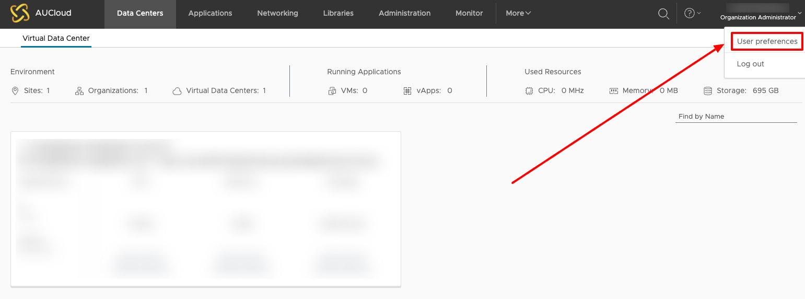
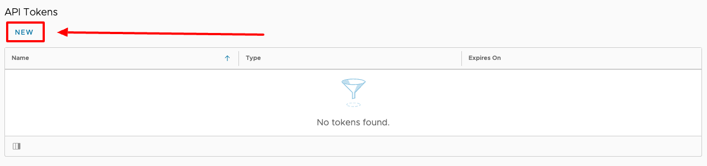
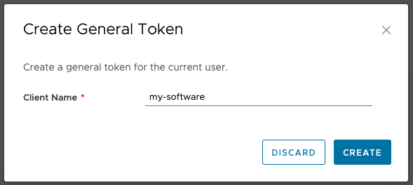
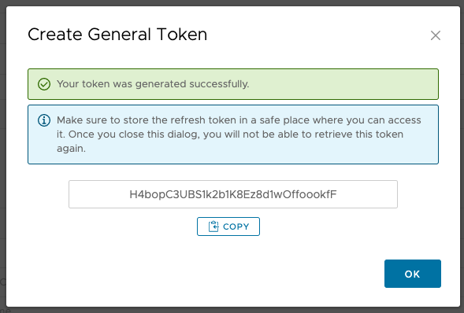
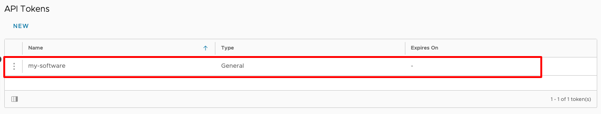

## Overview

This guide details the steps required to create an API Token in VMware Cloud Director (VCD)

## Steps

1. Log in to the [AUCyber Portal](https://app.aucloud.com.au)
1. Log in to the tenancy that you want to connect to:

    <!-- TODO: FIX THIS -->
    

1. In the top right-hand corner, click on your name, then "User Preferences":

    

1. Scroll down to the "API Tokens" section and click "New":

    

1. Enter a **Client Name**, this is the name of the client that will be using this token.  It is useful to create a separate token per client so that you can control access on a per client basis. 

    

1. Copy your newly generated API token and save it somewhere safe:

    

1. After you close this dialogue you will be presented with the list of your API Tokens, you can come back to this list at any time to revoke a token that you have created:

    

