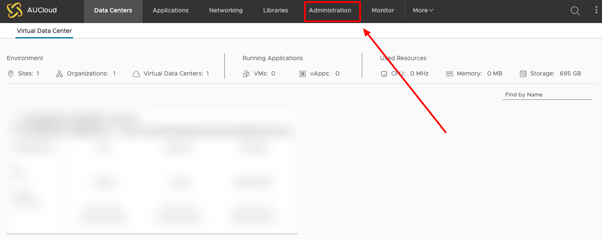
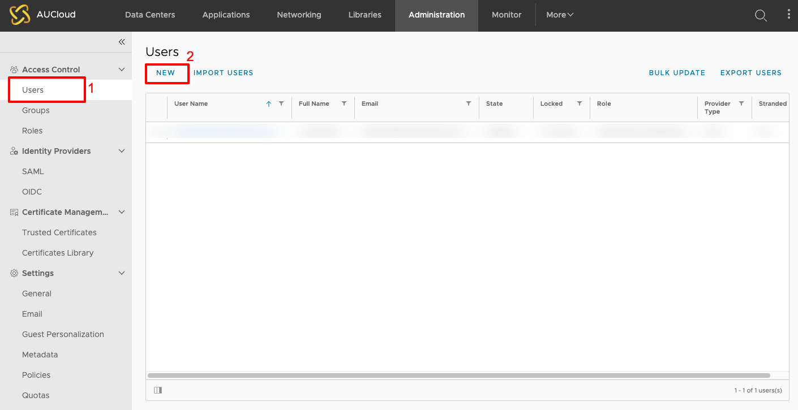
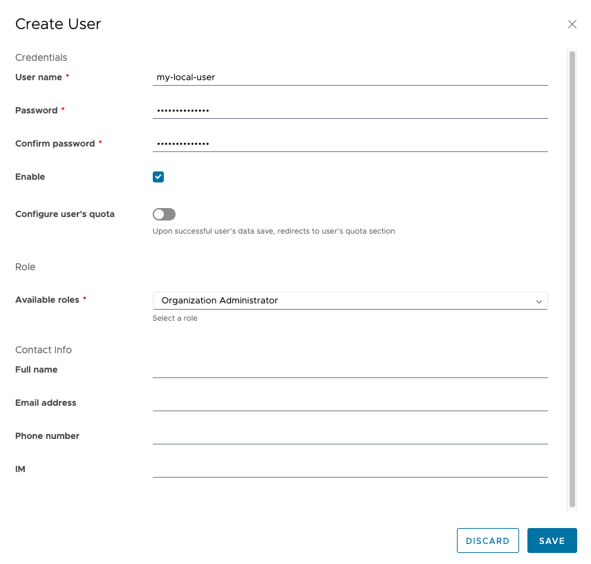
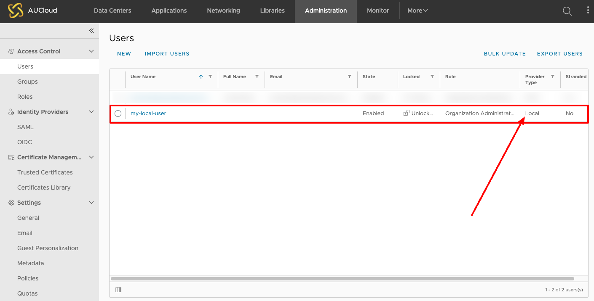

## Overview

In order to use the [VMWare OVF tool](../../Compute/Working_with_Virtual_Machines/how_to_vmtemplate_media_using_ovf_tool.md), or to interact with [VMWare Cloud Director via PowerCLI](./establishing_a_connection_to_aucloud_with_powercli.md) you will need a "local" user account in VCD. 

This document details the steps required to set up this user. 

## Steps

1. Log in to the [AUCloud Portal](https://app.aucloud.com.au)
1. Log in to the tenancy that you want to connect to:

    <!-- TODO: FIX THIS -->
    

1. Navigate to "Administration":

    

1. Navigate to "Users" and click "New User":

    

1. Fill in the details for your new "local" user, giving it the relevant permissions to be able interact with your VCD tenancy:

    

1. Your "local" user has been successfully created:

    

1. You can now use the username and password of this user to use the [VMWare OVF tool](../../Compute/Working_with_Virtual_Machines/how_to_vmtemplate_media_using_ovf_tool.md), or to interact with [VMWare Cloud Director via PowerCLI](./establishing_a_connection_to_aucloud_with_powercli.md)