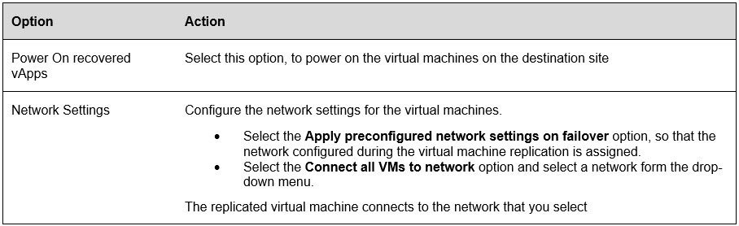

**How to conduct a test failover**

With test failover tasks, you can verify whether the data from the source is replicated correctly on the target site. The replication Data is deleted once the Test Failover has been performed

**Conducting the test failover**

1. In the VMware Cloud Director Availability Portal, either form the **Incoming Replications** or from the **Outgoing Replications** pane, select the protected vApp that you want to test.

    

1. Click Test Failover.

    

1. The Test Failover wizard opens.

    

1. On the **Recovery Settings** page, use the options to configure the test task and click **Next**.

    

1. On the Recovery Instance page, configure the recovery point in time and click **Next.**

    
  
1. On the Ready to Complete page, review the test details and click **Finish** to initiate the Test Failover task.

    

1. You can monitor the progress in the **Replications Task** pane.

    

**Conducting the Test Cleanup**

1. From the **Incoming Replications** or the **Outgoing Replications** pane, you can conduct the test cleanup.

1. Select **Test Cleanup**

    

1. Click **CLEANUP**

    

**Deleting Replications**

1. You can remove the replication by selecting the vApp or VM and clicking **Delete.**

    

1. Confirm you wish to delete the selected replication by clicking **DELETE**

    
