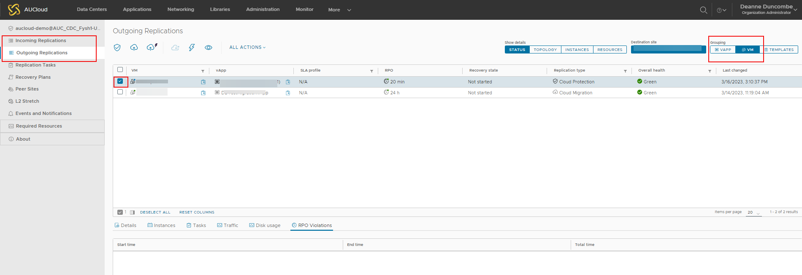
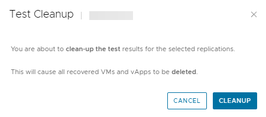

## Overview

With test failover tasks, you can verify whether the data from the source is replicated correctly on the target site. The replication Data is deleted once the Test Failover has been performed.

## Conducting the test failover

1. In the VMware Cloud Director Availability Portal, either form the **Incoming Replications** or from the **Outgoing Replications** pane, select the protected vApp that you want to test.

    

1. Click Test Failover.

    

1. The Test Failover wizard opens.

    

1. On the **Recovery Settings** page, use the options to configure the test task and click **Next**.

	| Option | Action |
	| ---    | ---    |
	| Power On recovered vApps | Select this option, to power on the virtual machines on the destination site |
	| Network Settings | <ul>Configure the network settings for the virtual machines:<li>Select the **Apply preconfigured network settings on failover** option, so that the network configured during the virtual machine replication is assigned.</li><li>Select the **Connect all VMs to network** option and select a network from the drop-down menu.</li></ul>

The replicated virtual machine connects to the network that you selected. |

1. On the **Recovery Instance** page, configure the recovery point in time and click **Next.**

	| Option | Description |
	| ---    | ---    |
	| Synchronize all VMs to their current state | Creates an instance of the powered on vApp with its latest changes and uses that instance for the Test Failover operation |
	| Manually select existing instance | Allows you to select an instance without synchronizing the data for the recovered vApp |

1. On the **Ready to Complete** page, review the test details and click **Finish** to initiate the Test Failover task.

    

1. You can monitor the progress in the **Replications Task** pane.

    

## Conducting the Test Cleanup

1. From the **Incoming Replications** or the **Outgoing Replications** pane, you can conduct the test cleanup.

1. Select **Test Cleanup**

    

1. Click **CLEANUP**

    

## Deleting Replications

1. You can remove the replication by selecting the vApp or VM and clicking **Delete.**

    

1. Confirm you wish to delete the selected replication by clicking **DELETE**

    