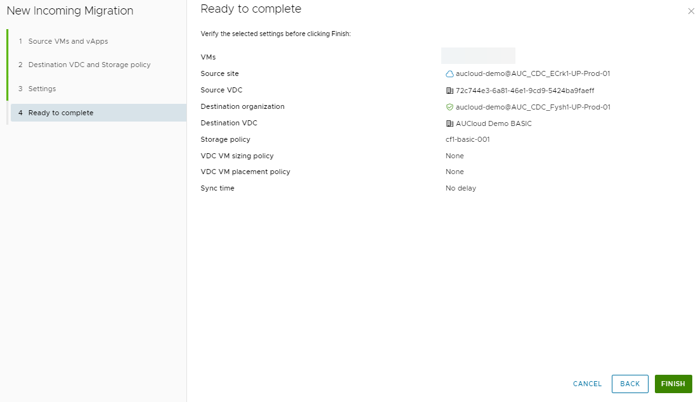
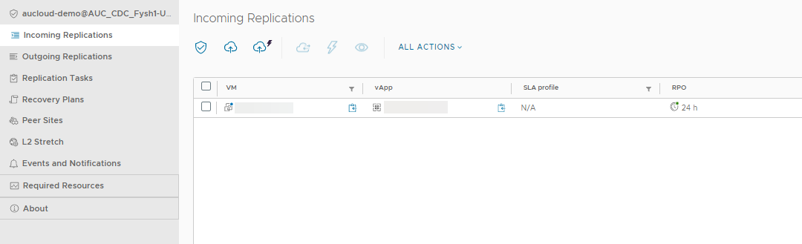

## Overview

To protect a vApp or a virtual machine from one organisation to another, you configure a replication by using VMware Cloud Director Availability.

To migrate the workload of a vApp or a virtual machine to a remote organisation, and run your operations from the remote organisation, you configure a migration by using the portal.

When you configure a protection, you set the Recovery Point Objective (RPO) to determine the maximum data loss that you can tolerate. For example, an RPO of 1 hour seeks to ensure that a virtual machine loses the data for no more than 1 hour during the recovery. For smaller RPO values, less data is lost in a recovery, but more network bandwidth is consumed keeping the replica up to date.

!!! note

    When you configure a migration, the default RPO is set to 24 hours.

When a virtual machine reaches its RPO target, the VMware Cloud Director Availability Replicator records approximately 3800 bytes of data in the vCenter Server events database. If you set a low RPO value, it creates a large volume of data in the database. To reduce the volume of data that is kept in the vCenter Server events database, limit the number of days that vCenter Server retains event data. Alternatively, set a higher RPO value.

## Configure a New Migration

You can configure for a virtual machine or a vApp to be migrated to a destination site. After successful failover of the migration to the destination site, you can power on the source virtual machine on the destination site.

1. From the side menu in your Availability service in the AUCyber Portal, select either **Incoming Replication** or **Outgoing Replication**.

    

1. Click the **Migration** symbol.

    

1. You will be prompted for your VMware Cloud Availability credentials for the source (incoming replication) or destination (outgoing replication) data centre. Enter your vCav credentials and click **LOGIN**

    

1. The **New Migration** wizard appears.

1. Select the Source site (incoming replication) or Destination site (outgoing replication).

    

1. Select whether you would like to explore vApps or VMs, then select the vApp/VMs that you would like to protect and click **Next**.

      

1. Select the target VDC as well as the storage policy and click **Next**.

    

1. You can also use additional settings related to your Migration, as per the image below.

    

1. Review the setting in Ready to Complete and click Finish to proceed with the migration.

      
    
1. Your vApp/vm will then appear in the incoming or outgoing replications tabs (depending on which you select) and will be ready for failover or test failover.

    
