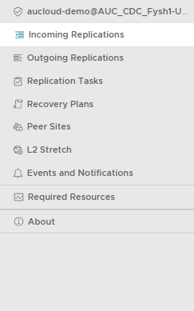
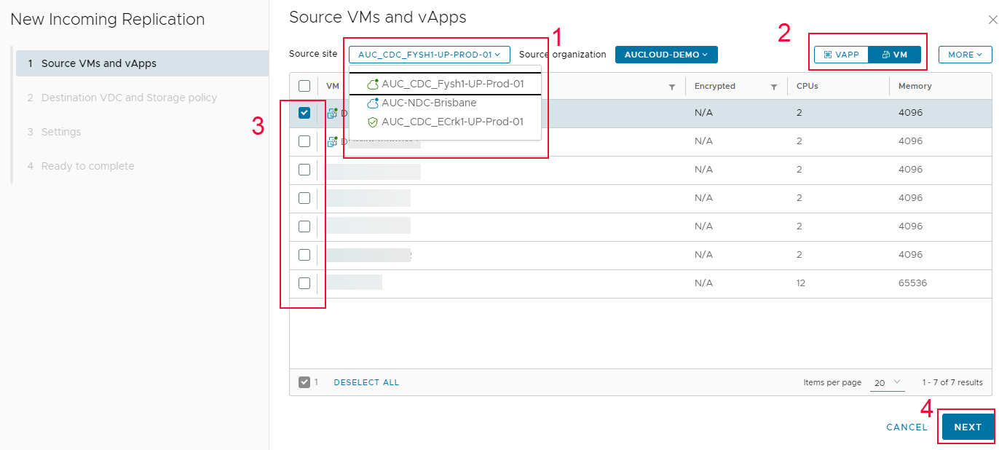
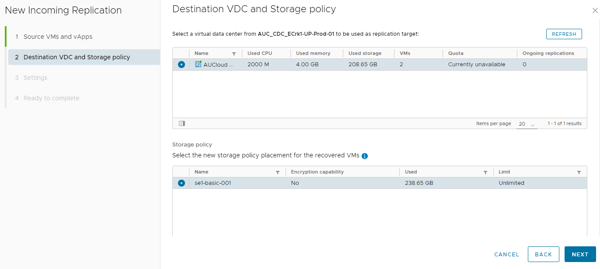
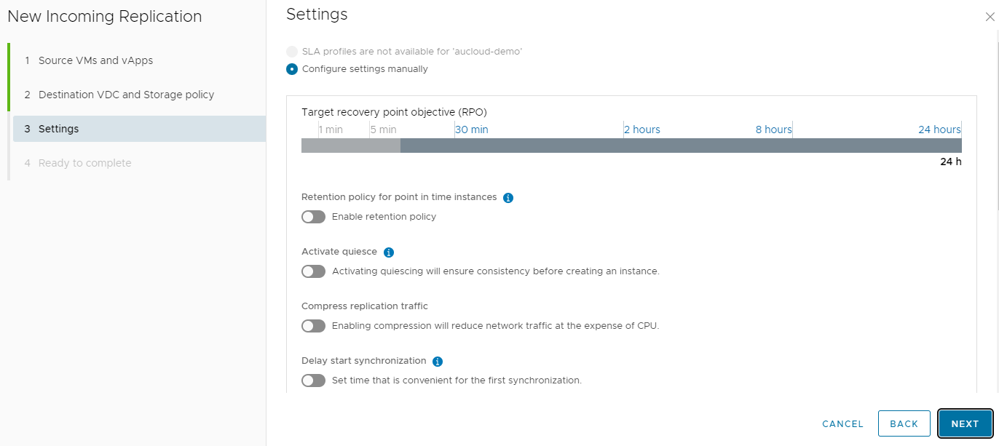
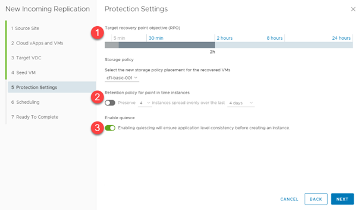

## Overview

You can configure for a Virtual Machine or a Virtual Application to be protected to a destination site. After successful failover of the migration to the destination site, you can power on the source virtual machine on the destination site.

## Configure a New Protection

1. Depending on what type of replication you would like to perform, select either **Incoming Replications** or **Outgoing Replications**.

    

1. Click **New Protection**.

    

1. When the **New Replication** wizard appears, select the **Source site** (incoming replication) or **Destination site** (outgoing replication), then choose whether you would like to explore vApps or VMs. Choose the vApps/VMs that you would like to protect, and then click **Next**.

    

1. Select the **Destination VDC** and **Storage Policy** and then click **Next**.

    

1. On the **Settings** page, set the following and then click **Next**:

    - Target Recovery Point Objective (RPO).
    - Retention policy for point in time instances.
    - Enable or disable quiescing. 
    - Enable or disable compression of replication traffic
    - Enable or disable delaying the start of synchronization
   
    !!! note
    
   	    Quiescing cannot be enabled when back-up is also enabled, [VMware KB81059](https://kb.vmware.com/s/article/81059)

    
  
1. On the **Ready to complete** page, review the replication settings, and click **Finish**.

    
