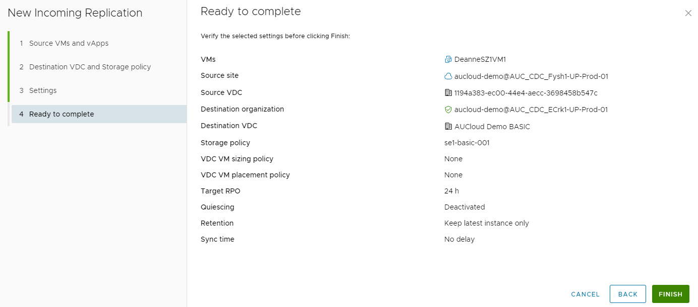

## Overview

You can configure for a Virtual Machine or a Virtual Application to be protected to a destination site. After successful failover of the migration to the destination site, you can power on the source virtual machine on the destination site.

## Configure a New Protection

1. Decide that type of replication you want to perform and unfold the **Incoming Replications** and **Outgoing Replications** menus.

    

1. Click **New Protection**.

    

1. Follow the prompts of the **New Replication** wizard and select the **Source Location**.

    

1. Select the **Destination VDC** and **Storage Policy.**

    

1. On the **Protection Settings** page, you must set:

    - Target Recovery Point Objective (RPO).
    - Retention policy for point in time instances.
    - Enable or disable quiescing. 
   
    !!! note
    
   	    Quiescing cannot be enabled when back-up is also enabled, [VMware KB81059](https://kb.vmware.com/s/article/81059)

    
  
1. On the **Ready to complete** page, review the replication settings, and click **Finish**.

    
