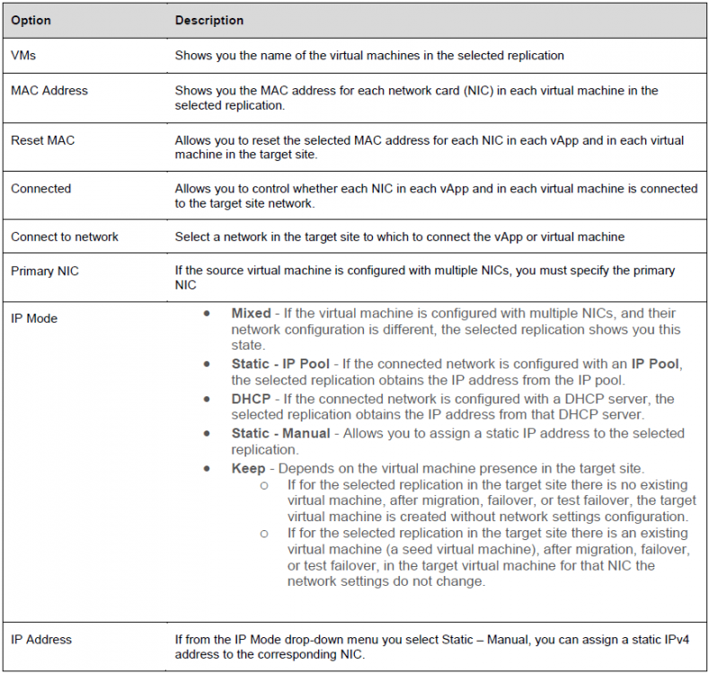

**How to configure the network settings of a replication**

To apply network settings to the target vApp or virtual machine after a migration, failover, or a test failover, for on-premises to cloud replications, or for cloud to cloud replications you configure the network settings.  
 

**Configure the network settings of a replication**

1. Under Incoming Replications or Outgoing Replications, select a replication for which you want to configure the network settings.

      

1. Click **Network** **Settings**.

    

1. The **Network Settings** window opens.

      
  
1. For the selected replication, configure the following network settings:

    

1. For the selected replication, apply the network settings by clicking **Apply**.