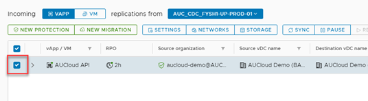
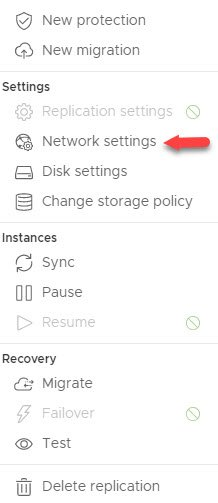
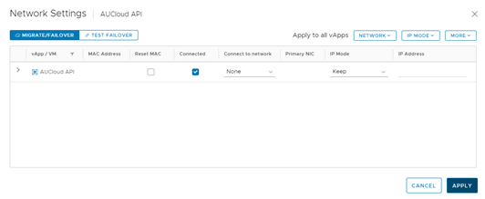

## Overview

To apply network settings to the target vApp or virtual machine after a migration, failover, or a test failover, for on-premises to cloud replications, or for cloud to cloud replications you configure the network settings.  
 
## Configure the network settings of a replication

1. Under Incoming Replications or Outgoing Replications, select a replication for which you want to configure the network settings.

      

1. Click **Network** **Settings**.

    

1. The **Network Settings** window opens.

      
  
1. For the selected replication, configure the following network settings:

	| Option | VMs |
	| --- | --- |
	| VMs | Shows you the name of the virtual machine in the selected replication |
	| MAC Address | Shows you the MAC address for each network card (NIC) in each virtual machine in the selected replication |
	| Reset MAC | Allows you to reset the selected MAC address for each NIC in each vApp and in each virtual machine in the target site |
	| Connected | Allows you to control whether each NIC in each vApp and in each virtual machine is connected to the target site network |
	| Connect to network | Select a network in the target site to which to connect the vApp or virtual machine |
	| Primary NIC | If the source virtual machine is configured with multiple NICs, you must specify the primary NIC |
	| IP Mode | <ul><li>**Mixed** - If the virtual machine is configured with multiple NICs, and their network configuration is different, the selected replication shows you this state</li><li>**Static - IP Pool** - If the connected network is configured with an **IP Pool**, the selected replication obtains the IP Address from the IP Pool</li><li>**DHCP** - If the connected network is configured with a DHCP server, the selected replication obtains the IP address from that DHCP server</li><li>**Static - Manual** - Allows you to assign a static IP address to the selected replication</li><li>**Keep** - Depends on the virtual machine presence in the target site:</li><ul><li>If the selected replication in the target site there is no existing virtual machine, after migration, failover, or test failover, the target virtual machine is created without network settings configuration</li><li>If for the selected replication in the target site there is an existing virtual machine (a seed virtual machine), after migration, failover, or test failover, in the target virtual machine for that NIC the network settings do not change</li></ul></ul> |
	| IP Address | If from the **IP Mode** drop-down menu you select **Static - Manual**, you can assign a static IPv4 address to the corresponding NIC |

1. For the selected replication, apply the network settings by clicking **Apply**.