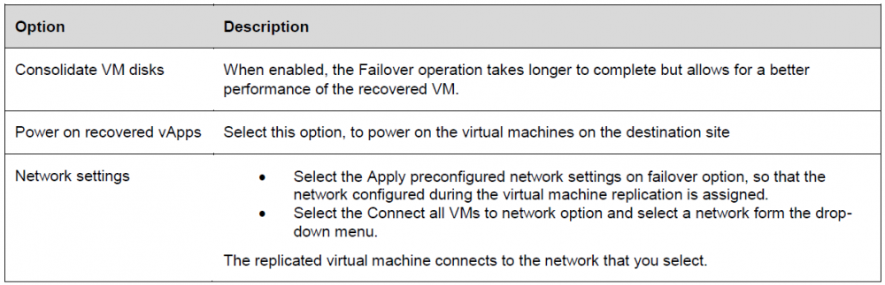

**How to perform a failover task**

You perform a disaster recovery operation of a Virtual Machine to the Target site if the protected source is unavailable.  

**Prerequisites**

Verify that the vApp containing the Virtual Machine is protected on your destination site  

**Procedure**

1. In VMware Cloud Director Availability Portal, either from the **Incoming Replications** or from the **Outgoing Replications** pane, select the virtual machine that you wish to failover, click **All Actions** and then click **Failover**. The **Failover** wizard opens.

1. In the Recovery Settings tab, use the options to configure the task and click **Next.**

    

1. On the Recovery Instance page, configure the recovery point in time and click Next.

1. On the Ready to Complete page, review the test details and click Finish to initiate the Failover task. You can monitor the progress of the task either in the Incoming Replications or the Outgoing Replications pane.

    The failed over vApp is running on your destination site. The vApp is no longer protected upon the task completion.

1. What to do next: You can reverse the vApp back to your source site environment or delete the vApp replication. If you delete the replication, it is no longer protected by the solution, and disappears from the vApps list.
